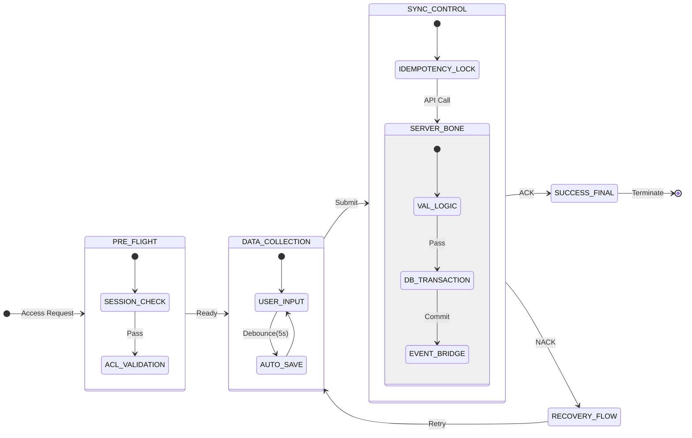

# [Template] High-Stakes Logic Flow & FMEA Validator
## Subject: [Functional Domain]

### 1. 비질런트 데이터 라이프사이클 (Hyper-Detailed Lifecycle)
엔티티의 생애 전 주기를 **'데이터 무결성'**과 **'트랜잭션 안전성'** 관점에서 미분하듯 분석합니다.

| 단계 | 트리거 (Trigger) | 상태 (State) | 필드 제약 (Atomicity) | 비표준 예외 및 장애 복구 (Resilience) |
| :--- | :--- | :---: | :--- | :--- |
| **권한검증** | [화면 진입] | `AUTH_VAL` | 세션 유효성/ACL 체크 | 토큰 만료 시 작성 중 데이터 임시 세션 보존 정책 |
| **데이터입력** | [On-Change] | `INPUTTING` | 타입/길이 실시간 체크 | 브라우저 비정상 종료 시 IndexedDB 자동 복구 |
| **전송락** | [Submit] | `LOCKED` | 중복 요청(Nonce) 방지 | 타임아웃 발생 시 '진행 중' 상태 UI 유지 및 재시도 |
| **서버검증** | [Biz-Logic] | `VALIDATING` | DB 레벨 제약 조건 체크 | 데이터 상충(Conflict) 시 사용자 옵션 선택(덮어쓰기/취소) |
| **영속화** | [Commit] | `COMMITTED` | 트랜잭션 원자성 보장 | 로그 생성 완료 전까지 클라이언트 ACK 보류 |
| **데이터파기** | [Expire/Del] | `PURGED` | 연관 참조 전수 해제 | 법적 보관 주기 준수 및 마스킹된 백업 생성 |

### 2. 고밀도 상태 전이 및 사이드 이펙트 매트릭스
상태 변이 시 발생하는 **'모든 연쇄 반응'**을 전산학적으로 추적합니다.

| From -> To | 주동작 (Main Action) | 연쇄 반응 (Cascade Effect) | 무결성 보증 (Self-Audit) |
| :--- | :--- | :--- | :--- |
| `DRAFT` -> `ACTIVE` | 게시물 공개 | 검색 인덱싱 스케줄링, 작성자 점수 반영, 알림 서버 push | 알림 서버 장애 시 큐(Queue) 적재 여부 확인 |
| `ACTIVE` -> `SUSPEND` | 일시 정지 | 연결된 유료 서비스 즉시 차단, 사용자에게 중지 메일 발송 | 차단 시점의 미납 금액 자동 정산 처리 확인 |
| `ACTIVE` -> `EDIT` | 정보 수정 | 버전 히스토리 생성, 캐시 서버 Purge | 수정 중 구버전 데이터 노출 허용 여부 확정 |

### 3. FMEA (Failure Mode and Effects Analysis) 기획서
발생 가능한 결함 모드를 사전에 탐지하고 그 가혹도를 평가합니다.

| 잠재적 결함 모드 (Failure Mode) | 발생 원인 (Cause) | 시스템 영향 (Effect) | 탐지 및 방어 (Prevention) | 가혹도 (1~10) |
| :--- | :--- | :--- | :--- | :---: |
| 데이터 동시 수정 충돌 | 다중 사용자 접근 | 데이터 유실/정합성 파괴 | Optimistic Locking 및 UI 상 점유 표시 | 9 |
| 외부 연동 API 무응답 | 네트워크 장애 | 화면 멈춤(Freezing) | 비동기 처리 및 Circuit Breaker 적용 | 8 |
| 비정상 파라미터 공격 | URL 직접 조작 | 권한 없는 데이터 유출 | 서버 측 RBAC 재검증 및 마인타입 체크 | 10 |

### 4. 시각적 무결성 도표 (Mermaid Advanced)

### 5. 무결성 보증 최종 전문 (Certification)
- 본 분석표는 기획된 화면의 모든 논리적 분기점을 **전산학적 무결성** 관점에서 전수 탐색하였습니다. 하위 개발 및 디자인 직군이 '기획 해석'을 위해 소모하는 시간을 0시간으로 단축하고, 코딩 단계에서 발생할 수 있는 '정의되지 않은 동작'을 원천 배제하였음을 선언합니다.
