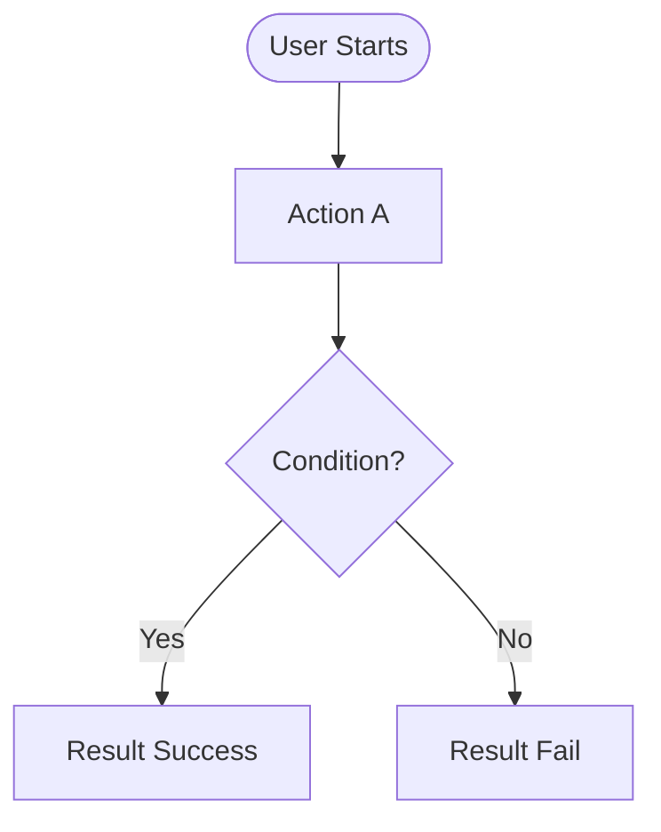

# [Project Name] Functional Specification

## 1. Overview
- **Feature Name**: [Feature Name]
- **Goal**: [Brief description of what the user achieves]
- **Actors**: [Who uses this? e.g., Admin, Guest]

## 2. User Journey (Flowchart)

## 3. Screen Requirements
*(Repeat for each screen)*

### [SCN-ID] Screen Name
- **Description**: [What is this screen?]
- **UI Elements**:
  | Element | Type | Rules / Validation |
  | :--- | :--- | :--- |
  | `Input_Title` | TextField | Max 50 chars, specific chars only |
  | `Btn_Save` | Button | Enabled only when input is valid |

- **Process Logic**:
  1. User enters text into `Input_Title`.
  2. System validates length on `blur`.
  3. User clicks `Btn_Save`.
  4. System saves data to [Storage].

## 4. Unhappy Paths (Exception Handling)
| Trigger | System Response | User Feedback (Toast/Alert) |
| :--- | :--- | :--- |
| Network Fail | Retry 3 times, then save locally | "Offline mode active" |
| Empty Input | Block submit | "Please enter a title" |
| Duplicate Data | Block submit | "This item already exists" |

## 5. Acceptance Criteria
- [ ] User can add a task.
- [ ] User sees an error when input is empty.
- [ ] Data persists after refresh.
