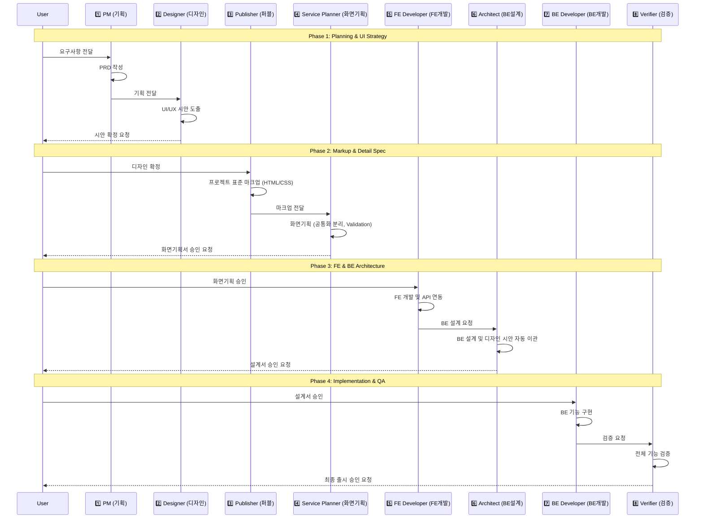

# PDD Plugin Master Workflow (v3.0 - 8 Phase Special Edition)

이 가이드는 사용자의 요청에 맞춰 최적화된 **8단계 전문 개발 워크플로우**의 운영 표준을 정의합니다.

## 1. High-Level Workflow (The 8-Phase Pipeline)

## 2. 단계별 상세 정의 및 산출물 경로

1.  **기획 (PM)**: 비즈니스 요구사항을 PRD로 정립.
    - 산출물: `docs/pages/{page}/plan_{page}.md`
2.  **디자인 (Designer)**: UI/UX 컨셉 설계 및 확정 시안 도출.
    - 산출물: `docs/pages/{page}/design_{page}.png`
3.  **퍼블 (Publisher)**: 정적 HTML 및 프로젝트 표준 CSS 마크업 생성.
    - 산출물: `docs/pages/{page}/pub_{page}.html` (HTML 선택 시)
4.  **화면기획 (Service Planner)**: 공통화 분리 및 상세 검증(Validation) 로직 설계.
    - 산출물: `docs/pages/{page}/fe_{page}.md`
5.  **FE 개발 (FE Developer)**: 마크업에 로직 주입 및 API 연동 개발.
6.  **BE 설계 (Architect)**: DB 설계 및 디자인 시안 자동 이관.
    - 산출물: `docs/03-architect/page/{page-name}.md`
7.  **BE 개발 (BE Developer)**: 설계에 따른 서버 기능 구현.
8.  **검증 (Verifier)**: 최종 품질 검수 및 워크스루 작성.
    - 산출물: `docs/04-verify/qa_report_{page}.md`, `walkthrough_{page}.md`

---

## 3. 전 단계 공통 필수 규칙 (Global Mandatory Rules)

> ⚠️ **이 규칙은 모든 에이전트가 반드시 숙지해야 하며, 위반 시 해당 단계를 즉시 중단한다.**

### 3.1 모든 단계 공통
| 규칙 | 상세 |
|:---|:---|
| **억제 및 대기** | 어떤 작업(Write/Edit) 전 반드시 구현 방향을 사용자에게 설명하고 "진행해도 될까요?" 확인 후 승인받아야 한다 |
| **자율적 수정 금지** | 사용자 요청 없이 임의로 기술 스택/로직/설계를 변경하지 않는다. 제안은 가능하나 승인 전 실행 금지 |
| **명시적 핸드오버** | 작업 완료 후 다음 단계로 스스로 넘어가지 않는다. "다음 단계로 넘어갈까요?" 확인 후 승인받아야 한다 |
| **한국어 소통** | 모든 설명, 보고, 주석은 한국어로 작성한다 |

### 3.2 코드 작성 단계만 해당 (05.FE 개발 / 07.BE 개발)
> ⚠️ 이 규칙은 **실제 소스코드를 작성하는 단계(5단계, 7단계)**에만 적용된다.
> 설계 단계(4단계 화면기획, 6단계 BE설계)에서는 적용하지 않는다.

| 규칙 | 상세 |
|:---|:---|
| **🔴 코드 난이도 확인 (최우선)** | 코드 작성 **시작 전** 반드시 사용자에게 난이도를 물어야 한다. 답변 전까지 코드 작성 금지 |
| | 1. **초보자** — 상세 주석, 단순 구조, 복잡한 추상화 지양 |
| | 2. **중급개발자** — 적절한 추상화, 핵심 주석만, 일반적 패턴 활용 |
| | 3. **고급개발자** — 디자인 패턴 적극 활용, 최적화 중심, 최소 주석 |
| **체크리스트 전수 검증** | 개발 완료 후 설계서의 체크리스트를 항목별로 검증하고 결과를 표로 보고해야 한다. 모든 항목 통과 전 완료 보고 금지 |
| **무결성 검증** | FE: `npx tsc --noEmit` / BE: `./gradlew build` 실행하여 오류 없음을 확인해야 한다 |
| **🔴 FE 연동 테스트 (BE 개발 시 필수)** | BE 개발 완료 후 반드시 FE와 연동 테스트를 수행해야 한다. 조회/생성/수정/삭제/에러 전 시나리오 확인 필수 |
| **🔴 하드코딩/로컬 제거 (BE 개발 시 필수)** | FE store에 목(Mock) 데이터, 하드코딩 배열, setTimeout, localStorage 직접 저장이 남아있으면 실제 API로 교체해야 한다 |
| **API 응답 형식 검증** | BE 응답 JSON 필드명/구조가 FE store 타입과 일치하는지 확인. 불일치 시 수정 필수 |

### 3.3 설계 단계 (04.화면기획 / 06.BE설계)
| 규칙 | 상세 |
|:---|:---|
| **설계서 승인 대기** | 설계서 작성 완료 후 사용자 검토 + 승인 전까지 다음 단계 진행 금지 |
| **체크리스트 포함 필수** | 모든 설계서에 개발 단계에서 검증할 체크리스트를 포함해야 한다 |
| **정량적 표현** | "적절한", "일반적으로" 등 추상적 표현 금지. 수치, 정규식, 구체적 에러 메시지로 명시 |

### 3.4 퍼블리싱 단계 (03.Publisher)
| 규칙 | 상세 |
|:---|:---|
| **전략 확인** | 전략 A(직접 화면 개발) / 전략 B(정적 HTML) 중 어떤 방식으로 진행할지 사용자에게 확인 |
| **로직 배제** | 비즈니스 로직(API, 상태 관리)은 배제하고 정적 UI 구성에만 집중 |
| **🔴 기존 파일 참조 (최우선)** | 작업 시작 전 반드시 동일 디렉토리·동일 계열 기존 파일을 Read/Glob으로 탐색하여 레이아웃·스타일·컴포넌트 구조를 파악할 것. 파악 내용을 사용자에게 요약 보고 후 진행 |
| **참조 없이 독립 디자인 금지** | 참조할 파일이 없을 경우에만 독자적으로 설계하되, 사용자에게 먼저 고지할 것 |
| **통일성 검증** | 구현 완료 후 기존 파일과 레이아웃·색상·간격·컴포넌트 스타일이 일치하는지 직접 비교 확인. 불일치 항목 발견 시 즉시 수정 |

### 3.5 검증 단계 (08.Verifier)
| 규칙 | 상세 |
|:---|:---|
| **직접 코드 수정 금지** | 결함 발견 시 리스트업하여 보고만. 수정은 사용자 승인 후 진행 |
| **정량적 보고** | "잘 되는 것 같습니다" 금지. "15개 필드 중 15개 통과" 등 수치로 보고 |

---

> [!IMPORTANT]
> 모든 단위 화면 프로젝트 자산(기획/디자인/퍼블/화면설계)은 **`docs/pages/{page}/`** 폴더 내에서 한눈에 관리되는 것을 원칙으로 합니다.
