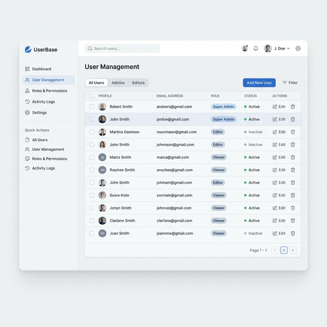
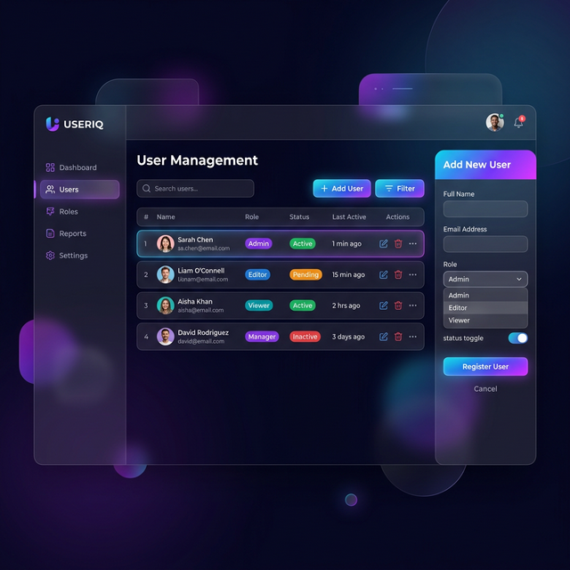

# 사용자 관리 화면 디자인 시안 (Design Options)

사용자 관리 페이지를 위한 3가지 시각적 컨셉 시안입니다. 각 시안의 특징을 확인하신 후 하나를 확정해 주세요.

---

## 시안 A: 미니멀 & 클린 (Minimalist & Clean)
깔끔한 공백(Whitespace)과 차분한 블루/그레이 톤을 사용하여 정보 인지력을 높인 디자인입니다.
- **특징**: 간결한 테이블 구조, 부드러운 그림자, 높은 가독성.
- **추천**: 정보가 많아도 눈이 피로하지 않은 디자인을 원할 때.

---

## 시안 B: 트렌디 & 다이나믹 (Trendy & Dynamic)
글래스모피즘(Glassmorphism) 효과와 생동감 넘치는 그라데이션을 사용한 현대적인 디자인입니다.
- **특징**: 화려한 UI 요소, 라운드 코너, 다크 모드 친화적.
- **추천**: 프리미엄 SaaS 제품의 세련된 느낌을 강조하고 싶을 때.

---

## 시안 C: 코퍼레이트 & 프로페셔널 (Corporate & Professional)
높은 정보 밀도와 체계적인 그리드 시스템을 갖춘 신뢰감 있는 디자인입니다.
- **특징**: 견고한 레이아웃, 명확한 액션 버튼, 다크 블루 포인트.
- **추천**: 명확한 구조와 전문적인 업무 환경을 중시할 때.

---

**[Decision]**: 마음에 드는 시안(**A, B, C**) 중 하나를 선택해 주세요. 선택하신 시안을 바탕으로 모든 세부 화면(등록, 수정 등)을 전개하겠습니다.
