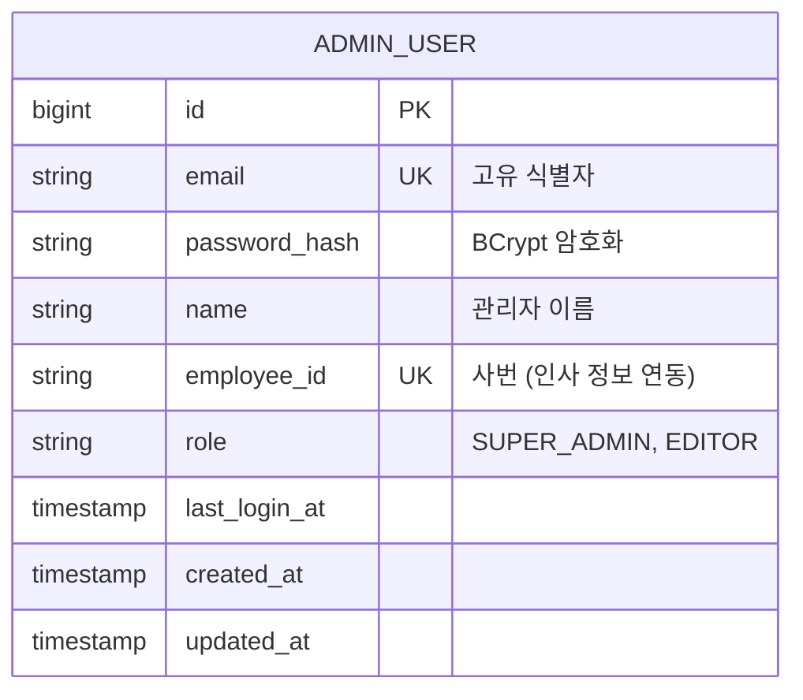

# [아키텍처 설계] 관리자 계정 관리 (Admin User Management)

## 1. 개요
- **목적**: 관리자 계정의 CRUD 연산을 위한 데이터 모델 및 통신 규약 정의.
- **선택된 디자인**: **시안 B (Side Drawer)** - 목록과 상세 등록/수정 드로어가 공존하는 멀티태스킹 인터페이스.
- **디자인 시안**: 

## 2. 데이터베이스 스키마 (Database Schema)

`admin_user` 테이블에 사번(`employee_id`) 필드를 추가하여 확장합니다.



## 3. API 명세 (API Specifications)

모든 엔드포인트는 `SUPER_ADMIN` 권한이 필요합니다 (`@PreAuthorize("hasRole('SUPER_ADMIN')")`).

### 3.1. 관리자 목록 조회
- **Endpoint**: `GET /api/v1/admins`
- **Response**: `List<AdminResponse>` (ID, 이메일, 이름, 사번, 권한, 최종로그인, 생성일)

### 3.2. 관리자 상세 조회
- **Endpoint**: `GET /api/v1/admins/{id}`
- **Response**: `AdminResponse`

### 3.3. 신규 관리자 등록
- **Endpoint**: `POST /api/v1/admins`
- **Request Body**:
  ```json
  {
    "email": "string",
    "name": "string",
    "employeeId": "string",
    "password": "string", // 직접 입력 시
    "isAutoPassword": "boolean", // 임시 비밀번호 발급 여부
    "role": "string"
  }
  ```
- **Validation**: 이메일/사번 중복 체크, 이메일 형식 확인.

### 3.4. 관리자 정보 수정
- **Endpoint**: `PATCH /api/v1/admins/{id}`
- **Request Body**: `UpdateAdminRequest` (이름, 사번, 권한, [비밀번호])

### 3.5. 관리자 삭제
- **Endpoint**: `DELETE /api/v1/admins/{id}`

## 4. 보안 및 비즈니스 로직 (Security & Logic)
- **암호화**: `BCryptPasswordEncoder` (Rounds: 12) 사용.
- **감사(Auditing)**: `JpaAuditing`을 통해 `created_at`, `updated_at` 자동 관리.
- **로그**: 계정 생성/삭제/권한 변경 시 별도의 Audit Table에 이력 기록 (추후 확장).
- **접속 로그**: 로그인 시 `last_login_at` 갱신 및 `login_history` 테이블에 기록.

## 5. 프론트엔드 검증 (Frontend Validation) 규칙
`AdminDrawer` 컴포넌트의 폼 상태 관리 및 검증을 위해 `zod` 스키마를 다음과 같이 고도화합니다.

### 5.1. 기본 검증 규칙
- **이메일**: 올바른 이메일 형식 필수.
- **성함**: 최소 2자 이상 필수.
- **사번**: 자동생성 BO-2026-00000 (5자리 숫자 시퀀스)
- **권한**: `SUPER_ADMIN` 또는 `EDITOR` 중 택일.

### 5.2. 비밀번호 조건부 검증 규칙
`zod`의 `superRefine` 기능을 활용하여 계정 **신규 생성 시**와 **기존 계정 수정 시**를 명확히 구분하여 검증합니다. 서식 내부 상태관리에 `isEditMode` (수정 모드 여부) 값을 추가하여 판별합니다.

#### A. 신규 계정 등록 시 (`isEditMode: false`)
- **수동 설정 시**: 비밀번호 필드가 **필수값**이 되며, **8자 이상** 입력해야 합니다. (미달 시 "수동 설정 시 8자 이상의 비밀번호를 입력해야 합니다." 경고 표시)
- **자동 발급 시**: 비밀번호 입력을 강제하지 않고 통과시킵니다.

#### B. 기존 계정 수정 시 (`isEditMode: true`)
계정 수정 창에서는 비밀번호 변경이 '선택 사항'이므로, 무조건 8자리를 묻지 않아야 합니다.
- **비밀번호 입력란이 깔끔하게 비워져 있을 때** (`length === 0`): 기존 비밀번호를 유지하겠다는 의미이므로 **무사 통과(Valid)** 처리합니다.
- **비밀번호 입력란에 한 글자라도 적었을 때** (`length > 0`): 비밀번호를 새롭게 바꾸려는 의도로 간주하고, 안전을 위해 반드시 **8자 이상**이 되도록 검증 에러를 띄웁니다. (만약 쓰다가 지워서 1~7자리가 남았다면 "비밀번호 변경 시 8자 이상 입력해주세요. (변경하지 않으려면 완전히 비워두세요)"라는 에러 출력)
