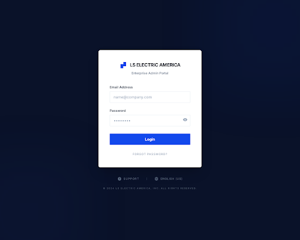

# 구현 기획서: 로그인 화면 (Login Screen)
> **경로**: `/admin/login` | **상태**: 설계 완료

---

## 1. 디자인 참조

- **테마**: Enterprise Corporate (Deep Navy)
- **컴포넌트**: `LoginForm`, `Input`, `Button`, `Toast` (sonner)

---

## 2. 화면 상세 명세 (Screen Specs)

### 2.1. 조회 및 렌더링 명세 (View Spec)
- **사용 API**: 없음
- **초기 로드**: 
  - `Background`: `#0A1F4E` (Full screen)
  - `Form Card`: 중앙 정렬, White, Rounded-lg, Shadow
  - `Auto Focus**: Email 입력 필드

### 2.2. 입력 및 검증 명세 (Input & Validation Spec)
| 필드명 | ID | 타입 | 필수 | 클라이언트 검증 (Zod) | 백엔드 검증 (Java) | 에러 메시지 |
|-------|----|-----|:---:|-------------------|-------------------|-------------------|
| 이메일 | `email` | `text` | ✅ | `.email().min(1)` | `@Email`, `@NotBlank` | "올바른 이메일 주소를 입력해주세요." |
| 비밀번호 | `password` | `password` | ✅ | `.min(4)` | `@Size(min=4)`, `@NotBlank` | "비밀번호는 최소 4자 이상이어야 합니다." |

---

## 3. 이벤트 파이프라인 (Event Pipeline)

### 3.1. 로그인 제출 (`onSubmit`)
1. **[Step 1] Client Validation**: 
   - `react-hook-form` + `Zod` 스키마 검증 실행.
2. **[Step 2] Loading State**: 
   - `isSubmitting` -> `true`. [Login] 버튼 비활성화.
3. **[Step 3] API Integration**: 
   - `POST /api/v1/auth/login` 호출.
4. **[Step 4] Server Validation**:
   - `AuthRequest` DTO에서 `@Valid` 검증 수행.
   - 비활성화 계정 여부 등 비즈니스 로직 체크.
5. **[Step 5] Success Handler**: 
   - JWT 발급 및 `localStorage` 저장.
   - `router.push("/admin/dashboard")`.
6. **[Step 6] Error Handler**: 
   - `Status 401`: `toast.error("인증에 실패했습니다.")`.
   - `loading` -> `false`.

---

## 4. 관련 코드 구조 (Reference Structure)

### Frontend (Next.js)
- `src/app/admin/login/page.tsx`: 페이지 엔트리
- `src/components/auth/LoginForm.tsx`: 로그인 폼 컴포넌트

### Backend (Spring Boot)
- `AuthController.java`: `POST /api/v1/auth/login`
- `AuthService.java`: 회원 검증 및 JWT 발급
