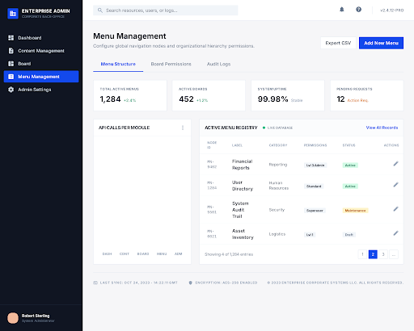

# 구현 기획서: 메인 대시보드 (KPI Dashboard)
> **경로**: `/admin/dashboard` | **상태**: 설계 완료

---

## 1. 디자인 참조

- **테마**: Enterprise Corporate (Light Mode)
- **컴포넌트**: `KpiCard` (4종), `RecentPostsTable`, `Sidebar`, `Header`

---

## 2. 화면 상세 명세 (Screen Specs)

### 2.1. 조회 및 렌더링 명세 (View Spec)
- **사용 API**: 
  - `GET /api/v1/dashboard/stats`: KPI 카드 데이터 (방문자, 게시글 수 등)
  - `GET /api/v1/dashboard/recent-posts`: 최근 게시글 목록 (최신 5개)
- **데이터 매핑**:
  - `KpiCard`: `totalVisitors`, `newPostsToday`, `activePopups`, `activeBanners` 매핑
  - `RecentPostsTable`: `title`, `category`, `createdAt`, `status` 매핑
- **예외 처리**:
  - 로딩 중: `Skeleton` UI 적용 (카드 4개 + 테이블 행)
  - 데이터 없음: KPI는 "0" 표시, 테이블은 "최근 게시글이 없습니다." 문구 출력

### 2.2. 입력 및 검증 명세 (Input & Validation Spec)
- **입력 필드**: 없음 (단순 조회 화면)

---

## 3. 이벤트 파이프라인 (Event Pipeline)

### 3.1. 초기 로드 (`onMount`)
1. **[Step 1] Data Fetching**: 
   - `TanStack Query`를 사용하여 통계 데이터와 최근 게시글 데이터를 병렬 호출.
2. **[Step 2] RBAC Check**: 
   - 현재 로그인한 사용자의 Role이 `SUPER_ADMIN` 또는 `EDITOR`인지 확인 (미인증 시 로그인 리다이렉트).

### 3.2. 테이블 행 클릭 (`onClick`)
1. **[Step 1] Navigation**: 
   - 게시글 상세 수정 페이지(`/admin/boards/[boardId]/posts/[id]/edit`)로 이동.

---

## 4. 관련 코드 구조 (Reference Structure)

### Frontend (Next.js)
- `src/app/admin/dashboard/page.tsx`: 대시보드 페이지 엔트리
- `src/components/dashboard/KpiCard.tsx`: 공통 통계 카드
- `src/components/dashboard/RecentPostsTable.tsx`: 최근 게시글 테이블

### Backend (Spring Boot)
- `DashboardController.java`: `GET /api/v1/dashboard/*`
- `DashboardService.java`: 통계 집계 및 최신 데이터 조회 로직
