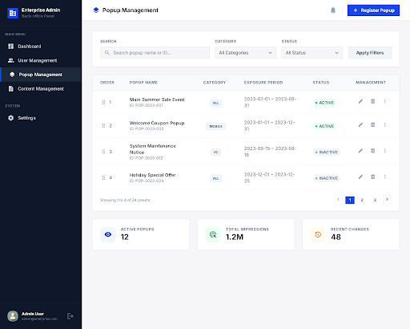

# 구현 기획서: 팝업 관리 목록 (Popup List)
> **경로**: `/admin/popups` | **상태**: 설계 완료

---

## 1. 디자인 참조

- **테마**: Enterprise Corporate
- **컴포넌트**: `DataTable`, `DragHandle`, `StatusBadge`, `SearchInput`, `Button`

---

## 2. 화면 상세 명세 (Screen Specs)

### 2.1. 조회 및 렌더링 명세 (View Spec)
- **사용 API**: 
  - `GET /api/v1/popups`: 팝업 전체 목록 조회 (정렬 순서 포함)
- **데이터 매핑**:
  - `Table Columns`: `Drag(No)`, `팝업명(title)`, `구분(deviceType)`, `노출기간(startAt ~ endAt)`, `상태(isActive)`, `작업(Edit/Delete)`
- **예외 처리**:
  - 데이터 로딩: `Skeleton` 테이블 로우 표시
  - 데이터 없음: "등록된 팝업이 없습니다. 우측 상단 '팝업 등록' 버튼을 클릭해 주세요."

### 2.2. 입력 및 검증 명세 (Input & Validation Spec)
- **검색 필터**:
  | 필드명 | 타입 | 설명 |
  |-------|-----|-----|
  | `keyword` | `text` | 팝업명 검색 |
  | `status` | `select` | 전체 / 활성 / 비활성 필터 |

---

## 3. 이벤트 파이프라인 (Event Pipeline)

### 3.1. 목록 정렬 변경 (`onDragEnd`)
1. **[Step 1] UI Update**: 드래그 앤 드롭으로 리스트 순서 즉시 변경 (Optimistic Update).
2. **[Step 2] API Call**: `PATCH /api/v1/popups/sort-order` 호출.
   - Payload: `[{ id: 1, sortOrder: 1 }, { id: 2, sortOrder: 0 }, ...]`
3. **[Step 3] Sync**: 성공 시 토스트 알림, 실패 시 원복 및 에러 토스트.

### 3.2. 상태 토글 (`onToggle`)
1. **[Step 1] API Call**: `PATCH /api/v1/popups/[id]/status` 호출 (isActive 값 반전).
2. **[Step 2] Invalidate**: 성공 시 `popups` 쿼리 무효화 및 데이터 갱신.

### 3.3. 삭제 클릭 (`onDelete`)
1. **[Step 1] Confirmation**: "정말 삭제하시겠습니까?" AlertDialog 표시.
2. **[Step 2] API Call**: `DELETE /api/v1/popups/[id]` 호출.
3. **[Step 3] Success**: 목록에서 제거 및 성공 Toast.

---

## 4. 관련 코드 구조 (Reference Structure)

### Frontend (Next.js)
- `src/app/admin/popups/page.tsx`: 목록 페이지
- `src/components/popups/PopupTable.tsx`: 드래그 가능한 데이터 테이블

### Backend (Spring Boot)
- `PopupController.java`: `GET /api/v1/popups`, `PATCH /api/v1/popups/*`, `DELETE /api/v1/popups/*`
- `PopupService.java`: 정렬 순서 업데이트 및 상태 변경 비즈니스 로직
