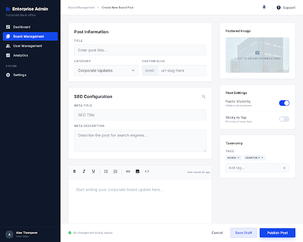

# 구현 기획서: 게시글 에디터 (Post Editor)
> **경로**: `/admin/boards/[boardId]/posts/new`, `.../[id]/edit` | **상태**: 설계 완료

---

## 1. 디자인 참조

- **테마**: 메인 에디터 + 우측 설정 사이드바
- **컴포넌트**: `Tiptap` 또는 `Quill` 에디터, `SeoPanel`, `ImageUpload`, `TagInput`

---

## 2. 화면 상세 명세 (Screen Specs)

### 2.1. 조회 및 렌더링 명세 (View Spec)
- **사용 API**: 
  - `GET /api/v1/posts/[id]`: 기존 글 로드
  - `GET /api/v1/boards`: 카테고리/게시판 목록 로드
- **레이아웃**: 
  - 좌측(75%): 제목 입력 + 리치 텍스트 에디터 본문
  - 우측(25%): 썸네일 업로드, SEO(Slug, Meta Title/Desc), 배포 설정(DRAFT/PUBLISHED)

### 2.2. 입력 및 검증 명세 (Input & Validation Spec)
| 필드명 | 입력타입 | 필수 | 검증 규칙 (Zod) | 실패 시 메시지 |
|-------|---------|:---:|-------------------|-------------------|
| **title** | `text` | ✅ | `.min(2).max(300)` | "제목은 2자 이상입니다." |
| **slug** | `text` | ✅ | `^[a-z0-9\-]+$` | "Slug는 영문 소문자, 숫자, -만 가능합니다." |
| **content** | `editor` | ✅ | `.min(1)` | "본문 내용을 입력해 주세요." |
| **metaTitle** | `text` | ❌ | `.max(100)` | - |
| **thumbnail** | `file` | ❌ | `image/*` | - |

---

## 3. 이벤트 파이프라인 (Event Pipeline)

### 3.1. 제목 입력 시 Slug 자동 생성
1. **[Step 1] onChange**: 제목 입력 시 실시간 감지.
2. **[Step 2] Transform**: 영어/숫자의 경우 하이픈으로 자동 치환하여 Slug 기본값 제안 (사용자 수정 가능).

### 3.2. 저장/발행 (`onSubmit`)
1. **[Step 1] Validation**: Zod 전체 검증.
2. **[Step 2] Image Upload**: 썸네일 or 본문 삽입 이미지가 있을 경우 R2(S3) 선행 업로드 후 URL 반환.
3. **[Step 3] API Integration**: `POST/PUT /api/v1/posts` 호출.
4. **[Step 4] Success**: 목록 이동 및 성공 토스트.

---

## 4. 관련 코드 구조 (Reference Structure)

### Frontend (Next.js)
- `src/components/editor/WysiwygEditor.tsx`: 리치 텍스트 에디터 엔진
- `src/components/editor/SeoConfigPanel.tsx`: SEO 관련 설정 패널

### Backend (Spring Boot)
- `PostController.java`: CRUD API
- `PostEntity.java`: `slug` 유니크 인덱스 적용 및 `content_html` 저장
- `PostService.java`: 슬러그 중복 검사 로직 포함
