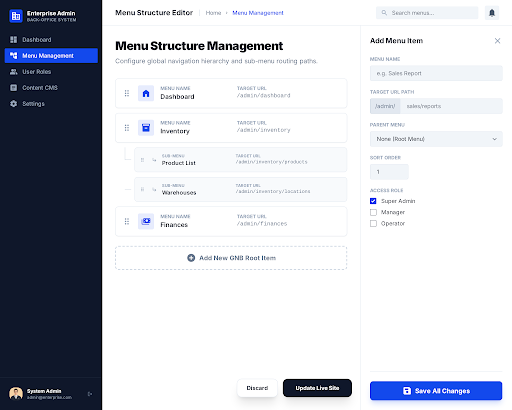

# 구현 기획서: 메뉴 구조 관리 (Menu Tree Manager)
> **경로**: `/admin/menus` | **상태**: 설계 완료

---

## 1. 디자인 참조

- **테마**: Tree 구조 (Nested List) + 우측 상세 편집 패널
- **컴포넌트**: `DndTree`, `MenuEditPanel`, `Input`, `Button`

---

## 2. 화면 상세 명세 (Screen Specs)

### 2.1. 조회 및 렌더링 명세 (View Spec)
- **사용 API**: 
  - `GET /api/v1/menus`: 전체 메뉴 트리 구조(Hierarchical JSON) 조회
- **데이터 구조**: 
  - `ID`, `Name`, `LinkUrl`, `ParentId`, `children[]` 형태의 중첩 데이터 처리

### 2.2. 입력 및 검증 명세 (Input & Validation Spec)
| 필드명 | 입력타입 | 필수 | 검증 규칙 (Zod) | 실패 시 메시지 |
|-------|---------|:---:|-------------------|-------------------|
| **name** | `text` | ✅ | `.min(1).max(50)` | "메뉴 이름은 필수입니다." |
| **linkUrl** | `text` | ❌ | - | - |
| **parentId** | `select` | ❌ | - | - |

---

## 3. 이벤트 파이프라인 (Event Pipeline)

### 3.1. 드래그 앤 드롭 트리 변경
1. **[Step 1] DndAction**: 메뉴 항목을 이동하여 상위 노드를 바꾸거나 순서를 변경.
2. **[Step 2] Recalculate**: 이동된 모든 노드의 `parentId`와 `sortOrder`를 프론트엔드에서 재계산.

### 3.2. 전체 저장 (`onSaveAll`)
1. **[Step 1] Data Packing**: 트리 전체 구조를 평탄화(Flatten)된 배열 또는 중첩 객체로 직렬화.
2. **[Step 2] API Call**: `PUT /api/v1/menus/bulk-update` 호출.
3. **[Step 3] Cache Clear**: 성공 시 프론트엔드 GNB 메뉴 데이터 캐시 무효화.

---

## 4. 관련 코드 구조 (Reference Structure)

### Frontend (Next.js)
- `src/components/menus/MenuTreeItem.tsx`: 단일 메뉴 항목 (재귀적 렌더링)
- `src/hooks/useMenuTree.ts`: 트리 이동 로직 전용 훅

### Backend (Spring Boot)
- `MenuController.java`: 조회 및 벌크 업데이트 API
- `MenuEntity.java`: Self-referencing ManyToOne (`parent`) 관계 정의
