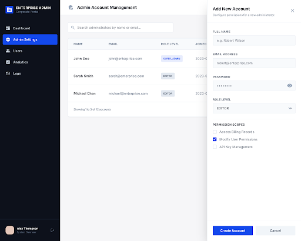

# 구현 기획서: 관리자 계정 관리 (Admin Account Manager)
> **경로**: `/admin/accounts` | **상태**: 설계 완료

---

## 1. 디자인 참조

- **테마**: 목록 테이블 + 사이드 슬라이드 패널(Drawer)
- **컴포넌트**: `DataTable`, `Drawer`, `Badge`, `RoleSelect`

---

## 2. 화면 상세 명세 (Screen Specs)

### 2.1. 조회 및 렌더링 명세 (View Spec)
- **사용 API**: 
  - `GET /api/v1/admins`: 전체 관리자 목록 조회 (SUPER_ADMIN 전용)
- **권한 제어**: 
  - `EDITOR` 계정으로 접속 시 해당 메뉴에 대한 접근을 원령 차단 (`403 Forbidden` 페이지 or 숨김 처리)

### 2.2. 입력 및 검증 명세 (Input & Validation Spec)
Drawer 패널을 통한 계정 추가/수정 시 검증 규칙입니다.
| 필드명 | ID | 타입 | 필수 | 클라이언트 검증 (Zod) | 백엔드 검증 (Java) | 메시지 |
|-------|----|-----|:---:|-------------------|-------------------|-------------------|
| 이름 | `name` | `text` | ✅ | `.min(2)` | `@NotBlank`, `@Size(min=2)` | "이름은 2자 이상입니다." |
| 이메일 | `email` | `email` | ✅ | `.email()` | `@Email`, `@NotBlank` | "이메일 형식이 아닙니다." |
| 비밀번호 | `password` | `password` | ✅ | `.min(4)` | `@Size(min=4)` | "4자 이상 필수입니다." |
| 권한등급 | `role` | `select` | ✅ | `enum(...)` | `@NotNull`, `@Enumerated` | "권한을 선택하세요." |

---

## 3. 이벤트 파이프라인 (Event Pipeline)

### 3.1. 계정 등록/수정 전송
1. **[Step 1] Validation (Client)**: 필드 검증 수행.
2. **[Step 2] API Call**: `POST/PUT /api/v1/admins` 호출.
3. **[Step 3] Validation (Server)**:
   - DTO `@Valid` 검증.
   - **이메일 중복 체크** (DB 존재 여부 확인).
4. **[Step 4] Success**: 캐시 무효화 및 Drawer 닫기.

### 3.2. 권한 배지 렌더링
1. **Logic**: `role === "SUPER_ADMIN"` 이면 네이비 블루 배지, `EDITOR` 이면 그레이 배지 노출.

---

## 4. 관련 코드 구조 (Reference Structure)

### Frontend (Next.js)
- `src/components/accounts/AccountDrawer.tsx`: 계정 생성/수정 슬라이드 폼
- `src/hooks/useAdmins.ts`: 계정 목록 관리용 TanStack Query 훅

### Backend (Spring Boot)
- `AdminController.java`: 관리자 계정 CRUD (RBAC 적용으로 `@PreAuthorize("hasRole('SUPER_ADMIN')")` 필수)
- `AdminUserEntity.java`: Password 해싱 처리 포함
