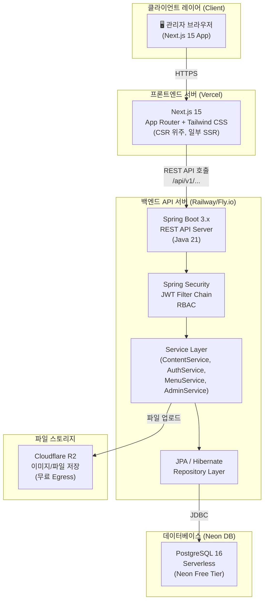
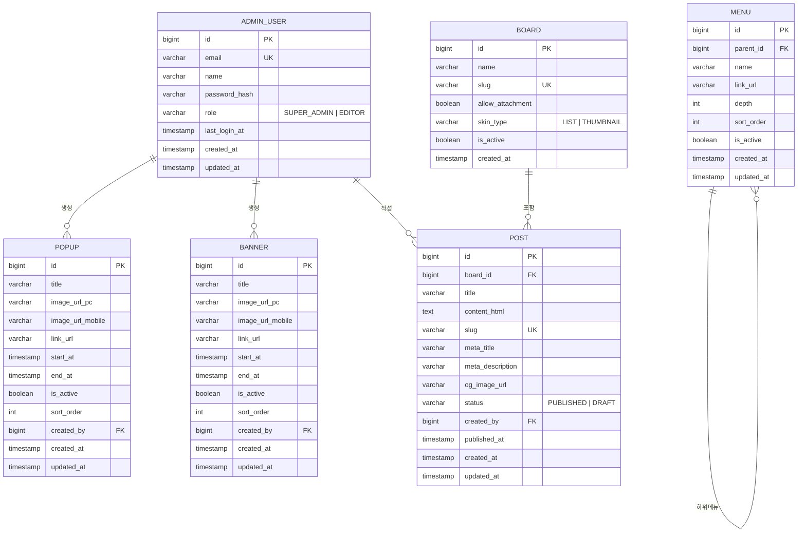
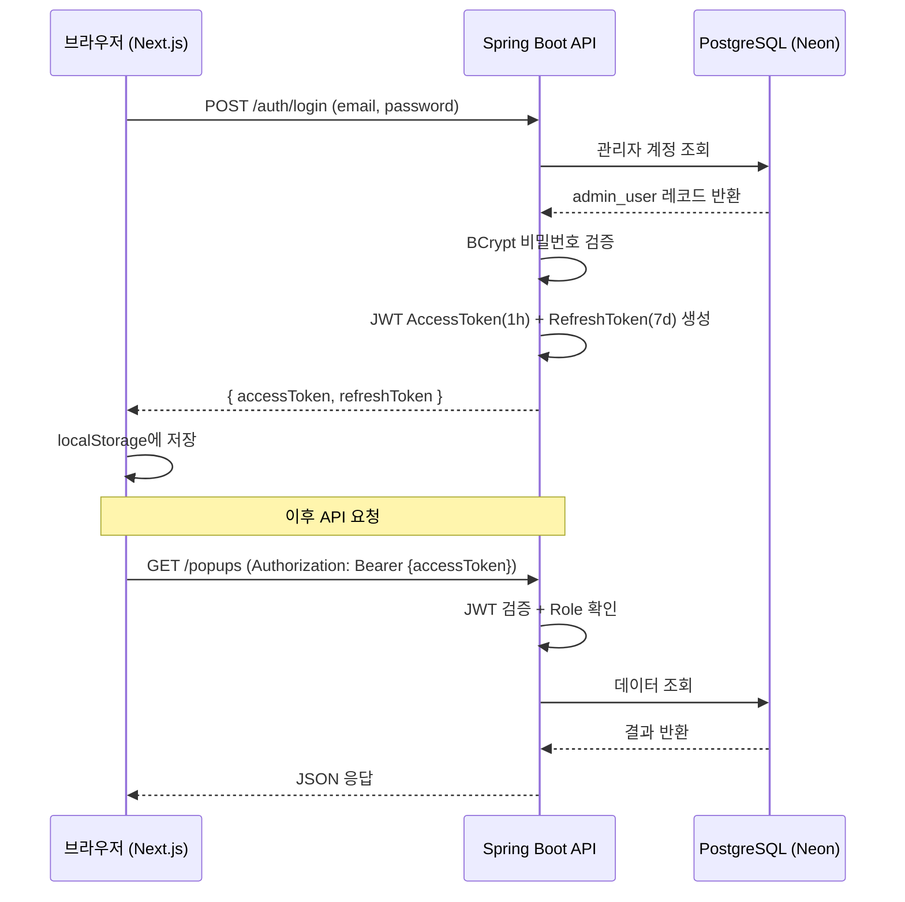

# 시스템 아키텍처 설계서 (System Architecture Document)
> **프로젝트**: 백오피스 관리 시스템
> **버전**: v1.0 | **작성일**: 2026-03-09

---

## 1. 확정 기술 스택 및 선정 사유

### 1.1 기술 스택 요약 (Tech Stack Summary)

| 레이어 | 기술 | 버전 | 선정 사유 |
|-------|------|------|---------|
| **Frontend** | Next.js | 15 (App Router) | 관리자용 CSR 위주이나, API Routes로 BFF 패턴 일부 활용 가능. Tailwind CSS로 Enterprise Corporate 스타일 구현 |
| **Backend** | Spring Boot | 3.x (Java 21) | 강력한 RBAC(Spring Security), 엔터프라이즈급 안정성, JPA 기반 ORM 완비. 확장성∙보안 우선 정책에 최적 |
| **Database** | PostgreSQL | 16 | 복잡한 관계형 모델(RBAC, 계층 메뉴) 처리에 최적. JSON 컬럼 지원으로 메타데이터 확장 유연 |
| **DB 호스팅** | **로컬 PostgreSQL** | 16 | **개발 환경**: `localhost:5432/bo` (postgres/1234). 운영 전환 시 Neon DB 또는 RDS로 마이그레이션 예정 |
| **Auth** | Spring Security + JWT | - | Stateless JWT 토큰 기반 인증, Refresh Token 전략, Role 기반 인가 |
| **파일 업로드** | AWS S3 또는 Cloudflare R2 | - | 팝업/배너 이미지 저장. Cloudflare R2는 무료 Egress 제공으로 비용 절감 |
| **배포** | Vercel (FE) + Railway/Fly.io (BE) | - | Vercel: Next.js 최적화 무료 CDN. Railway: Spring Boot 배포 무료 티어 제공 |

> ⚠️ **DB 무료 확인**: Neon DB 무료 티어 - 0.5GB 스토리지 / 5GB 에그리게이트 / 100 프로젝트. 용량 초과 시 Pro 플랜($19/월) 전환 기준.

---

## 2. 시스템 아키텍처 다이어그램 (High-Level Architecture)



---

## 3. 메뉴 구조도 (Information Architecture)

```
📁 백오피스 시스템 (/admin)
│
├── 🔐 인증 레이어
│   └── /admin/login                    # 로그인 화면
│
├── 🏠 대시보드 (SUPER_ADMIN, EDITOR)
│   └── /admin/dashboard                # KPI 통계 요약 메인
│
├── 📣 기본 콘텐츠 관리 (SUPER_ADMIN, EDITOR)
│   ├── /admin/popups                   # 팝업 목록 조회/순서변경
│   ├── /admin/popups/new               # 팝업 신규 등록
│   ├── /admin/popups/[id]/edit         # 팝업 수정
│   ├── /admin/banners                  # 배너 목록 조회/순서변경
│   ├── /admin/banners/new              # 배너 신규 등록
│   └── /admin/banners/[id]/edit        # 배너 수정
│
├── 💬 게시판 관리 (SUPER_ADMIN, EDITOR)
│   ├── /admin/boards                   # 게시판 마스터 목록 (SUPER_ADMIN만 수정)
│   ├── /admin/boards/[boardId]/posts   # 게시글 목록
│   ├── /admin/boards/[boardId]/posts/new      # 게시글 등록 (SEO+에디터)
│   └── /admin/boards/[boardId]/posts/[id]/edit # 게시글 수정
│
├── ⚙️ 사이트 설정 (SUPER_ADMIN, EDITOR)
│   ├── /admin/menus                    # GNB/LNB 메뉴 트리 편집기
│   └── /admin/seo                      # 고정 페이지 Meta Title/Description 관리
│
└── 🛡️ 관리자 설정 (SUPER_ADMIN 전용)
    ├── /admin/accounts                 # 관리자 계정 목록
    └── /admin/accounts/[id]/edit       # 계정 수정
```

---

## 4. 데이터베이스 스키마 (ERD & Table Specification)

### 4.1 ERD (Mermaid)



### 4.2 테이블 명세서

#### 테이블: `admin_user` (관리자 계정)

| 컬럼명 | 타입 | Not Null | 기본값 | 제약 | 설명 |
|-------|------|----------|--------|------|------|
| `id` | `BIGSERIAL` | ✅ | - | PK | 자동 증가 ID |
| `email` | `VARCHAR(100)` | ✅ | - | UNIQUE | 로그인 이메일(ID) |
| `name` | `VARCHAR(50)` | ✅ | - | - | 관리자 이름 |
| `password_hash` | `VARCHAR(255)` | ✅ | - | - | BCrypt 해싱된 비밀번호 |
| `role` | `VARCHAR(20)` | ✅ | `'EDITOR'` | CHECK | `SUPER_ADMIN` 또는 `EDITOR` |
| `last_login_at` | `TIMESTAMPTZ` | ❌ | - | - | 마지막 로그인 일시 |
| `created_at` | `TIMESTAMPTZ` | ✅ | `NOW()` | - | 계정 생성 일시 |
| `updated_at` | `TIMESTAMPTZ` | ✅ | `NOW()` | - | 마지막 수정 일시 |

#### 테이블: `popup` (팝업 관리)

| 컬럼명 | 타입 | Not Null | 기본값 | 제약 | 설명 |
|-------|------|----------|--------|------|------|
| `id` | `BIGSERIAL` | ✅ | - | PK | 자동 증가 ID |
| `title` | `VARCHAR(100)` | ✅ | - | - | 팝업 제목 (관리용) |
| `image_url_pc` | `VARCHAR(500)` | ❌ | - | - | PC 화면 이미지 URL |
| `image_url_mobile` | `VARCHAR(500)` | ❌ | - | - | 모바일 이미지 URL |
| `link_url` | `VARCHAR(500)` | ❌ | - | - | 클릭 시 이동할 URL |
| `start_at` | `TIMESTAMPTZ` | ✅ | - | - | 노출 시작 일시 |
| `end_at` | `TIMESTAMPTZ` | ✅ | - | - | 노출 종료 일시 |
| `is_active` | `BOOLEAN` | ✅ | `false` | - | 활성화 여부 토글 |
| `sort_order` | `INTEGER` | ✅ | `0` | - | 노출 우선순위 순서 |
| `created_by` | `BIGINT` | ✅ | - | FK → admin_user.id | 등록자 |
| `created_at` | `TIMESTAMPTZ` | ✅ | `NOW()` | - | 등록 일시 |

#### 테이블: `post` (게시글)

| 컬럼명 | 타입 | Not Null | 기본값 | 제약 | 설명 |
|-------|------|----------|--------|------|------|
| `id` | `BIGSERIAL` | ✅ | - | PK | 자동 증가 ID |
| `board_id` | `BIGINT` | ✅ | - | FK → board.id | 소속 게시판 |
| `title` | `VARCHAR(300)` | ✅ | - | - | 게시글 제목 |
| `content_html` | `TEXT` | ❌ | - | - | WYSIWYG HTML 본문 |
| `slug` | `VARCHAR(200)` | ✅ | - | UNIQUE | SEO용 커스텀 URL |
| `meta_title` | `VARCHAR(100)` | ❌ | - | - | SEO Meta Title |
| `meta_description` | `VARCHAR(300)` | ❌ | - | - | SEO Meta Description |
| `og_image_url` | `VARCHAR(500)` | ❌ | - | - | OGP 이미지 URL |
| `status` | `VARCHAR(20)` | ✅ | `'DRAFT'` | CHECK | `PUBLISHED` 또는 `DRAFT` |
| `created_by` | `BIGINT` | ✅ | - | FK → admin_user.id | 작성자 |
| `published_at` | `TIMESTAMPTZ` | ❌ | - | - | 발행 일시 |
| `created_at` | `TIMESTAMPTZ` | ✅ | `NOW()` | - | 생성 일시 |

#### 테이블: `menu` (메뉴 구조)

| 컬럼명 | 타입 | Not Null | 기본값 | 제약 | 설명 |
|-------|------|----------|--------|------|------|
| `id` | `BIGSERIAL` | ✅ | - | PK | 자동 증가 ID |
| `parent_id` | `BIGINT` | ❌ | `NULL` | FK → menu.id | NULL이면 1 Depth(GNB) |
| `name` | `VARCHAR(100)` | ✅ | - | - | 메뉴 표시 이름 |
| `link_url` | `VARCHAR(500)` | ❌ | - | - | 클릭 시 이동 URL |
| `depth` | `INTEGER` | ✅ | `1` | - | 1: GNB, 2: 서브메뉴 |
| `sort_order` | `INTEGER` | ✅ | `0` | - | 같은 depth 내 순서 |
| `is_active` | `BOOLEAN` | ✅ | `true` | - | 메뉴 표시 여부 |

---

## 5. API 계약 명세 (API Contract)

### 5.1 공통 규칙
- **Base URL**: `https://api.ge-bo.com/api/v1`
- **인증**: 모든 엔드포인트는 `Authorization: Bearer {JWT}` 헤더 필수 (로그인 제외)
- **에러 응답 공통 포맷**:
```json
{
  "status": 401,
  "error": "UNAUTHORIZED",
  "message": "인증 토큰이 만료되었습니다.",
  "timestamp": "2026-03-09T12:00:00Z"
}
```

### 5.2 인증 API

#### `POST /auth/login` - 관리자 로그인
**Request Body**:
```json
{
  "email": "admin@ge.com",
  "password": "P@ssw0rd123"
}
```
**Success Response (200)**:
```json
{
  "accessToken": "eyJhbGciOiJIUzI1NiJ9...",
  "refreshToken": "dGhpcyBpcyBhIHJlZnJlc2...",
  "expiresIn": 3600,
  "adminInfo": {
    "id": 1,
    "name": "홍길동",
    "role": "SUPER_ADMIN"
  }
}
```
**Error (401)**: 이메일/비밀번호 불일치 시

---

### 5.3 팝업 API

#### `GET /popups` - 팝업 목록 조회
**Query Params**: `?page=0&size=10&status=ACTIVE`
**Success Response (200)**:
```json
{
  "content": [
    {
      "id": 1,
      "title": "봄 프로모션 팝업",
      "isActive": true,
      "startAt": "2026-03-01T00:00:00Z",
      "endAt": "2026-03-31T23:59:59Z",
      "sortOrder": 1
    }
  ],
  "totalElements": 5,
  "totalPages": 1
}
```

#### `POST /popups` - 팝업 등록
**Request Body (multipart/form-data)**:
```
title: "봄 프로모션"
linkUrl: "https://geamerica.com/promo"
startAt: "2026-03-01T00:00:00Z"
endAt: "2026-03-31T23:59:59Z"
isActive: true
imageFilePc: [Binary File]
imageFileMobile: [Binary File]
```

#### `PATCH /popups/sort-order` - 팝업 순서 변경
**Request Body**:
```json
{
  "orders": [
    {"id": 3, "sortOrder": 1},
    {"id": 1, "sortOrder": 2},
    {"id": 2, "sortOrder": 3}
  ]
}
```

---

### 5.4 게시글 API

#### `GET /boards/{boardId}/posts` - 게시글 목록
**Query Params**: `?page=0&size=10&keyword=검색어&status=PUBLISHED`

#### `POST /boards/{boardId}/posts` - 게시글 등록
**Request Body**:
```json
{
  "title": "신제품 출시 안내",
  "contentHtml": "<p>본문 내용...</p>",
  "slug": "new-product-launch-2026",
  "metaTitle": "신제품 출시",
  "metaDescription": "새로운 제품을 소개합니다.",
  "status": "PUBLISHED"
}
```

---

## 6. 화면별 폼 검증 명세 (Input Validation)

### 6.1 팝업 등록 폼

| 필드명 | 타입 | 필수 | 최대 길이 | 검증 규칙 | 에러 메시지 |
|-------|------|------|----------|---------|-----------|
| `title` | `text` | ✅ | 100자 | 공백 제거 후 1자 이상 | "팝업 제목을 입력해주세요." |
| `linkUrl` | `url` | ❌ | 500자 | `^https?://.*` 패턴 | "올바른 URL 형식이 아닙니다. (https://...)" |
| `startAt` | `datetime` | ✅ | - | 현재 시각 이후 | "노출 시작 일시는 현재 이후여야 합니다." |
| `endAt` | `datetime` | ✅ | - | startAt 이후 | "종료 일시는 시작 일시 이후여야 합니다." |
| `imageFilePc` | `file` | ❌ | 5MB | `.jpg,.png,.webp` | "이미지는 5MB 이하 JPG/PNG/WEBP만 가능합니다." |

### 6.2 게시글 등록 폼

| 필드명 | 타입 | 필수 | 최대 길이 | 검증 규칙 | 에러 메시지 |
|-------|------|------|----------|---------|-----------|
| `title` | `text` | ✅ | 300자 | 공백 제거 후 2자 이상 | "제목을 입력해주세요." |
| `slug` | `text` | ✅ | 200자 | `^[a-z0-9\-]+$` 소문자+숫자+하이픈 | "Slug는 소문자, 숫자, 하이픈(-)만 사용 가능합니다." |
| `metaTitle` | `text` | ❌ | 100자 | - | "Meta Title은 100자 이하로 입력해주세요." |
| `metaDescription` | `textarea` | ❌ | 300자 | - | "Meta Description은 300자 이하로 입력해주세요." |

---

## 7. 보안 전략 (Authorization & Security)

### 7.1 JWT 인증 플로우



### 7.2 RBAC (Role-Based Access Control)

| 기능 | SUPER_ADMIN | EDITOR |
|-----|:-----------:|:------:|
| 대시보드 조회 | ✅ | ✅ |
| 팝업/배너 CRUD | ✅ | ✅ |
| 게시글 CRUD | ✅ | ✅ |
| 메뉴 구조 편집 | ✅ | ✅ |
| 게시판 마스터 생성/삭제 | ✅ | ❌ |
| 관리자 계정 관리 | ✅ | ❌ |

### 7.3 보안 상세 항목
- **비밀번호**: BCrypt (rounds=12) 해싱
- **JWT Secret**: 256-bit 이상 랜덤 키, 환경변수로 관리
- **HTTPS**: 운영 환경 전 구간 TLS 1.3 강제
- **CORS**: Spring Boot에서 허용 Origin을 Vercel 도메인으로 제한

## 8. 화면별 상세 구현 명세 (Screen Mapping & Event Specs)

각 화면에 대한 상세 구현 지시서는 아래 개별 문서에서 관리합니다.

1. **[01. 로그인 화면 (Login Screen)](./pages/01-login.md)**
2. **[02. 메인 대시보드 (KPI Dashboard)](./pages/02-dashboard.md)**
3. **[03. 팝업 관리 목록 (Popup List)](./pages/03-popup-list.md)**
4. **[04. 팝업 등록/수정 폼 (Popup Form)](./pages/04-popup-form.md)**
5. **[05. 게시글 에디터 (Post Editor)](./pages/05-post-editor.md)**
6. **[06. 메뉴 구조 관리 (Menu Tree Manager)](./pages/06-menu-tree.md)**
7. **[07. 관리자 계정 관리 (Admin Account Manager)](./pages/07-admin-account.md)**

---


---

## 9. 프론트엔드 상태 관리 전략

| 상태 종류 | 관리 도구 | 근거 |
|---------|---------|------|
| 서버 데이터 (팝업 목록 등) | **TanStack Query (React Query)** | 캐싱, 자동 재요청, 로딩/에러 상태 자동화 |
| 전역 클라이언트 상태 (로그인 세션, 권한) | **Zustand** | 경량 상태관리. React Context보다 리렌더 최소화 |
| 폼 상태 및 검증 | **React Hook Form + Zod** | 타입 안전한 스키마 검증, 비제어 컴포넌트 방식으로 성능 최적화 |

---

## 10. Neon DB 연결 설정 (Spring Boot)

```yaml
# application.yml (개발 환경 - 로컬 PostgreSQL)
spring:
  datasource:
    url: jdbc:postgresql://localhost:5432/bo
    username: postgres
    password: "1234"
    driver-class-name: org.postgresql.Driver
  jpa:
    database-platform: org.hibernate.dialect.PostgreSQLDialect
    hibernate:
      ddl-auto: update   # 개발 환경: update (운영 시 validate + Flyway로 전환)
    show-sql: true       # 개발 중 SQL 쿼리 콘솔 출력

# JWT 설정
app:
  jwt:
    secret: ${JWT_SECRET_KEY}   # 256-bit 이상 환경변수 (.env 또는 application-local.yml)
    expiration: 3600            # 1시간 (초)
    refresh-expiration: 604800  # 7일 (초)

# 포트 설정 정보
# Frontend: 3002
# Backend: 8002
```
