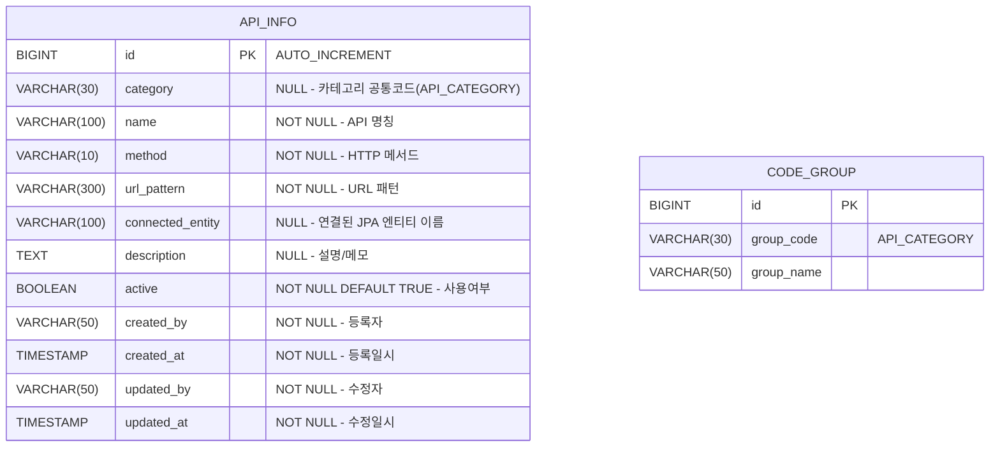

# API 정보 관리 DB 설계서

## 1. ERD



> `category` 컬럼은 공통코드 그룹 `API_CATEGORY`의 코드값(`code`)을 저장합니다. (FK 미설정, 코드값 참조)

## 2. 테이블 상세

### 2.1 api_info

| 컬럼 | 타입 | NULL | 기본값 | 설명 |
|:---|:---|:---|:---|:---|
| `id` | BIGINT | NO | AUTO_INCREMENT | PK |
| `category` | VARCHAR(30) | YES | NULL | 카테고리 코드 (공통코드 `API_CATEGORY` 참조) |
| `name` | VARCHAR(100) | NO | - | API 명칭 (예: 게시판 목록 조회) |
| `method` | VARCHAR(10) | NO | - | HTTP 메서드 (GET / POST / PUT / PATCH / DELETE) |
| `url_pattern` | VARCHAR(300) | NO | - | URL 패턴 (예: /api/v1/page-data/{slug}) |
| `connected_entity` | VARCHAR(100) | YES | NULL | 연결된 JPA 엔티티 자동매핑 이름 |
| `description` | TEXT | YES | NULL | 설명 및 메모 |
| `active` | BOOLEAN | NO | TRUE | 사용여부 |
| `created_by` | VARCHAR(50) | NO | - | 등록자 ID |
| `created_at` | TIMESTAMP | NO | CURRENT_TIMESTAMP | 등록일시 |
| `updated_by` | VARCHAR(50) | NO | - | 수정자 ID |
| `updated_at` | TIMESTAMP | NO | CURRENT_TIMESTAMP | 수정일시 |

**인덱스:**
| 인덱스명 | 컬럼 | 타입 | 설명 |
|:---|:---|:---|:---|
| PK_API_INFO | `id` | PRIMARY | PK |
| IDX_API_INFO_CATEGORY | `category` | INDEX | 카테고리별 조회 |
| IDX_API_INFO_METHOD | `method` | INDEX | 메서드별 조회 |

### 2.2 공통코드 — API_CATEGORY (code_group / code_detail)

기존 `code_group` / `code_detail` 테이블 활용 (신규 테이블 불필요)

| code (코드값) | name (코드명) | sort_order |
|:---|:---|:---|
| `MENU` | 메뉴 | 1 |
| `CODE` | 공통코드 | 2 |
| `PAGE_DATA` | 페이지데이터 | 3 |
| `PAGE_TEMPLATE` | 페이지템플릿 | 4 |
| `ADMIN_USER` | 관리자 | 5 |
| `ETC` | 기타 | 99 |

## 3. DDL

```sql
-- api_info 테이블
CREATE TABLE api_info (
    id BIGINT AUTO_INCREMENT PRIMARY KEY,
    category VARCHAR(30),
    name VARCHAR(100) NOT NULL,
    method VARCHAR(10) NOT NULL,
    url_pattern VARCHAR(300) NOT NULL,
    connected_entity VARCHAR(100),
    description TEXT,
    active BOOLEAN NOT NULL DEFAULT TRUE,
    created_by VARCHAR(50) NOT NULL,
    created_at TIMESTAMP NOT NULL DEFAULT CURRENT_TIMESTAMP,
    updated_by VARCHAR(50) NOT NULL,
    updated_at TIMESTAMP NOT NULL DEFAULT CURRENT_TIMESTAMP ON UPDATE CURRENT_TIMESTAMP,

    INDEX idx_api_info_category (category),
    INDEX idx_api_info_method (method)
);

-- 공통코드 그룹 등록
INSERT INTO code_group (group_code, group_name, description, active, created_by, updated_by) VALUES
('API_CATEGORY', 'API 카테고리', 'API 정보 관리 카테고리 구분', TRUE, 'system', 'system');

-- 공통코드 상세 등록
INSERT INTO code_detail (group_id, code, name, sort_order, active, created_by, updated_by) VALUES
((SELECT id FROM code_group WHERE group_code = 'API_CATEGORY'), 'MENU',          '메뉴',       1,  TRUE, 'system', 'system'),
((SELECT id FROM code_group WHERE group_code = 'API_CATEGORY'), 'CODE',          '공통코드',   2,  TRUE, 'system', 'system'),
((SELECT id FROM code_group WHERE group_code = 'API_CATEGORY'), 'PAGE_DATA',     '페이지데이터', 3, TRUE, 'system', 'system'),
((SELECT id FROM code_group WHERE group_code = 'API_CATEGORY'), 'PAGE_TEMPLATE', '페이지템플릿', 4, TRUE, 'system', 'system'),
((SELECT id FROM code_group WHERE group_code = 'API_CATEGORY'), 'ADMIN_USER',    '관리자',     5,  TRUE, 'system', 'system'),
((SELECT id FROM code_group WHERE group_code = 'API_CATEGORY'), 'ETC',           '기타',       99, TRUE, 'system', 'system');

-- api_info 초기 데이터
INSERT INTO api_info (category, name, method, url_pattern, description, active, created_by, updated_by) VALUES
('MENU',          '메뉴 목록 조회',        'GET',    '/api/v1/menus',                          '전체 메뉴 트리 조회',            TRUE, 'system', 'system'),
('MENU',          '메뉴 등록',             'POST',   '/api/v1/menus',                          '신규 메뉴 등록',                 TRUE, 'system', 'system'),
('MENU',          '메뉴 수정',             'PUT',    '/api/v1/menus/{id}',                     '메뉴 정보 수정',                 TRUE, 'system', 'system'),
('MENU',          '메뉴 삭제',             'DELETE', '/api/v1/menus/{id}',                     '메뉴 삭제',                      TRUE, 'system', 'system'),
('CODE',          '공통코드 그룹 목록',     'GET',    '/api/v1/codes',                          '공통코드 그룹 전체 목록',        TRUE, 'system', 'system'),
('CODE',          '공통코드 그룹 등록',     'POST',   '/api/v1/codes',                          '공통코드 그룹 신규 등록',        TRUE, 'system', 'system'),
('CODE',          '공통코드 상세 등록',     'POST',   '/api/v1/codes/{groupId}/details',        '공통코드 상세항목 등록',         TRUE, 'system', 'system'),
('PAGE_DATA',     '페이지 데이터 목록',    'GET',    '/api/v1/page-data/{slug}',               'slug 기반 페이지 데이터 목록',   TRUE, 'system', 'system'),
('PAGE_DATA',     '페이지 데이터 등록',    'POST',   '/api/v1/page-data/{slug}',               'slug 기반 페이지 데이터 등록',   TRUE, 'system', 'system'),
('PAGE_DATA',     '페이지 데이터 수정',    'PUT',    '/api/v1/page-data/{slug}/{id}',          'slug+id 기반 데이터 수정',       TRUE, 'system', 'system'),
('PAGE_DATA',     '페이지 데이터 삭제',    'DELETE', '/api/v1/page-data/{slug}/{id}',          'slug+id 기반 데이터 삭제',       TRUE, 'system', 'system'),
('PAGE_TEMPLATE', '템플릿 목록 조회',      'GET',    '/api/v1/page-templates',                 '페이지 템플릿 목록 조회',        TRUE, 'system', 'system'),
('PAGE_TEMPLATE', '템플릿 slug 조회',      'GET',    '/api/v1/page-templates/by-slug/{slug}',  'slug로 템플릿 단건 조회',        TRUE, 'system', 'system'),
('PAGE_TEMPLATE', '템플릿 저장',           'POST',   '/api/v1/page-templates',                 '템플릿 신규 저장',               TRUE, 'system', 'system'),
('PAGE_TEMPLATE', '템플릿 수정',           'PUT',    '/api/v1/page-templates/{id}',            '템플릿 수정',                    TRUE, 'system', 'system'),
('ADMIN_USER',    '관리자 목록 조회',      'GET',    '/api/v1/admin-users',                    '관리자 계정 목록 조회',          TRUE, 'system', 'system'),
('ADMIN_USER',    '관리자 등록',           'POST',   '/api/v1/admin-users',                    '관리자 계정 등록',               TRUE, 'system', 'system');
```

## 4. 설계 결정 사항

- **단일 테이블**: API 목록은 레지스트리 성격으로 `category` 컬럼 필터링으로 충분.
- **category → 공통코드 연동**: `API_CATEGORY` 그룹코드로 관리 — 카테고리 추가/수정 시 공통코드에서 관리.
- **method**: VARCHAR(10) — GET/POST/PUT/PATCH/DELETE 직접 저장.
- **url_pattern**: 경로 변수(`{slug}`, `{id}`)를 포함한 패턴 문자열 저장.
- **감사 컬럼 4개 필수**: created_by / created_at / updated_by / updated_at (JPA Auditing 적용).
