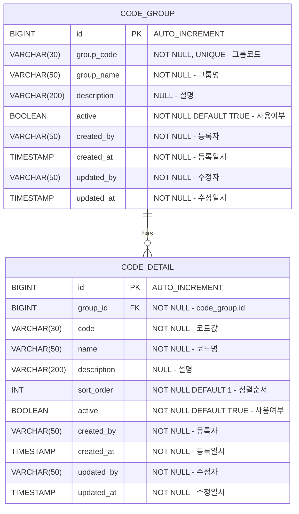

# 공통코드 관리 DB 설계서

## 1. ERD



## 2. 테이블 상세

### 2.1 code_group

| 컬럼 | 타입 | NULL | 기본값 | 설명 |
|:---|:---|:---|:---|:---|
| `id` | BIGINT | NO | AUTO_INCREMENT | PK |
| `group_code` | VARCHAR(30) | NO | - | 그룹코드 (UNIQUE) |
| `group_name` | VARCHAR(50) | NO | - | 그룹명 |
| `description` | VARCHAR(200) | YES | NULL | 설명 |
| `active` | BOOLEAN | NO | TRUE | 사용여부 |
| `created_by` | VARCHAR(50) | NO | - | 등록자 |
| `created_at` | TIMESTAMP | NO | CURRENT_TIMESTAMP | 등록일시 |
| `updated_by` | VARCHAR(50) | NO | - | 수정자 |
| `updated_at` | TIMESTAMP | NO | CURRENT_TIMESTAMP | 수정일시 |

**인덱스:**
| 인덱스명 | 컬럼 | 타입 | 설명 |
|:---|:---|:---|:---|
| PK_CODE_GROUP | `id` | PRIMARY | PK |
| UQ_CODE_GROUP_CODE | `group_code` | UNIQUE | 그룹코드 유일성 |

### 2.2 code_detail

| 컬럼 | 타입 | NULL | 기본값 | 설명 |
|:---|:---|:---|:---|:---|
| `id` | BIGINT | NO | AUTO_INCREMENT | PK |
| `group_id` | BIGINT | NO | - | 그룹 ID (FK) |
| `code` | VARCHAR(30) | NO | - | 코드값 |
| `name` | VARCHAR(50) | NO | - | 코드명 |
| `description` | VARCHAR(200) | YES | NULL | 설명 |
| `sort_order` | INT | NO | 1 | 정렬순서 |
| `active` | BOOLEAN | NO | TRUE | 사용여부 |
| `created_by` | VARCHAR(50) | NO | - | 등록자 |
| `created_at` | TIMESTAMP | NO | CURRENT_TIMESTAMP | 등록일시 |
| `updated_by` | VARCHAR(50) | NO | - | 수정자 |
| `updated_at` | TIMESTAMP | NO | CURRENT_TIMESTAMP | 수정일시 |

**인덱스:**
| 인덱스명 | 컬럼 | 타입 | 설명 |
|:---|:---|:---|:---|
| PK_CODE_DETAIL | `id` | PRIMARY | PK |
| FK_CODE_DETAIL_GROUP | `group_id` | FOREIGN KEY | ON DELETE CASCADE |
| UQ_CODE_DETAIL_GROUP_CODE | `group_id, code` | UNIQUE | 같은 그룹 내 코드값 유일성 |
| IDX_CODE_DETAIL_SORT | `group_id, sort_order` | INDEX | 그룹별 정렬 조회 |

## 3. DDL

```sql
CREATE TABLE code_group (
    id BIGINT AUTO_INCREMENT PRIMARY KEY,
    group_code VARCHAR(30) NOT NULL UNIQUE,
    group_name VARCHAR(50) NOT NULL,
    description VARCHAR(200),
    active BOOLEAN NOT NULL DEFAULT TRUE,
    created_by VARCHAR(50) NOT NULL,
    created_at TIMESTAMP NOT NULL DEFAULT CURRENT_TIMESTAMP,
    updated_by VARCHAR(50) NOT NULL,
    updated_at TIMESTAMP NOT NULL DEFAULT CURRENT_TIMESTAMP ON UPDATE CURRENT_TIMESTAMP
);

CREATE TABLE code_detail (
    id BIGINT AUTO_INCREMENT PRIMARY KEY,
    group_id BIGINT NOT NULL,
    code VARCHAR(30) NOT NULL,
    name VARCHAR(50) NOT NULL,
    description VARCHAR(200),
    sort_order INT NOT NULL DEFAULT 1,
    active BOOLEAN NOT NULL DEFAULT TRUE,
    created_by VARCHAR(50) NOT NULL,
    created_at TIMESTAMP NOT NULL DEFAULT CURRENT_TIMESTAMP,
    updated_by VARCHAR(50) NOT NULL,
    updated_at TIMESTAMP NOT NULL DEFAULT CURRENT_TIMESTAMP ON UPDATE CURRENT_TIMESTAMP,

    CONSTRAINT fk_code_detail_group FOREIGN KEY (group_id) REFERENCES code_group(id) ON DELETE CASCADE,
    CONSTRAINT uq_code_detail_group_code UNIQUE (group_id, code),
    INDEX idx_code_detail_sort (group_id, sort_order)
);

-- 초기 데이터
INSERT INTO code_group (group_code, group_name, description, active, created_by, updated_by) VALUES
('STATUS', '상태코드', '시스템 공통 상태 코드', TRUE, 'system', 'system'),
('CATEGORY', '분류코드', '게시물/콘텐츠 분류', TRUE, 'system', 'system'),
('PRIORITY', '우선순위', '업무 우선순위 구분', TRUE, 'system', 'system');

INSERT INTO code_detail (group_id, code, name, sort_order, active, created_by, updated_by) VALUES
((SELECT id FROM code_group WHERE group_code = 'STATUS'), 'APPROVED', '승인완료', 1, TRUE, 'system', 'system'),
((SELECT id FROM code_group WHERE group_code = 'STATUS'), 'PROGRESS', '진행중', 2, TRUE, 'system', 'system'),
((SELECT id FROM code_group WHERE group_code = 'STATUS'), 'PENDING', '대기', 3, TRUE, 'system', 'system'),
((SELECT id FROM code_group WHERE group_code = 'STATUS'), 'REJECTED', '반려', 4, TRUE, 'system', 'system'),
((SELECT id FROM code_group WHERE group_code = 'CATEGORY'), 'NOTICE', '공지사항', 1, TRUE, 'system', 'system'),
((SELECT id FROM code_group WHERE group_code = 'CATEGORY'), 'FAQ', 'FAQ', 2, TRUE, 'system', 'system'),
((SELECT id FROM code_group WHERE group_code = 'CATEGORY'), 'EVENT', '이벤트', 3, TRUE, 'system', 'system'),
((SELECT id FROM code_group WHERE group_code = 'PRIORITY'), 'URGENT', '긴급', 1, TRUE, 'system', 'system'),
((SELECT id FROM code_group WHERE group_code = 'PRIORITY'), 'NORMAL', '보통', 2, TRUE, 'system', 'system'),
((SELECT id FROM code_group WHERE group_code = 'PRIORITY'), 'LOW', '낮음', 3, TRUE, 'system', 'system');
```
