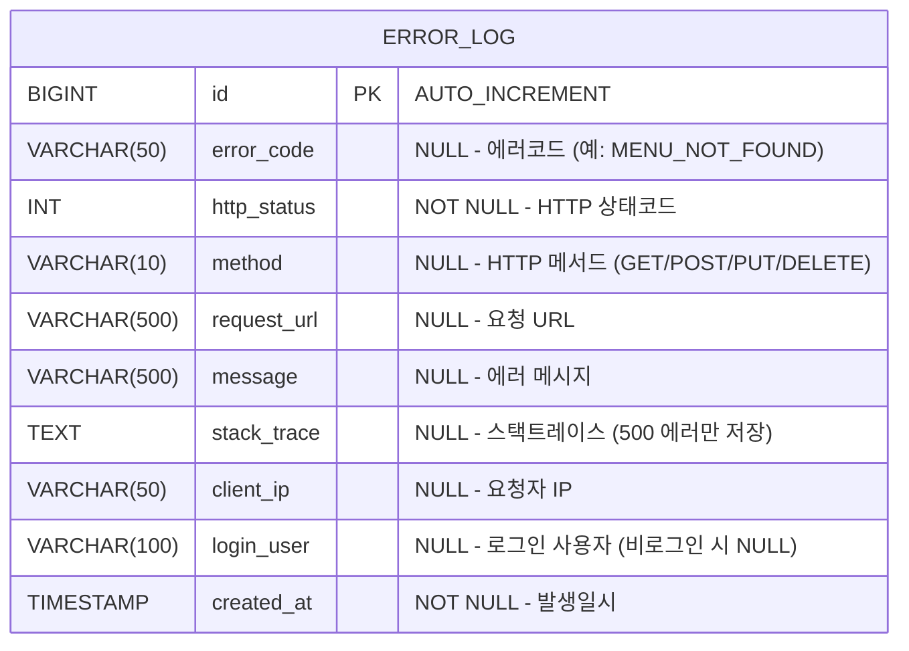

# 오류로그 DB 설계서

## 1. ERD



---

## 2. 테이블 상세

### 2.1 error_log

> 이력성 테이블 — 수정 없이 저장만 하므로 `updated_by`, `updated_at` 컬럼 제외

| 컬럼 | 타입 | NULL | 기본값 | 설명 |
|:---|:---|:---|:---|:---|
| `id` | BIGINT | NO | AUTO_INCREMENT | PK |
| `error_code` | VARCHAR(50) | YES | NULL | 에러코드 (예: `MENU_NOT_FOUND`, `VALIDATION_FAILED`) |
| `http_status` | INT | NO | - | HTTP 상태코드 (400, 403, 404, 409, 500 등) |
| `method` | VARCHAR(10) | YES | NULL | HTTP 메서드 (GET, POST, PUT, DELETE, OPTIONS) |
| `request_url` | VARCHAR(500) | YES | NULL | 요청 URL (쿼리스트링 포함) |
| `message` | VARCHAR(500) | YES | NULL | 사용자 노출 에러 메시지 |
| `stack_trace` | TEXT | YES | NULL | 스택트레이스 (500 에러만 저장, 나머지 NULL) |
| `client_ip` | VARCHAR(50) | YES | NULL | 요청자 IP (X-Forwarded-For 우선) |
| `login_user` | VARCHAR(100) | YES | NULL | 로그인 사용자 이메일 (비로그인 시 NULL) |
| `created_at` | TIMESTAMP | NO | CURRENT_TIMESTAMP | 발생일시 |

---

## 3. 인덱스 설계

| 인덱스명 | 컬럼 | 타입 | 설명 |
|:---|:---|:---|:---|
| `PK_ERROR_LOG` | `id` | PRIMARY | PK |
| `IDX_ERROR_LOG_STATUS` | `http_status` | INDEX | 상태코드별 조회용 (B 단계 대비) |
| `IDX_ERROR_LOG_CREATED` | `created_at` | INDEX | 발생일시 범위 조회용 (B 단계 대비) |

---

## 4. 설계 결정 사항

| 항목 | 결정 | 이유 |
|:---|:---|:---|
| `updated_by/at` 제외 | ✅ 제외 | 오류 이력은 수정 없는 append-only 데이터 |
| `stack_trace` 조건부 저장 | 500 에러만 | 4xx는 비즈니스 예외라 스택트레이스 불필요, 용량 절약 |
| 비동기 저장 (`@Async`) | ✅ 적용 | 오류 저장이 메인 API 응답 지연에 영향 없도록 |
| `client_ip` 수집 | X-Forwarded-For 우선 | Render(Reverse Proxy) 환경에서 실제 클라이언트 IP 수집 |
| `login_user` nullable | ✅ | 미인증 요청(401 등)에서도 로그 저장 가능하도록 |

---

## 5. DDL

```sql
CREATE TABLE error_log (
    id          BIGSERIAL       PRIMARY KEY,
    error_code  VARCHAR(50),
    http_status INT             NOT NULL,
    method      VARCHAR(10),
    request_url VARCHAR(500),
    message     VARCHAR(500),
    stack_trace TEXT,
    client_ip   VARCHAR(50),
    login_user  VARCHAR(100),
    created_at  TIMESTAMP       NOT NULL DEFAULT CURRENT_TIMESTAMP
);

-- 인덱스
CREATE INDEX IDX_ERROR_LOG_STATUS  ON error_log (http_status);
CREATE INDEX IDX_ERROR_LOG_CREATED ON error_log (created_at);
```
