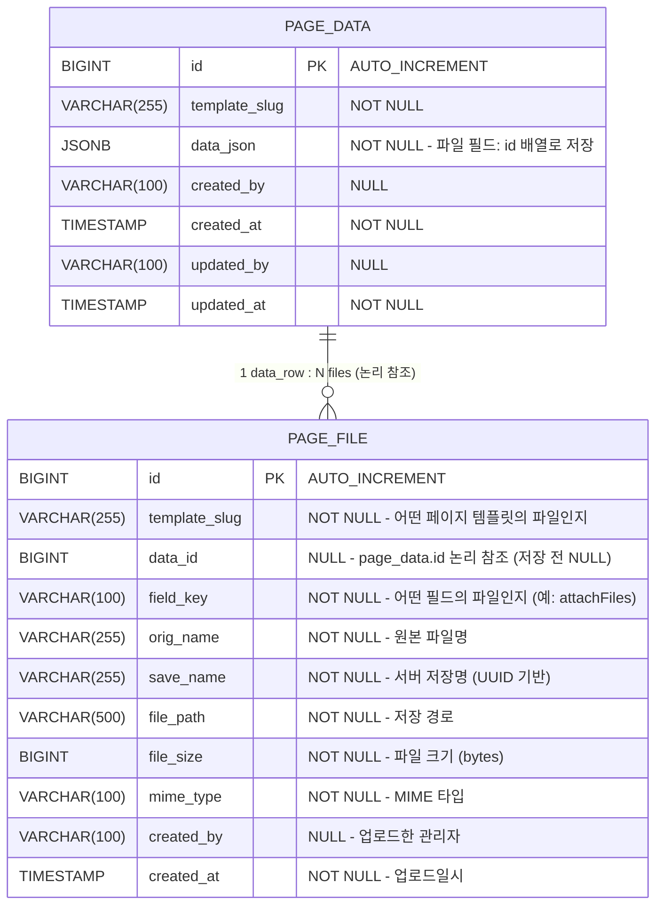

# 레이어 팝업 빌더 — 파일 업로드 필드 DB 설계서

- **기능명**: 파일 업로드 필드 타입 추가
- **작성일**: 2026-03-29
- **변경 요약**: 레이어 팝업 빌더에서 생성된 페이지의 파일 첨부를 저장하기 위한 `page_file` 테이블 신규 추가
- **참조 문서**: `docs/db/page-data/db_page-data.md`

---

## 1. ERD



> **참조 방식**: `page_file.data_id`는 `page_data.id`를 **논리적으로** 참조합니다.
> DB FK 제약 미적용 — 임시 업로드(data_id=NULL) 상태를 허용해야 하기 때문.

---

## 2. 테이블 상세

### 2.1 page_file (신규)

| 컬럼 | 타입 | NULL | 기본값 | 설명 |
|:---|:---|:---|:---|:---|
| `id` | BIGINT | NO | AUTO_INCREMENT | PK |
| `template_slug` | VARCHAR(255) | NO | - | 어떤 페이지 템플릿의 파일인지 (예: `user-register`) |
| `data_id` | BIGINT | YES | NULL | page_data.id 논리 참조. 폼 저장 전 업로드 시 NULL |
| `field_key` | VARCHAR(100) | NO | - | 어떤 필드에 첨부된 파일인지 (예: `attachFiles`) |
| `orig_name` | VARCHAR(255) | NO | - | 사용자가 업로드한 원본 파일명 (예: `report.pdf`) |
| `save_name` | VARCHAR(255) | NO | - | 서버 저장명 — UUID + 원본 확장자 (예: `a3f2c1d4.pdf`) |
| `file_path` | VARCHAR(500) | NO | - | 저장 경로 (예: `/uploads/page-files/2026/03/`) |
| `file_size` | BIGINT | NO | - | 파일 크기 (bytes) |
| `mime_type` | VARCHAR(100) | NO | - | MIME 타입 (예: `application/pdf`, `image/jpeg`) |
| `created_by` | VARCHAR(100) | YES | NULL | 업로드한 관리자 이메일 |
| `created_at` | TIMESTAMP | NO | CURRENT_TIMESTAMP | 업로드일시 |

**인덱스:**

| 인덱스명 | 컬럼 | 타입 | 설명 |
|:---|:---|:---|:---|
| PK_PAGE_FILE | `id` | PRIMARY | PK |
| IDX_PAGE_FILE_DATA_ID | `data_id` | INDEX | data_id로 파일 목록 조회 |
| IDX_PAGE_FILE_SLUG_FIELD | `template_slug, field_key` | INDEX | 슬러그+필드키 조합 조회 |
| IDX_PAGE_FILE_SAVE_NAME | `save_name` | UNIQUE | 저장명 중복 방지 |

---

## 3. data_json 연계 구조

`page_data.data_json`의 파일 필드는 `page_file.id` 배열로 저장합니다.

```json
{
  "userName": "홍길동",
  "status": "active",
  "attachFiles": [1, 2, 3]
}
```

- 키(`attachFiles`)는 빌더에서 설정한 `fieldKey` 값
- 값은 `page_file.id` 정수 배열
- 파일 상세 정보 조회 시 `SELECT * FROM page_file WHERE id IN (1, 2, 3)`

---

## 4. 파일 저장 경로 규칙

```
{upload_root}/page-files/{YYYY}/{MM}/{save_name}
예) /uploads/page-files/2026/03/a3f2c1d4.pdf
```

- `save_name` = `UUID.randomUUID() + "." + 원본확장자` (소문자 변환)
- 연월 디렉토리 자동 생성
- 동일 파일명 재업로드 시 UUID로 충돌 없음

---

## 5. 삭제 전략

물리 삭제 방식 (soft delete 미사용):

| 시나리오 | 처리 방식 |
|:---|:---|
| 파일 단건 삭제 | `page_file` row 삭제 → 파일시스템 파일 삭제 |
| page_data 삭제 시 | 연관 `page_file` 전체 삭제 → 파일시스템 삭제 (서비스 레이어 처리) |
| 임시 파일 정리 (data_id=NULL) | 배치 또는 업로드 후 일정 시간 경과 시 자동 삭제 (추후 개발) |

---

## 6. 제약 사항

- `save_name`은 전체 유니크 — UUID 기반으로 중복 없음 보장
- `file_size` 단위는 bytes (클라이언트 MB 표시는 애플리케이션 레벨 변환)
- `mime_type`은 파일 확장자 기반이 아닌 실제 Content-Type 헤더 값으로 저장
- `data_id=NULL` 상태의 임시 파일은 폼 저장 완료 시 즉시 data_id 업데이트

---

## 7. DDL

```sql
CREATE TABLE page_file (
    id            BIGINT AUTO_INCREMENT PRIMARY KEY,
    template_slug VARCHAR(255) NOT NULL,
    data_id       BIGINT       NULL,
    field_key     VARCHAR(100) NOT NULL,
    orig_name     VARCHAR(255) NOT NULL,
    save_name     VARCHAR(255) NOT NULL,
    file_path     VARCHAR(500) NOT NULL,
    file_size     BIGINT       NOT NULL,
    mime_type     VARCHAR(100) NOT NULL,
    created_by    VARCHAR(100) NULL,
    created_at    TIMESTAMP    NOT NULL DEFAULT CURRENT_TIMESTAMP,

    CONSTRAINT uq_page_file_save_name UNIQUE (save_name),
    INDEX idx_page_file_data_id      (data_id),
    INDEX idx_page_file_slug_field   (template_slug, field_key)
);
```

> `ddl-auto: update` 설정으로 JPA Entity 작성 시 자동 생성됩니다. DDL은 참고용입니다.
