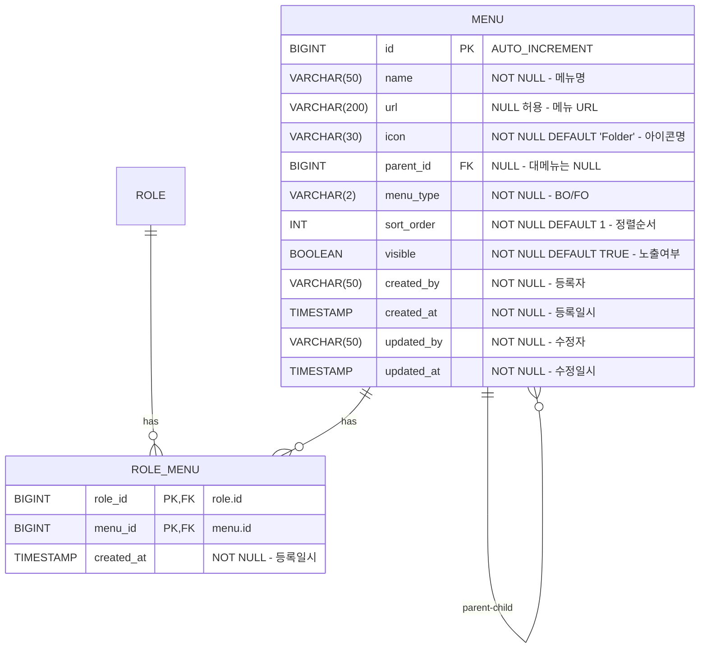

# 메뉴 관리 DB 설계서

## 1. ERD



## 2. 테이블 상세

### 2.1 menu

| 컬럼 | 타입 | NULL | 기본값 | 설명 |
|:---|:---|:---|:---|:---|
| `id` | BIGINT | NO | AUTO_INCREMENT | PK |
| `name` | VARCHAR(50) | NO | - | 메뉴명 |
| `url` | VARCHAR(200) | YES | NULL | 메뉴 URL (대메뉴는 NULL 가능) |
| `icon` | VARCHAR(30) | NO | 'Folder' | lucide-react 아이콘명 |
| `parent_id` | BIGINT | YES | NULL | 상위 메뉴 ID (self-join FK) |
| `menu_type` | VARCHAR(2) | NO | - | 'BO' 또는 'FO' |
| `sort_order` | INT | NO | 1 | 정렬 순서 (1~999) |
| `visible` | BOOLEAN | NO | TRUE | 노출 여부 |
| `created_by` | VARCHAR(50) | NO | - | 등록자 ID |
| `created_at` | TIMESTAMP | NO | CURRENT_TIMESTAMP | 등록일시 |
| `updated_by` | VARCHAR(50) | NO | - | 수정자 ID |
| `updated_at` | TIMESTAMP | NO | CURRENT_TIMESTAMP | 수정일시 |

**인덱스:**
| 인덱스명 | 컬럼 | 타입 | 설명 |
|:---|:---|:---|:---|
| PK_MENU | `id` | PRIMARY | PK |
| FK_MENU_PARENT | `parent_id` | FOREIGN KEY | self-join, ON DELETE SET NULL |
| IDX_MENU_TYPE_PARENT | `menu_type, parent_id` | INDEX | 타입별 + 부모별 조회 |
| UQ_MENU_NAME_PARENT_TYPE | `name, parent_id, menu_type` | UNIQUE | 동일 부모/타입 내 이름 중복 방지 |

### 2.2 role_menu

| 컬럼 | 타입 | NULL | 기본값 | 설명 |
|:---|:---|:---|:---|:---|
| `role_id` | BIGINT | NO | - | 역할 ID (FK → role.id) |
| `menu_id` | BIGINT | NO | - | 메뉴 ID (FK → menu.id) |
| `created_at` | TIMESTAMP | NO | CURRENT_TIMESTAMP | 매핑 등록일시 |

**인덱스:**
| 인덱스명 | 컬럼 | 타입 | 설명 |
|:---|:---|:---|:---|
| PK_ROLE_MENU | `role_id, menu_id` | PRIMARY (복합) | 복합 PK |
| FK_ROLE_MENU_ROLE | `role_id` | FOREIGN KEY | ON DELETE CASCADE |
| FK_ROLE_MENU_MENU | `menu_id` | FOREIGN KEY | ON DELETE CASCADE |

## 3. DDL

```sql
-- 메뉴 테이블
CREATE TABLE menu (
    id BIGINT AUTO_INCREMENT PRIMARY KEY,
    name VARCHAR(50) NOT NULL,
    url VARCHAR(200),
    icon VARCHAR(30) NOT NULL DEFAULT 'Folder',
    parent_id BIGINT,
    menu_type VARCHAR(2) NOT NULL,
    sort_order INT NOT NULL DEFAULT 1,
    visible BOOLEAN NOT NULL DEFAULT TRUE,
    created_by VARCHAR(50) NOT NULL,
    created_at TIMESTAMP NOT NULL DEFAULT CURRENT_TIMESTAMP,
    updated_by VARCHAR(50) NOT NULL,
    updated_at TIMESTAMP NOT NULL DEFAULT CURRENT_TIMESTAMP ON UPDATE CURRENT_TIMESTAMP,

    CONSTRAINT fk_menu_parent FOREIGN KEY (parent_id) REFERENCES menu(id) ON DELETE SET NULL,
    CONSTRAINT uq_menu_name_parent_type UNIQUE (name, parent_id, menu_type),
    INDEX idx_menu_type_parent (menu_type, parent_id)
);

-- 역할-메뉴 매핑 테이블
CREATE TABLE role_menu (
    role_id BIGINT NOT NULL,
    menu_id BIGINT NOT NULL,
    created_at TIMESTAMP NOT NULL DEFAULT CURRENT_TIMESTAMP,

    PRIMARY KEY (role_id, menu_id),
    CONSTRAINT fk_role_menu_role FOREIGN KEY (role_id) REFERENCES role(id) ON DELETE CASCADE,
    CONSTRAINT fk_role_menu_menu FOREIGN KEY (menu_id) REFERENCES menu(id) ON DELETE CASCADE
);

-- 초기 데이터
INSERT INTO menu (name, url, icon, parent_id, menu_type, sort_order, visible, created_by, updated_by) VALUES
('Settings', NULL, 'Settings', NULL, 'BO', 1, TRUE, 'system', 'system'),
('관리자 관리', '/admin/settings/users', 'Users', 1, 'BO', 1, TRUE, 'system', 'system'),
('권한 관리', '/admin/settings/roles', 'Shield', 1, 'BO', 2, TRUE, 'system', 'system'),
('메뉴 관리', '/admin/settings/menus', 'Menu', 1, 'BO', 3, TRUE, 'system', 'system'),
('Make', NULL, 'Wand2', NULL, 'BO', 2, TRUE, 'system', 'system'),
('List', '/admin/templates/make/list', 'Wand2', 5, 'BO', 1, TRUE, 'system', 'system'),
('Demo', NULL, 'Monitor', NULL, 'BO', 3, TRUE, 'system', 'system'),
('목록1(FE)', '/admin/templates/demo/page1', 'Monitor', 7, 'BO', 1, TRUE, 'system', 'system'),
('목록2(FE)', '/admin/templates/demo/page2', 'Monitor', 7, 'BO', 2, TRUE, 'system', 'system');
```
