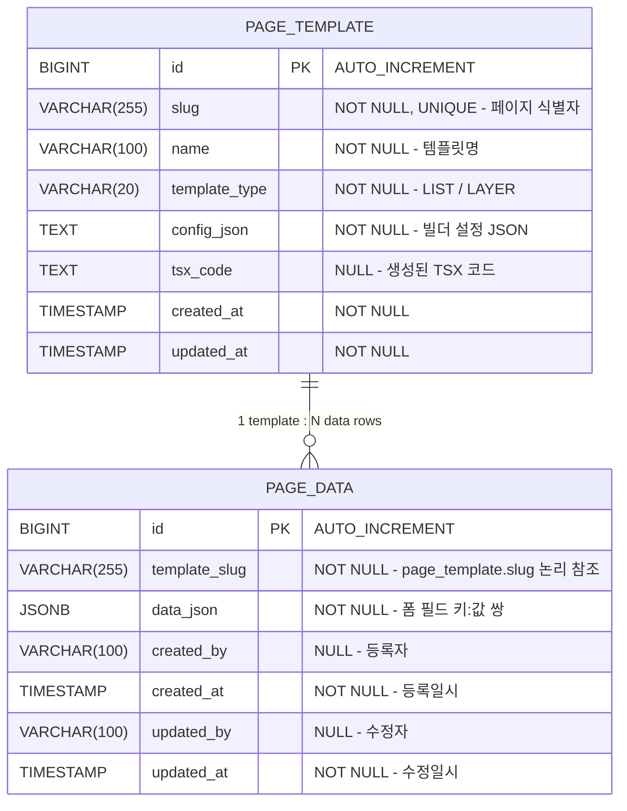

# 페이지 데이터 DB 설계서

## 1. ERD



> **참조 방식**: `template_slug`는 `page_template.slug`를 **논리적으로** 참조합니다.
> DB FK 제약은 의도적으로 적용하지 않음 — 템플릿이 삭제되어도 실데이터는 보존해야 하기 때문.

---

## 2. 테이블 상세

### 2.1 page_data

| 컬럼 | 타입 | NULL | 기본값 | 설명 |
|:---|:---|:---|:---|:---|
| `id` | BIGINT | NO | AUTO_INCREMENT | PK |
| `template_slug` | VARCHAR(255) | NO | - | 어떤 페이지의 데이터인지 식별 (ex: `user-list`) |
| `data_json` | JSONB | NO | - | 폼 필드 데이터 전체 (`{ "name": "홍길동", "status": "active" }`) |
| `created_by` | VARCHAR(100) | YES | NULL | 등록자 (로그인한 관리자 이메일) |
| `created_at` | TIMESTAMP | NO | CURRENT_TIMESTAMP | 등록일시 |
| `updated_by` | VARCHAR(100) | YES | NULL | 수정자 (로그인한 관리자 이메일) |
| `updated_at` | TIMESTAMP | NO | CURRENT_TIMESTAMP | 수정일시 |

**인덱스:**

| 인덱스명 | 컬럼 | 타입 | 설명 |
|:---|:---|:---|:---|
| PK_PAGE_DATA | `id` | PRIMARY | PK |
| IDX_PAGE_DATA_SLUG | `template_slug` | INDEX | slug별 데이터 조회 최적화 |
| IDX_PAGE_DATA_SLUG_CREATED | `template_slug, created_at DESC` | INDEX | 목록 최신순 정렬 최적화 |

---

## 3. JSONB 구조 예시

`data_json` 컬럼은 페이지 메이커에서 정의한 필드 키:값 쌍을 저장합니다.
키는 빌더에서 설정한 `fieldKey` 또는 라벨의 camelCase 변환값입니다.

```json
{
  "name": "홍길동",
  "email": "hong@example.com",
  "status": "active",
  "joinDate": "2026-03-27",
  "memo": "특이사항 없음"
}
```

**검색 방식별 JSONB 쿼리:**

| 필드 타입 | 검색 방식 | SQL 예시 |
|:---|:---|:---|
| input / textarea | 부분 일치 (ILIKE) | `data_json->>'name' ILIKE '%홍%'` |
| select / radio | 정확 일치 | `data_json->>'status' = 'active'` |
| date | 범위 검색 (추후 확장) | `data_json->>'joinDate' >= '2026-01-01'` |
| 빈 값 | 조건 제외 | WHERE 절에서 생략 |

---

## 4. 제약 사항

- `template_slug`와 `page_template.slug`는 논리적으로 동일한 값을 사용하며, 애플리케이션 레벨에서 일관성 유지
- `data_json`은 빈 객체(`{}`)를 허용하지 않으며, 최소 1개 이상의 필드를 포함해야 함
- `created_at`, `updated_at`은 JPA Auditing으로 자동 관리
- `created_by`, `updated_by`는 JWT 토큰에서 추출한 이메일로 자동 설정

---

## 5. DDL

```sql
-- 페이지 데이터 테이블 (PostgreSQL)
CREATE TABLE page_data (
    id          BIGSERIAL PRIMARY KEY,
    template_slug VARCHAR(255) NOT NULL,
    data_json   JSONB NOT NULL DEFAULT '{}',
    created_by  VARCHAR(100),
    created_at  TIMESTAMP NOT NULL DEFAULT CURRENT_TIMESTAMP,
    updated_by  VARCHAR(100),
    updated_at  TIMESTAMP NOT NULL DEFAULT CURRENT_TIMESTAMP
);

-- 인덱스
CREATE INDEX idx_page_data_slug
    ON page_data (template_slug);

CREATE INDEX idx_page_data_slug_created
    ON page_data (template_slug, created_at DESC);
```

> `ddl-auto: update` 설정으로 JPA Entity 작성 시 자동 생성됩니다. DDL은 참고용입니다.
