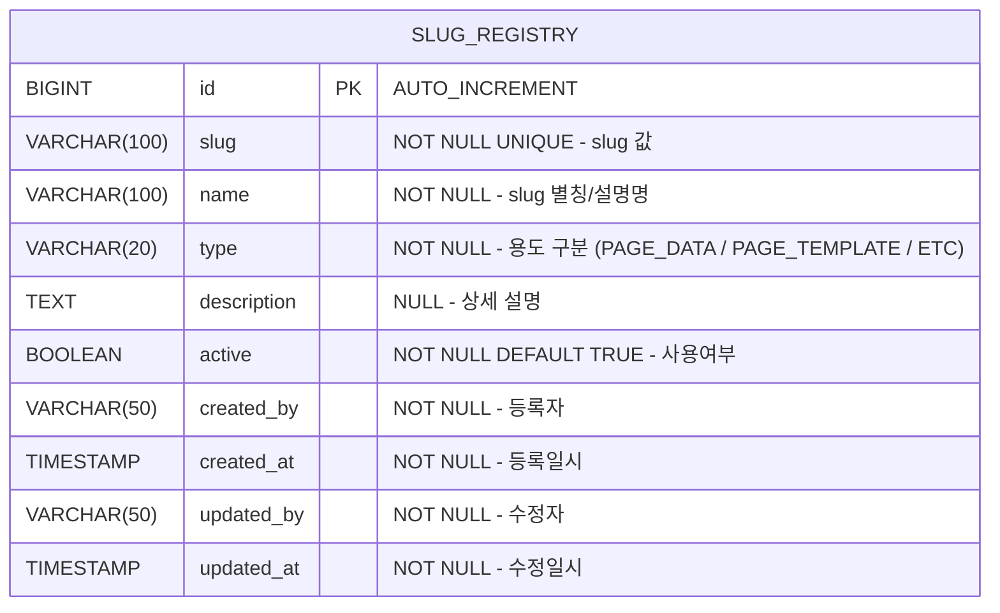

# Slug 레지스트리 DB 설계서

## 1. ERD



## 2. 테이블 상세

### 2.1 slug_registry

| 컬럼 | 타입 | NULL | 기본값 | 설명 |
|:---|:---|:---|:---|:---|
| `id` | BIGINT | NO | AUTO_INCREMENT | PK |
| `slug` | VARCHAR(100) | NO | - | slug 값 (시스템 내 유일, 예: boardListSave) |
| `name` | VARCHAR(100) | NO | - | slug 별칭 (예: 게시판 목록 저장) |
| `type` | VARCHAR(20) | NO | - | 용도 구분 (PAGE_DATA / PAGE_TEMPLATE / ETC) |
| `description` | TEXT | YES | NULL | 상세 설명 |
| `active` | BOOLEAN | NO | TRUE | 사용여부 (false이면 위젯 빌더 드롭다운 미노출) |
| `created_by` | VARCHAR(50) | NO | - | 등록자 ID |
| `created_at` | TIMESTAMP | NO | CURRENT_TIMESTAMP | 등록일시 |
| `updated_by` | VARCHAR(50) | NO | - | 수정자 ID |
| `updated_at` | TIMESTAMP | NO | CURRENT_TIMESTAMP | 수정일시 |

**인덱스:**
| 인덱스명 | 컬럼 | 타입 | 설명 |
|:---|:---|:---|:---|
| PK_SLUG_REGISTRY | `id` | PRIMARY | PK |
| UQ_SLUG_REGISTRY_SLUG | `slug` | UNIQUE | slug 중복 방지 |
| IDX_SLUG_REGISTRY_TYPE | `type` | INDEX | type별 필터 조회 |

### 2.2 type 코드값

공통코드 테이블 미사용 — 고정 Enum으로 관리 (변동 가능성 낮음)

| type 값 | 설명 |
|:---|:---|
| `PAGE_DATA` | page_data API (`/api/v1/page-data/{slug}`) 연동 slug |
| `PAGE_TEMPLATE` | page_template slug |
| `ETC` | 기타 용도 slug |

## 3. DDL

```sql
-- slug_registry 테이블
CREATE TABLE slug_registry (
    id          BIGINT AUTO_INCREMENT PRIMARY KEY,
    slug        VARCHAR(100) NOT NULL,
    name        VARCHAR(100) NOT NULL,
    type        VARCHAR(20)  NOT NULL,
    description TEXT,
    active      BOOLEAN      NOT NULL DEFAULT TRUE,
    created_by  VARCHAR(50)  NOT NULL,
    created_at  TIMESTAMP    NOT NULL DEFAULT CURRENT_TIMESTAMP,
    updated_by  VARCHAR(50)  NOT NULL,
    updated_at  TIMESTAMP    NOT NULL DEFAULT CURRENT_TIMESTAMP ON UPDATE CURRENT_TIMESTAMP,

    UNIQUE INDEX uq_slug_registry_slug (slug),
    INDEX idx_slug_registry_type (type)
);
```

## 4. 초기 데이터

서버 기동 시 `DataInitializer`에서 삽입 (멱등성 보장 — count > 0이면 스킵)

| slug | name | type |
|:---|:---|:---|
| `boardListSave` | 게시판 목록 | PAGE_DATA |
| `board-search` | 게시판 검색 | PAGE_DATA |

> 초기 데이터는 최소한으로 유지하고, 실제 사용 slug는 관리 화면에서 등록

## 5. 설계 결정 사항

- **slug UNIQUE 제약**: 시스템 내 slug는 유일해야 하므로 DB 레벨 UNIQUE 인덱스 적용.
- **type은 Enum 고정**: PAGE_DATA / PAGE_TEMPLATE / ETC 3가지로 충분, 공통코드 불필요.
- **통합 뷰 전략**: 관리 페이지에서 slug 별로 page_template / page_data 실제 사용 여부를 FE에서 병렬 조회하여 표시.
- **위젯 빌더 연동**: `active=true`인 목록만 `/api/v1/slug-registry/active` 로 조회 → Search·Form의 `connectedSlug` 드롭다운에 사용.
- **감사 컬럼 4개 필수**: created_by / created_at / updated_by / updated_at (JPA Auditing 적용).
