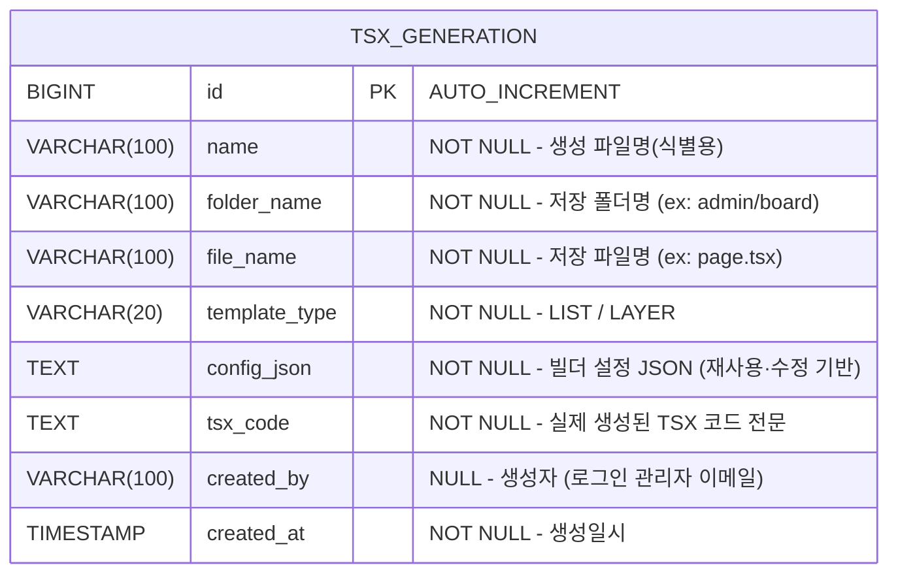

# TSX 생성 이력 DB 설계서

## 1. ERD



> **설계 의도**
> - `[생성]` 버튼 클릭 시 TSX 파일을 로컬에 저장하는 동시에 이 테이블에 이력을 남긴다.
> - `[저장/수정]` 버튼(기존 `page_template`)과 **완전히 분리**된 독립 테이블이다.
> - 생성 이력을 기반으로 configJson을 다시 불러와 빌더에서 재편집·재생성할 수 있다.

---

## 2. 테이블 상세

### 2.1 tsx_generation

| 컬럼 | 타입 | NULL | 기본값 | 설명 |
|:---|:---|:---|:---|:---|
| `id` | BIGINT | NO | AUTO_INCREMENT | PK |
| `name` | VARCHAR(100) | NO | - | 이력 식별용 이름 (ex: `게시판 목록`) |
| `folder_name` | VARCHAR(100) | NO | - | 생성된 파일의 폴더 경로 (ex: `admin/board`) |
| `file_name` | VARCHAR(100) | NO | - | 생성된 파일명 (ex: `page.tsx`) |
| `template_type` | VARCHAR(20) | NO | - | `LIST` 또는 `LAYER` |
| `config_json` | TEXT | NO | - | 빌더 설정 JSON 전체 (재편집 기반) |
| `tsx_code` | TEXT | NO | - | 실제 생성된 TSX 코드 전문 |
| `created_by` | VARCHAR(100) | YES | NULL | 생성자 (JWT에서 추출한 이메일) |
| `created_at` | TIMESTAMP | NO | CURRENT_TIMESTAMP | 생성일시 |

**인덱스:**

| 인덱스명 | 컬럼 | 타입 | 설명 |
|:---|:---|:---|:---|
| PK_TSX_GENERATION | `id` | PRIMARY | PK |
| IDX_TSX_GEN_TYPE | `template_type` | INDEX | 타입별 이력 조회 최적화 |
| IDX_TSX_GEN_CREATED | `created_at DESC` | INDEX | 최신 이력 정렬 최적화 |

---

## 3. config_json 구조 예시

`config_json` 컬럼은 빌더에서 설정한 전체 구성을 JSON으로 저장합니다.
이 값을 불러오면 빌더에서 그대로 재편집할 수 있습니다.

```json
{
  "templateType": "LIST",
  "searchRows": [...],
  "tableColumns": [...],
  "buttonConfigs": [...],
  "displayMode": "pagination"
}
```

---

## 4. 제약 사항

- `config_json`, `tsx_code`는 빈 문자열을 허용하지 않음
- `folder_name`은 `/`를 포함할 수 있으며, 실제 파일 시스템 경로로 사용됨
- `created_at`은 JPA Auditing으로 자동 관리
- `created_by`는 JWT 토큰에서 추출한 이메일로 자동 설정 (비로그인 환경에서는 NULL 허용)
- 동일 `folder_name + file_name` 조합으로 여러 이력이 존재할 수 있음 (덮어쓰기 방식이 아닌 이력 누적)

---

## 5. DDL

```sql
-- TSX 생성 이력 테이블 (PostgreSQL)
CREATE TABLE tsx_generation (
    id            BIGSERIAL PRIMARY KEY,
    name          VARCHAR(100) NOT NULL,
    folder_name   VARCHAR(100) NOT NULL,
    file_name     VARCHAR(100) NOT NULL,
    template_type VARCHAR(20)  NOT NULL,
    config_json   TEXT         NOT NULL,
    tsx_code      TEXT         NOT NULL,
    created_by    VARCHAR(100),
    created_at    TIMESTAMP    NOT NULL DEFAULT CURRENT_TIMESTAMP
);

-- 인덱스
CREATE INDEX idx_tsx_gen_type
    ON tsx_generation (template_type);

CREATE INDEX idx_tsx_gen_created
    ON tsx_generation (created_at DESC);
```

> `ddl-auto: update` 설정으로 JPA Entity 작성 시 자동 생성됩니다. DDL은 참고용입니다.
