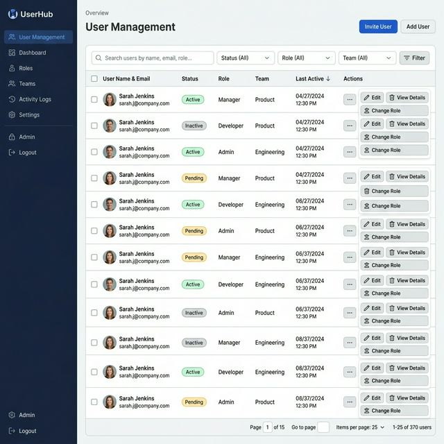

# Admin User BE 상세 설계서

> **v2 업데이트** _(2026-03-18)_: 권한관리(Roles) 연동 — 역할 코드 동적 검증으로 변경

## 1. 개요
관리자 목록 조회, 등록, 수정, 삭제 및 상태 관리(잠금/활성), 비밀번호 초기화 기능을 제공하는 API 설계입니다.

## 2. API 명세서

### 2.1 관리자 목록 조회
- **Endpoint**: `GET /api/v1/admins`
- **Description**: 전체 관리자 목록을 조회합니다. (역할별 필터링 기능 포함)
- **Query Params**:
    - `role`: 필터링할 역할 코드 (roles 테이블에 등록된 code 값) - Optional
- **Response**: `List<AdminDto.Response>`

### 2.2 관리자 등록
- **Endpoint**: `POST /api/v1/admins`
- **Description**: 새로운 관리자를 등록합니다. 비밀번호는 보안을 위해 **백엔드에서 자동 생성**됩니다.
- **Request Body**: `AdminDto.CreateRequest`
    - `email` (필수), `name` (필수), `employeeId` (선택), `role` (필수), `isActive` (필수)
- **Response**: `AdminDto.Response`
    - `tempPassword`: BE에서 생성된 초기 비밀번호 (응답 시 딱 한 번만 평문으로 노출)

### 2.3 관리자 정보 수정
- **Endpoint**: `PATCH /api/v1/admins/{id}`
- **Description**: 특정 관리자의 정보를 수정합니다. (비밀번호 수정은 제외하며, 필요시 초기화 API를 사용함)
- **Request Body**: `AdminDto.UpdateRequest`
    - `name`, `employeeId`, `role`, `isActive`
- **Response**: `AdminDto.Response`

### 2.4 관리자 계정 삭제
- **Endpoint**: `DELETE /api/v1/admins/{id}`
- **Description**: 특정 관리자 계정을 완전히 삭제합니다.

### 2.5 계정 상태 토글 (잠금/활성)
- **Endpoint**: `PATCH /api/v1/admins/{id}/status`
- **Description**: 관리자의 활성화 상태를 변경합니다.
- **Request Body**: `{ "isActive": boolean }`
- **Response**: `AdminDto.Response`

### 2.6 비밀번호 초기화
- **Endpoint**: `POST /api/v1/admins/{id}/reset-password`
- **Description**: 관리자의 비밀번호를 백엔드에서 생성한 임시 비밀번호로 초기화합니다.
- **Response**: `{ "tempPassword": "test12345" }` (또는 BE에서 무작위 생성된 값)

## 3. 유효성 검사 상세 (Validation)

| 필드명 | 규칙 | HTTP Status | 메시지 |
| :--- | :--- | :---: | :--- |
| `email` | 필수값, 이메일 형식 | 400 | "유효한 이메일 주소를 입력해주세요." |
| `email` | 중복 확인 (DB) | 400 | "이미 사용 중인 이메일입니다." |
| `name` | 필수값, 2~50자 | 400 | "이름은 2자 이상 50자 이하로 입력해주세요." |
| `employeeId` | 50자 이내, 중복 확인 | 400 | "중복된 사번이 존재합니다." |
| `role` | 필수값, roles 테이블 code 존재 여부 검증 | 400 | "유효하지 않은 역할 코드입니다." |
| `isActive` | Boolean 필수 | 400 | "계정 상태 값은 필수입니다." |

## 4. 도메인 로직 및 보안 정책
- **비밀번호 생성 주권**: 모든 비밀번호 생성 로직은 BE에서 수행됩니다. FE는 더 이상 등록/수정 시 비밀번호 평문을 전송하지 않습니다.
- **초기 비밀번호 정책**: 신규 등록 시 BE에서 12자리 이상의 무작위 문자열 또는 지정된 패턴(`test12345`)으로 생성하여 DB에는 해시화하여 저장하고, 응답 객체에만 평문을 실어 보냅니다.
- **해시 알고리즘**: `BCrypt` (Strength: 10)를 사용합니다.

## 4. 예외 처리 정책
| 예외 상황 | HTTP Status | Error Code | 메시지 |
| :--- | :--- | :--- | :--- |
| 이메일 중복 | 400 Bad Request | `DUPLICATE_EMAIL` | "이미 등록된 이메일 계정입니다." |
| 사번 중복 | 400 Bad Request | `DUPLICATE_EMPLOYEE_ID` | "이미 등록된 사번입니다." |
| 계정 미존재 | 404 Not Found | `ADMIN_NOT_FOUND` | "해당 관리자를 찾을 수 없습니다." |
| 유효하지 않은 역할 코드 _(2026-03-18 추가)_ | 400 Bad Request | `INVALID_ROLE` | "유효하지 않은 역할 코드입니다." |

## 5. 역할 코드 검증 정책 _(2026-03-18 추가)_

| 항목 | 내용 |
| :--- | :--- |
| 검증 시점 | `createAdmin()`, `updateAdmin()` 호출 시 |
| 검증 방법 | `roleRepository.existsByCode(role)` |
| 검증 실패 처리 | `BusinessException(400, "INVALID_ROLE", "유효하지 않은 역할 코드입니다.")` |
| 의존 관계 | `AdminService` → `RoleRepository` 주입 |
