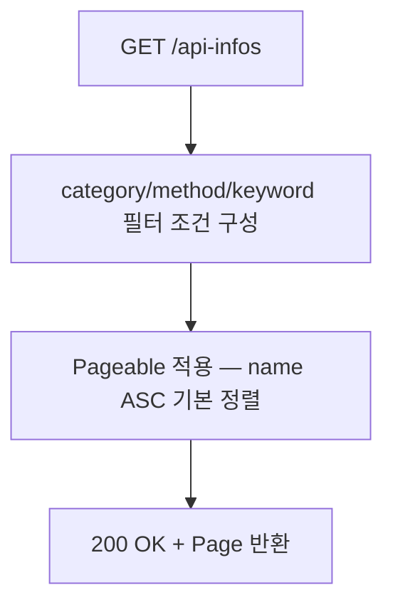

# API 정보 관리 BE 상세 설계서

## 1. 개요
- **도메인**: API 정보(ApiInfo) — 백엔드 API 엔드포인트 목록 CRUD
- **DB 설계**: [db_api-info.md](../../db/api-info/db_api-info.md)
- **패키지 경로**: `com.ge.bo`

---

## 2. 파일 구조

```
com.ge.bo/
├── entity/
│   └── ApiInfo.java
├── dto/
│   ├── ApiInfoRequest.java       # 등록/수정 요청
│   └── ApiInfoResponse.java      # 응답
├── repository/
│   └── ApiInfoRepository.java
├── service/
│   └── ApiInfoService.java
└── controller/
    └── ApiInfoController.java
```

---

## 3. 엔티티 설계

### 3.1 ApiInfo

| 필드 | 컬럼 | 타입 (Java) | 매핑 | 설명 |
|:---|:---|:---|:---|:---|
| id | id | Long | @Id, AUTO_INCREMENT | PK |
| category | category | String | @Column(length=30, NULL) | 카테고리 코드 (API_CATEGORY 공통코드) |
| name | name | String | @Column(length=100, NOT NULL) | API 명칭 |
| method | method | String | @Column(length=10, NOT NULL) | HTTP 메서드 |
| urlPattern | url_pattern | String | @Column(length=300, NOT NULL) | URL 패턴 |
| description | description | String | @Column(columnDefinition="TEXT", NULL) | 설명 |
| active | active | Boolean | @Column(NOT NULL, default=true) | 사용여부 |
| createdBy~updatedAt | - | - | @CreatedBy/@CreatedDate/@LastModifiedBy/@LastModifiedDate | 감사 컬럼 |

### 3.2 DTO

**ApiInfoRequest** (등록/수정):

| 필드 | 타입 | 필수 | Bean Validation | 에러 메시지 |
|:---|:---|:---|:---|:---|
| category | String | N | @Size(max=30) | - |
| name | String | Y | @NotBlank, @Size(max=100) | API 명칭을 입력해주세요. |
| method | String | Y | @NotBlank, @Pattern(^(GET\|POST\|PUT\|PATCH\|DELETE)$) | 올바른 HTTP 메서드를 입력해주세요. |
| urlPattern | String | Y | @NotBlank, @Size(max=300) | URL 패턴을 입력해주세요. |
| description | String | N | - | - |
| active | Boolean | N | - | - |

**ApiInfoResponse**:

| 필드 | 타입 | 설명 |
|:---|:---|:---|
| id | Long | PK |
| category | String | 카테고리 코드 |
| name | String | API 명칭 |
| method | String | HTTP 메서드 |
| urlPattern | String | URL 패턴 |
| description | String | 설명 |
| active | Boolean | 사용여부 |
| createdBy | String | 등록자 |
| createdAt | LocalDateTime | 등록일시 |
| updatedBy | String | 수정자 |
| updatedAt | LocalDateTime | 수정일시 |

---

## 4. API 엔드포인트 명세

| Method | URL | 설명 | 권한 | 트랜잭션 | 성공 코드 |
|:---|:---|:---|:---|:---|:---|
| GET | `/api/v1/api-infos` | 목록 조회 (페이징 + 필터) | SUPER_ADMIN | readOnly | 200 |
| GET | `/api/v1/api-infos/{id}` | 단건 조회 | SUPER_ADMIN | readOnly | 200 |
| POST | `/api/v1/api-infos` | 등록 | SUPER_ADMIN | REQUIRED | 201 |
| PUT | `/api/v1/api-infos/{id}` | 수정 | SUPER_ADMIN | REQUIRED | 200 |
| DELETE | `/api/v1/api-infos/{id}` | 삭제 | SUPER_ADMIN | REQUIRED | 204 |

### 4.1 GET `/api/v1/api-infos` — 목록 조회

**Query Parameters:**

| 파라미터 | 타입 | 필수 | 설명 |
|:---|:---|:---|:---|
| page | int | N | 페이지 번호 (0-based, 기본 0) |
| size | int | N | 페이지 크기 (기본 20) |
| category | String | N | 카테고리 코드 필터 |
| method | String | N | HTTP 메서드 필터 |
| keyword | String | N | name / urlPattern 부분 검색 |

**Response Body (200 OK):**
```json
{
  "content": [
    {
      "id": 1,
      "category": "MENU",
      "name": "메뉴 목록 조회",
      "method": "GET",
      "urlPattern": "/api/v1/menus",
      "description": "전체 메뉴 트리 조회",
      "active": true,
      "createdBy": "system",
      "createdAt": "2025-01-01T00:00:00",
      "updatedBy": "system",
      "updatedAt": "2025-01-01T00:00:00"
    }
  ],
  "totalElements": 18,
  "totalPages": 1,
  "size": 20,
  "number": 0
}
```

### 4.2 POST `/api/v1/api-infos` — 등록

**Request Body:**
```json
{
  "category": "MENU",
  "name": "메뉴 목록 조회",
  "method": "GET",
  "urlPattern": "/api/v1/menus",
  "description": "전체 메뉴 트리 조회",
  "active": true
}
```

**Response (201 Created):** ApiInfoResponse

### 4.3 PUT `/api/v1/api-infos/{id}` — 수정

**Request Body:** ApiInfoRequest (전체 필드)
**Response (200 OK):** ApiInfoResponse

### 4.4 DELETE `/api/v1/api-infos/{id}` — 삭제

**Response (204 No Content)**

---

## 5. 비즈니스 로직 상세

### 5.1 목록 조회



**핵심 비즈니스 규칙:**
1. keyword가 있으면 `name` 또는 `urlPattern` LIKE 검색 (`%keyword%`)
2. category, method 필터는 null이면 전체 조회
3. 기본 정렬: name ASC

### 5.2 등록

```mermaid
flowchart TD
    A[POST /api-infos] --> B[@Valid 검증]
    B -- 실패 --> C[400 VALIDATION_FAILED]
    B -- 성공 --> D[method 자동 대문자 + trim]
    D --> E[엔티티 저장]
    E --> F[201 Created]
```

**핵심 비즈니스 규칙:**
1. method 자동 대문자 변환 + trim
2. name, urlPattern trim 처리
3. active 미입력 시 기본값 true

### 5.3 수정

**핵심 비즈니스 규칙:**
1. id로 존재 확인 → 없으면 404
2. method 자동 대문자 변환
3. 모든 필드 수정 가능 (category 포함)

### 5.4 삭제

**핵심 비즈니스 규칙:**
1. id로 존재 확인 → 없으면 404
2. 단건 삭제, 연관 데이터 없음

---

## 6. Validation 상세

### 6.1 Controller 레벨 (Bean Validation)

| 필드 | 검증 규칙 | 에러 메시지 |
|:---|:---|:---|
| name | @NotBlank, @Size(max=100) | API 명칭을 입력해주세요. |
| method | @NotBlank, @Pattern(^(GET\|POST\|PUT\|PATCH\|DELETE)$) | 올바른 HTTP 메서드를 입력해주세요. |
| urlPattern | @NotBlank, @Size(max=300) | URL 패턴을 입력해주세요. |

### 6.2 Service 레벨 (비즈니스 Validation)

| 검증 항목 | HTTP | Error Code | 에러 메시지 |
|:---|:---|:---|:---|
| API 존재 확인 실패 | 404 | API_INFO_NOT_FOUND | 해당 API 정보를 찾을 수 없습니다. |

---

## 7. 예외 매핑 테이블

| 예외 상황 | HTTP | Error Code | 사용자 메시지 |
|:---|:---|:---|:---|
| API 없음 | 404 | API_INFO_NOT_FOUND | 해당 API 정보를 찾을 수 없습니다. |
| 권한 부족 | 403 | FORBIDDEN | 접근 권한이 없습니다. |
| Validation 실패 | 400 | VALIDATION_FAILED | (필드별 메시지) |

---

## 8. 보안 매트릭스

| API | Method | 권한 | 비인가 시 |
|:---|:---|:---|:---|
| `/api/v1/api-infos/**` | ALL | `ROLE_SUPER_ADMIN` | 403 Forbidden |

---

## 9. Repository 쿼리 설계

### ApiInfoRepository

| 메서드명 | 용도 |
|:---|:---|
| `findAll(Specification, Pageable)` | 필터 + 페이징 목록 조회 |

**동적 쿼리 (Specification):**
- `category` 필터: `WHERE category = :category`
- `method` 필터: `WHERE method = :method`
- `keyword` 검색: `WHERE name LIKE %:kw% OR url_pattern LIKE %:kw%`

---

## 10. DataInitializer 처리

기존 `DataInitializer`에 다음 순서로 추가:
1. `API_CATEGORY` 공통코드 그룹 + 상세 코드 삽입 (멱등성 보장)
2. `api_info` 초기 데이터 삽입 (멱등성 보장 — name+method+urlPattern 중복 확인 후 skip)

---

## 11. BE 개발 체크리스트

> ⚠️ **모든 항목이 ✅가 될 때까지 완료 보고 불가**

### 11.1 엔티티 및 DB
- [ ] ApiInfo 엔티티의 모든 필드가 설계서와 일치하는가?
- [ ] 감사 컬럼 4개가 JPA Auditing으로 자동 설정되는가?
- [ ] DataInitializer에 API_CATEGORY 공통코드 초기 데이터가 포함되었는가?
- [ ] DataInitializer에 api_info 초기 데이터가 포함되었는가?
- [ ] 중복 실행 시 에러가 없는가? (멱등성)

### 11.2 API 엔드포인트
- [ ] GET `/api/v1/api-infos` — 페이징 + 필터 조회가 구현되었는가?
- [ ] GET `/api/v1/api-infos/{id}` — 단건 조회가 구현되었는가?
- [ ] POST `/api/v1/api-infos` — 등록이 구현되었는가?
- [ ] PUT `/api/v1/api-infos/{id}` — 수정이 구현되었는가?
- [ ] DELETE `/api/v1/api-infos/{id}` — 삭제가 구현되었는가?
- [ ] POST 성공 시 HTTP 201을 반환하는가?
- [ ] DELETE 성공 시 HTTP 204를 반환하는가?

### 11.3 Request DTO Validation
- [ ] name: @NotBlank, @Size(max=100)이 적용되었는가?
- [ ] method: @NotBlank, @Pattern이 적용되었는가?
- [ ] urlPattern: @NotBlank, @Size(max=300)이 적용되었는가?
- [ ] @Valid가 Controller @RequestBody에 적용되었는가?

### 11.4 비즈니스 로직
- [ ] method 자동 대문자 + trim 처리가 동작하는가?
- [ ] keyword 검색 시 name/urlPattern 모두 검색되는가?
- [ ] category/method 필터가 null이면 전체 조회되는가?
- [ ] API 없음 시 404가 발생하는가?

### 11.5 트랜잭션
- [ ] GET API에 @Transactional(readOnly=true)가 적용되었는가?
- [ ] CUD API에 @Transactional이 적용되었는가?

### 11.6 보안
- [ ] /api/v1/api-infos/** 에 ROLE_SUPER_ADMIN 권한이 설정되었는가?

### 11.7 FE 연동 테스트
- [ ] 목록 조회: 페이지 진입 시 API 목록이 정상 표시되는가?
- [ ] 카테고리 필터: 선택 시 해당 카테고리만 표시되는가?
- [ ] 키워드 검색: 입력 시 name/urlPattern 부분 검색되는가?
- [ ] 등록: 입력 → 저장 → 성공 토스트 + 목록 반영 확인
- [ ] 수정: 수정 → 저장 → 성공 토스트 + 목록 반영 확인
- [ ] 삭제: confirm → 삭제 → 성공 토스트 + 목록에서 제거 확인
- [ ] 404 에러 토스트가 표시되는가?
- [ ] 400 Validation 에러 토스트가 표시되는가?
