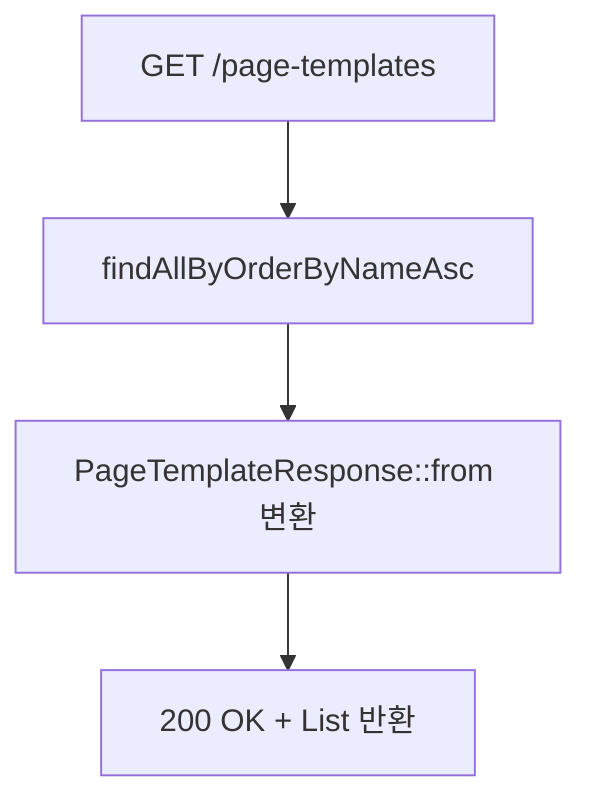

# 레이어 팝업 빌더 BE 상세 설계서

## 1. 개요

- **도메인**: 페이지 템플릿(PageTemplate) — 레이어 팝업 설정 저장 및 TSX 파일 생성 관리
- **FE 설계**: [fe_layer.md](./fe_layer.md)
- **패키지 경로**: `com.ge.bo`

---

## 2. 파일 구조

```
com.ge.bo/
├── entity/
│   └── PageTemplate.java
├── dto/
│   ├── PageTemplateRequest.java       # 생성/수정 요청 DTO
│   └── PageTemplateResponse.java      # 응답 DTO (pageUrl 포함)
├── repository/
│   └── PageTemplateRepository.java
├── service/
│   ├── PageTemplateService.java       # 비즈니스 로직 (DB + 파일 이중 저장)
│   └── PageTemplateFileService.java   # TSX 파일 쓰기/삭제 전담
└── controller/
    └── PageTemplateController.java
```

---

## 3. 엔티티 설계

### 3.1 PageTemplate

| 필드 | 컬럼 | 타입 (Java) | 매핑 | 설명 |
|:---|:---|:---|:---|:---|
| id | id | Long | @Id, AUTO_INCREMENT | PK |
| name | name | String | @Column(length=100, NOT NULL, UNIQUE) | 템플릿 표시 이름 |
| slug | slug | String | @Column(length=100, NOT NULL, UNIQUE) | URL+파일경로 식별자 (소문자+숫자+하이픈) |
| description | description | String | @Column(length=200, NULL) | 설명 |
| templateType | template_type | String | @Column(length=20, NOT NULL, default="LIST") | 템플릿 유형 |
| configJson | config_json | String | @Column(columnDefinition=TEXT, NOT NULL) | FE 설정 JSON 직렬화 |
| collapsible | collapsible | Boolean | @Column(NOT NULL, default=false) | 검색폼 접기 여부 |
| filePath | file_path | String | @Column(length=300, NOT NULL) | 생성된 TSX 파일 절대경로 (없으면 빈 문자열) |
| createdBy~updatedAt | - | - | @CreatedBy/@CreatedDate/@LastModifiedBy/@LastModifiedDate | 감사 컬럼 |

**제약조건:**
- UNIQUE: `name`, `slug` (각각 별도 UniqueConstraint)
- `filePath`: tsxCode 없이 저장 시 빈 문자열(`""`)

### 3.2 DTO

**PageTemplateRequest** (생성/수정 공용):

| 필드 | 타입 | 필수 | Bean Validation | 에러 메시지 |
|:---|:---|:---|:---|:---|
| name | String | Y | @NotBlank, @Size(max=100) | 이름은 필수입니다. |
| slug | String | Y | @NotBlank, @Pattern(^[a-z0-9-]+$), @Size(max=100) | slug는 소문자, 숫자, 하이픈만 허용됩니다. |
| description | String | N | @Size(max=200) | - |
| configJson | String | Y | @NotBlank | configJson은 필수입니다. |
| tsxCode | String | N | - | 있으면 TSX 파일 생성, 없으면 DB만 저장 |
| collapsible | boolean | N | - | 기본값 false |

**PageTemplateResponse** (응답):

| 필드 | 타입 | 설명 |
|:---|:---|:---|
| id | Long | PK |
| name | String | 템플릿 이름 |
| slug | String | Slug |
| description | String | 설명 |
| templateType | String | 템플릿 유형 |
| configJson | String | 설정 JSON |
| collapsible | boolean | 검색폼 접기 여부 |
| filePath | String | TSX 파일 절대경로 |
| pageUrl | String | Next.js 접근 URL (`/admin/generated/{slug}`) |
| createdBy | String | 생성자 |
| createdAt | LocalDateTime | 생성일시 |
| updatedAt | LocalDateTime | 수정일시 |

> `pageUrl`은 엔티티에 없는 계산 필드 — `PageTemplateResponse.from(entity)`에서 조합

---

## 4. API 엔드포인트 명세

| Method | URL | 설명 | 권한 | 트랜잭션 | 성공 코드 |
|:---|:---|:---|:---|:---|:---|
| GET | `/api/v1/page-templates` | 전체 목록 조회 (이름 오름차순) | 인증 필요 | readOnly | 200 |
| GET | `/api/v1/page-templates/{id}` | 단건 조회 (id) | 인증 필요 | readOnly | 200 |
| GET | `/api/v1/page-templates/by-slug/{slug}` | 단건 조회 (slug) — 동적 라우트 페이지용 | 인증 필요 | readOnly | 200 |
| POST | `/api/v1/page-templates` | 신규 생성 (DB + tsxCode 있으면 파일 생성) | 인증 필요 | REQUIRED | 201 |
| PUT | `/api/v1/page-templates/{id}` | 수정 (DB + tsxCode 있으면 파일 갱신) | 인증 필요 | REQUIRED | 200 |
| DELETE | `/api/v1/page-templates/{id}` | 삭제 (DB + 파일 삭제) | 인증 필요 | REQUIRED | 204 |

---

## 5. 비즈니스 로직 상세

### 5.1 목록 조회



### 5.2 생성

```mermaid
flowchart TD
    A[POST /page-templates] --> B[@Valid 검증]
    B -- 실패 --> C[400 VALIDATION_FAILED]
    B -- 성공 --> D{name 중복?}
    D -- 중복 --> E[409 PAGE_TEMPLATE_NAME_DUPLICATE]
    D -- 없음 --> F{slug 중복?}
    F -- 중복 --> G[409 PAGE_TEMPLATE_SLUG_DUPLICATE]
    F -- 없음 --> H{tsxCode 있음?}
    H -- 있음 --> I[PageTemplateFileService.writeFile]
    I -- 실패 --> J[500 PAGE_TEMPLATE_FILE_ERROR + DB 롤백]
    I -- 성공 --> K[filePath 설정]
    H -- 없음 --> L[filePath = 빈 문자열]
    K --> M[DB 저장]
    L --> M
    M --> N[201 Created + PageTemplateResponse]
```

**핵심 비즈니스 규칙:**
1. `name`과 `slug` 각각 전체 테이블 유일성 검사
2. `tsxCode` 없으면 DB만 저장 (저장 버튼), 있으면 파일도 생성 (생성 버튼)
3. 파일 쓰기 실패 시 RuntimeException → @Transactional 자동 롤백

### 5.3 수정

**핵심 비즈니스 규칙:**
1. `name` 중복 검사 (자신 ID 제외)
2. `slug` 중복 검사 (자신 ID 제외)
3. `tsxCode` 있으면 기존 파일 삭제 후 신규 파일 쓰기 (slug 변경 대응)
4. `tsxCode` 없으면 configJson/name/slug만 DB 업데이트

### 5.4 삭제

**핵심 비즈니스 규칙:**
1. ID로 엔티티 조회 (없으면 404)
2. DB 삭제 완료 후 파일 삭제 (파일 삭제 실패는 로그만, 예외 비전파)
3. 빈 디렉토리 자동 정리 (`PageTemplateFileService.deleteFile`)

### 5.5 파일 서비스 (`PageTemplateFileService`)

| 메서드 | 동작 | 실패 처리 |
|:---|:---|:---|
| `writeFile(slug, tsxCode)` | `{outputDir}/{slug}/page.tsx` 생성, Path Traversal 방어 후 Files.writeString | RuntimeException 발생 → DB 롤백 유발 |
| `deleteFile(filePath)` | 파일 존재 확인 → 삭제 → 빈 디렉토리 정리 | IOException 무시 (로그만) |
| `deleteFileQuietly(filePath)` | `deleteFile` 위임 (보상 처리용) | 동일 |

> **Path Traversal 방어**: `filePath.startsWith(baseDir)` 검증 실패 시 즉시 500 반환

---

## 6. Validation 상세

### 6.1 Controller 레벨 (Bean Validation)

| 필드 | 검증 규칙 | 에러 메시지 |
|:---|:---|:---|
| name | @NotBlank, @Size(max=100) | 이름은 필수입니다. |
| slug | @NotBlank, @Pattern(^[a-z0-9-]+$), @Size(max=100) | slug는 소문자, 숫자, 하이픈만 허용됩니다. |
| configJson | @NotBlank | configJson은 필수입니다. |

### 6.2 Service 레벨 (비즈니스 Validation)

| 검증 항목 | HTTP | Error Code | 에러 메시지 |
|:---|:---|:---|:---|
| 템플릿 존재 확인 실패 | 404 | PAGE_TEMPLATE_NOT_FOUND | 해당 페이지 템플릿을 찾을 수 없습니다. |
| name 중복 (생성) | 409 | PAGE_TEMPLATE_NAME_DUPLICATE | 이미 동일한 이름의 템플릿이 존재합니다. |
| name 중복 (수정, 자신 제외) | 409 | PAGE_TEMPLATE_NAME_DUPLICATE | 이미 동일한 이름의 템플릿이 존재합니다. |
| slug 중복 (생성) | 409 | PAGE_TEMPLATE_SLUG_DUPLICATE | 이미 사용 중인 slug입니다. |
| slug 중복 (수정, 자신 제외) | 409 | PAGE_TEMPLATE_SLUG_DUPLICATE | 이미 사용 중인 slug입니다. |
| TSX 파일 생성/쓰기 실패 | 500 | PAGE_TEMPLATE_FILE_ERROR | TSX 파일 생성 중 오류가 발생했습니다. |
| Path Traversal 감지 | 500 | PAGE_TEMPLATE_FILE_ERROR | TSX 파일 생성 중 오류가 발생했습니다. |

---

## 7. 예외 매핑 테이블

| 예외 상황 | HTTP | Error Code | 사용자 메시지 |
|:---|:---|:---|:---|
| 템플릿 없음 | 404 | PAGE_TEMPLATE_NOT_FOUND | 해당 페이지 템플릿을 찾을 수 없습니다. |
| 이름 중복 | 409 | PAGE_TEMPLATE_NAME_DUPLICATE | 이미 동일한 이름의 템플릿이 존재합니다. |
| Slug 중복 | 409 | PAGE_TEMPLATE_SLUG_DUPLICATE | 이미 사용 중인 slug입니다. |
| 파일 생성/Path Traversal | 500 | PAGE_TEMPLATE_FILE_ERROR | TSX 파일 생성 중 오류가 발생했습니다. |
| Bean Validation 실패 | 400 | VALIDATION_FAILED | (필드별 메시지) |
| 미인증 | 401 | UNAUTHORIZED | 인증이 필요합니다. |

---

## 8. 보안 매트릭스

| API | Method | 권한 | 비인가 시 |
|:---|:---|:---|:---|
| `/api/v1/page-templates/**` | ALL | 인증된 사용자 (JWT) | 401 Unauthorized |

---

## 9. Repository 쿼리 설계

| 메서드명 | 용도 |
|:---|:---|
| `findAllByOrderByNameAsc()` | 전체 목록 이름 오름차순 |
| `existsByName(name)` | 이름 중복 검사 (생성 시) |
| `existsBySlug(slug)` | slug 중복 검사 (생성 시) |
| `existsByNameAndIdNot(name, id)` | 이름 중복 검사 (수정 시, 자신 제외) |
| `existsBySlugAndIdNot(slug, id)` | slug 중복 검사 (수정 시, 자신 제외) |
| `findBySlug(slug)` | slug로 단건 조회 (동적 라우트용) |

---

## 10. application.yml 설정

```yaml
page-template:
  output-dir: "../bo/src/app/admin/generated"
```

> TSX 파일 생성 경로: `{output-dir}/{slug}/page.tsx`
> Next.js 접근 URL: `/admin/generated/{slug}`

---

## 11. BE 개발 체크리스트 (07단계 검증 필수)

> ⚠️ **모든 항목이 ✅가 될 때까지 완료 보고 불가**

### 11.1 엔티티 및 DB

- [ ] `name` 컬럼에 UNIQUE 제약이 설정되었는가?
- [ ] `slug` 컬럼에 UNIQUE 제약이 설정되었는가?
- [ ] `config_json`이 TEXT 타입으로 정의되었는가?
- [ ] `file_path` 기본값이 빈 문자열(`""`)로 처리되는가?
- [ ] 감사 컬럼(@CreatedBy, @CreatedDate 등)이 자동 설정되는가?
- [ ] `templateType` 기본값이 `"LIST"`인가?

### 11.2 API 엔드포인트

- [ ] `GET /api/v1/page-templates` — 목록 조회가 구현되었는가?
- [ ] `GET /api/v1/page-templates/{id}` — 단건 조회(id)가 구현되었는가?
- [ ] `GET /api/v1/page-templates/by-slug/{slug}` — 단건 조회(slug)가 구현되었는가?
- [ ] `POST /api/v1/page-templates` — 생성이 구현되었는가?
- [ ] `PUT /api/v1/page-templates/{id}` — 수정이 구현되었는가?
- [ ] `DELETE /api/v1/page-templates/{id}` — 삭제가 구현되었는가?
- [ ] POST 성공 시 HTTP 201을 반환하는가?
- [ ] DELETE 성공 시 HTTP 204를 반환하는가?

### 11.3 Request DTO Validation

- [ ] `name`: @NotBlank, @Size(max=100)이 적용되었는가?
- [ ] `slug`: @NotBlank, @Pattern(^[a-z0-9-]+$), @Size(max=100)이 적용되었는가?
- [ ] `configJson`: @NotBlank이 적용되었는가?
- [ ] @Valid가 Controller @RequestBody에 적용되었는가?

### 11.4 비즈니스 Validation

- [ ] 존재하지 않는 ID 조회 시 404가 발생하는가?
- [ ] 이름 중복 생성 시 409가 발생하는가?
- [ ] slug 중복 생성 시 409가 발생하는가?
- [ ] 이름 중복 수정 시 409가 발생하는가? (자신 제외)
- [ ] slug 중복 수정 시 409가 발생하는가? (자신 제외)

### 11.5 파일 생성 로직

- [ ] `tsxCode` 있을 때만 파일이 생성되는가?
- [ ] `tsxCode` 없을 때 DB만 저장되는가?
- [ ] 생성 경로가 `{outputDir}/{slug}/page.tsx`인가?
- [ ] Path Traversal 방어 로직이 동작하는가?
- [ ] 파일 쓰기 실패 시 DB가 롤백되는가?
- [ ] 삭제 시 빈 디렉토리도 정리되는가?
- [ ] 파일 삭제 실패가 예외를 발생시키지 않는가? (로그만)

### 11.6 응답 형식

- [ ] `pageUrl` 필드가 `/admin/generated/{slug}` 형식으로 반환되는가?
- [ ] `filePath` 필드가 절대경로로 반환되는가?
- [ ] `configJson`이 그대로 반환되는가? (파싱 없음)

### 11.7 트랜잭션

- [ ] GET API에 `@Transactional(readOnly=true)`가 적용되었는가?
- [ ] CUD API에 `@Transactional`이 적용되었는가?
- [ ] 파일 쓰기 실패 시 DB 저장이 롤백되는가?

### 11.8 예외 처리

- [ ] 설계서 섹션 7의 모든 예외가 `ErrorCode` enum + `BusinessException`으로 구현되었는가?
- [ ] 에러코드가 설계서와 일치하는가?
- [ ] 에러 메시지가 설계서와 일치하는가?

### 11.9 FE-BE API 응답 형식 일치 검증

- [ ] `PageTemplateResponse.id`가 FE `templateList`의 `id` 타입(number)과 일치하는가?
- [ ] `PageTemplateResponse.configJson`이 FE `restoreFromConfigJson()`에서 파싱 가능한가?
- [ ] `PageTemplateResponse.pageUrl`이 FE 성공 토스트에서 정상 표시되는가?
- [ ] `null` description이 FE에서 에러 없이 처리되는가?

### 11.10 FE 연동 테스트

- [ ] 불러오기: GET 호출 → 목록 모달에 템플릿 표시 확인
- [ ] 저장(신규): POST 호출 → 성공 토스트 + `currentTemplateId` 설정 확인
- [ ] 저장(수정): PUT 호출 → 성공 토스트 + 기존 데이터 유지 확인
- [ ] 생성: PUT/POST 호출 (tsxCode 포함) → `pageUrl` 토스트 표시 확인
- [ ] 이름 중복: 409 에러 토스트가 서버 메시지로 표시되는가?
- [ ] Slug 중복: 409 에러 토스트가 서버 메시지로 표시되는가?
- [ ] 미인증(401): 로그인 페이지로 리다이렉트되는가?

### 11.11 코드 품질

- [ ] `./gradlew build` 오류가 없는가?
- [ ] 에러 메시지/코드가 `ErrorCode` enum으로 관리되는가?
- [ ] DTO → Entity 변환이 `PageTemplateResponse.from(entity)` 정적 팩토리로 일관적인가?
