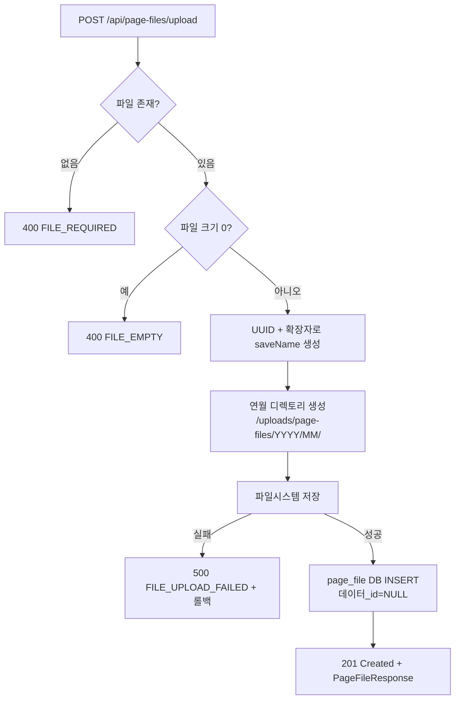
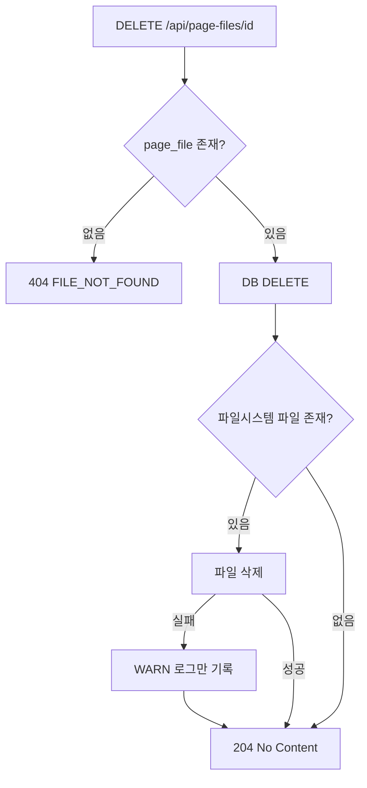

# 레이어 팝업 빌더 — 파일 업로드 필드 BE 상세 설계서

- **기능명**: 파일 업로드 필드 타입 추가
- **작성일**: 2026-03-29
- **변경 요약**: 레이어 팝업 빌더에서 생성된 폼의 파일 첨부 업로드/다운로드/삭제 API 신규 추가
- **참조 문서**:
  - FE 설계: [fe_layer_file-upload.md](./fe_layer_file-upload.md)
  - DB 설계: [db_layer_file-upload.md](../../db/layer/db_layer_file-upload.md)
  - 기존 BE: [be_layer.md](./be_layer.md)
- **패키지 경로**: `com.ge.bo`

---

## 1. 파일 구조

```
com.ge.bo/
├── entity/
│   └── PageFile.java                   # 신규
├── dto/
│   ├── PageFileResponse.java           # 신규 — 업로드 응답 DTO
│   └── PageFileDataIdRequest.java      # 신규 — data_id 연결 요청 DTO
├── repository/
│   └── PageFileRepository.java         # 신규
├── service/
│   └── PageFileService.java            # 신규 — 업로드/다운로드/삭제 비즈니스 로직
└── controller/
    └── PageFileController.java         # 신규
```

---

## 2. 엔티티 설계

### 2.1 PageFile

| 필드 | 컬럼 | 타입 (Java) | 매핑 | 설명 |
|:---|:---|:---|:---|:---|
| id | id | Long | @Id, AUTO_INCREMENT | PK |
| templateSlug | template_slug | String | @Column(length=255, NOT NULL) | 어떤 페이지 템플릿의 파일인지 |
| dataId | data_id | Long | @Column(NULL) | page_data.id 논리 참조 (저장 전 NULL) |
| fieldKey | field_key | String | @Column(length=100, NOT NULL) | 어떤 필드의 파일인지 (예: `attachFiles`) |
| origName | orig_name | String | @Column(length=255, NOT NULL) | 원본 파일명 |
| saveName | save_name | String | @Column(length=255, NOT NULL, UNIQUE) | 서버 저장명 (UUID 기반) |
| filePath | file_path | String | @Column(length=500, NOT NULL) | 저장 디렉토리 경로 |
| fileSize | file_size | Long | @Column(NOT NULL) | 파일 크기 (bytes) |
| mimeType | mime_type | String | @Column(length=100, NOT NULL) | MIME 타입 |
| createdBy | created_by | String | @Column(length=100, NULL) | 업로드한 관리자 이메일 |
| createdAt | created_at | LocalDateTime | @CreatedDate | 업로드일시 |

### 2.2 DTO

**PageFileResponse** (업로드/조회 응답):

| 필드 | 타입 | 설명 |
|:---|:---|:---|
| id | Long | PK |
| templateSlug | String | 페이지 템플릿 slug |
| dataId | Long | page_data.id (없으면 null) |
| fieldKey | String | 필드 키 |
| origName | String | 원본 파일명 |
| fileSize | Long | 파일 크기 (bytes) |
| mimeType | String | MIME 타입 |
| createdAt | LocalDateTime | 업로드일시 |

**PageFileDataIdRequest** (data_id 연결):

| 필드 | 타입 | 필수 | Bean Validation | 설명 |
|:---|:---|:---|:---|:---|
| dataId | Long | Y | @NotNull | 연결할 page_data.id |

---

## 3. API 엔드포인트 명세

| Method | URL | 설명 | 권한 | 트랜잭션 | 성공 코드 |
|:---|:---|:---|:---|:---|:---|
| POST | `/api/page-files/upload` | 파일 단건 업로드 | 인증 필요 | REQUIRED | 201 |
| GET | `/api/page-files/{id}` | 파일 다운로드 (스트리밍) | 인증 필요 | readOnly | 200 |
| PATCH | `/api/page-files/link` | 임시 파일에 data_id 연결 | 인증 필요 | REQUIRED | 200 |
| DELETE | `/api/page-files/{id}` | 파일 삭제 (DB + 파일시스템) | 인증 필요 | REQUIRED | 204 |

### 3.1 POST `/api/page-files/upload` — 파일 업로드

**Request:** `multipart/form-data`

| 파라미터 | 타입 | 필수 | 설명 |
|:---|:---|:---|:---|
| file | MultipartFile | Y | 업로드할 파일 |
| templateSlug | String | Y | 어떤 페이지 템플릿인지 |
| fieldKey | String | Y | 어떤 필드인지 (예: `attachFiles`) |

**Response:** `PageFileResponse` (HTTP 201)

```json
{
  "id": 42,
  "templateSlug": "user-register",
  "dataId": null,
  "fieldKey": "attachFiles",
  "origName": "report.pdf",
  "fileSize": 204800,
  "mimeType": "application/pdf",
  "createdAt": "2026-03-29T10:00:00"
}
```

### 3.2 GET `/api/page-files/{id}` — 파일 다운로드

- `Content-Disposition: attachment; filename="{origName}"`
- `Content-Type: {mimeType}`
- `Resource`: `InputStreamResource` 스트리밍 방식

### 3.3 PATCH `/api/page-files/link` — data_id 연결

폼 저장 완료 후 임시 파일(data_id=NULL)들을 page_data.id에 연결합니다.

**Request Body:**
```json
{
  "fileIds": [42, 43],
  "dataId": 100
}
```

### 3.4 DELETE `/api/page-files/{id}` — 파일 삭제

- DB row 삭제 → 파일시스템 파일 삭제
- 파일시스템 삭제 실패 시 로그만 기록 (예외 비전파)
- HTTP 204 No Content 반환

---

## 4. 비즈니스 로직 상세

### 4.1 파일 업로드 흐름



**파일 저장 경로 규칙:**
```
{upload-root}/page-files/{YYYY}/{MM}/{UUID}.{확장자소문자}
예) /uploads/page-files/2026/03/a3f2c1d4-9b8e-4c2a-b1f5-3d7e9c0f2a8b.pdf
```

### 4.2 파일 삭제 흐름



### 4.3 폼 저장 시 data_id 연결 흐름

```
1. FE: 파일 업로드 → page_file.id 반환 (data_id = NULL)
2. FE: 폼 저장 → page_data INSERT → page_data.id 반환
3. FE: PATCH /api/page-files/link → fileIds + dataId 전달
4. BE: UPDATE page_file SET data_id = ? WHERE id IN (...)
5. FE: data_json에 { "attachFiles": [42, 43] } 저장
```

### 4.4 page_data 삭제 시 연관 파일 처리

`PageDataService.delete()` 내부에서 처리 (PageFileService 의존):
```
1. page_data 삭제 전 해당 data_id의 page_file 목록 조회
2. 파일시스템 파일 일괄 삭제
3. page_file DB 일괄 삭제
4. page_data DB 삭제
```

---

## 5. Validation 상세

### 5.1 Controller 레벨 (Bean Validation)

| 파라미터 | 검증 규칙 | 에러 메시지 |
|:---|:---|:---|
| file | @NotNull | 파일은 필수입니다. |
| templateSlug | @NotBlank | templateSlug는 필수입니다. |
| fieldKey | @NotBlank | fieldKey는 필수입니다. |

### 5.2 Service 레벨 (비즈니스 Validation)

| 검증 항목 | HTTP | Error Code | 에러 메시지 |
|:---|:---|:---|:---|
| 파일 비어있음 (size=0) | 400 | FILE_EMPTY | 비어있는 파일은 업로드할 수 없습니다. |
| 파일 없음 | 400 | FILE_REQUIRED | 파일은 필수입니다. |
| page_file 조회 실패 | 404 | FILE_NOT_FOUND | 해당 파일을 찾을 수 없습니다. |
| 파일 저장 실패 | 500 | FILE_UPLOAD_FAILED | 파일 저장 중 오류가 발생했습니다. |

---

## 6. 예외 매핑 테이블

| 예외 상황 | HTTP | Error Code | 사용자 메시지 |
|:---|:---|:---|:---|
| 파일 없음 | 400 | FILE_REQUIRED | 파일은 필수입니다. |
| 파일 비어있음 | 400 | FILE_EMPTY | 비어있는 파일은 업로드할 수 없습니다. |
| 파일 없음 (조회) | 404 | FILE_NOT_FOUND | 해당 파일을 찾을 수 없습니다. |
| 파일 저장 실패 | 500 | FILE_UPLOAD_FAILED | 파일 저장 중 오류가 발생했습니다. |
| Bean Validation 실패 | 400 | VALIDATION_FAILED | (필드별 메시지) |
| 미인증 | 401 | UNAUTHORIZED | 인증이 필요합니다. |

---

## 7. 보안 매트릭스

| API | Method | 권한 | 비인가 시 |
|:---|:---|:---|:---|
| `/api/page-files/**` | ALL | 인증된 사용자 (JWT) | 401 Unauthorized |

---

## 8. Repository 쿼리 설계

| 메서드명 | 용도 |
|:---|:---|
| `findByDataId(Long dataId)` | data_id로 파일 목록 조회 (page_data 삭제 시) |
| `findByDataIdAndFieldKey(Long dataId, String fieldKey)` | 특정 필드의 파일 목록 조회 |

---

## 9. application.yml 설정

```yaml
file:
  upload-root: "/uploads"
```

> 파일 저장 경로: `{upload-root}/page-files/{YYYY}/{MM}/{saveName}`

---

## 10. 트랜잭션 전략

| API | 전략 | 이유 |
|:---|:---|:---|
| 업로드 | `@Transactional(REQUIRED)` | 파일저장 + DB INSERT 원자성 보장 |
| 다운로드 | `@Transactional(readOnly=true)` | 조회 전용, DB 부하 최소화 |
| data_id 연결 | `@Transactional(REQUIRED)` | 복수 row UPDATE 원자성 |
| 삭제 | `@Transactional(REQUIRED)` | DB DELETE 후 파일 삭제 (파일 실패는 로그만) |

---

## 11. BE 개발 체크리스트 (07단계 검증 필수)

> ⚠️ **모든 항목이 ✅가 될 때까지 완료 보고 불가**

### 11.1 엔티티 및 DB

- [x] `PageFile` 엔티티가 `page_file` 테이블과 정확히 매핑되었는가?
- [x] `save_name` 컬럼에 UNIQUE 제약이 설정되었는가?
- [x] `data_id`가 NULL 허용으로 설정되었는가?
- [x] `@CreatedDate`로 `created_at`이 자동 설정되는가?

### 11.2 API 엔드포인트

- [x] `POST /api/page-files/upload` — 업로드가 구현되었는가?
- [x] `GET /api/page-files/{id}` — 다운로드 스트리밍이 구현되었는가?
- [x] `PATCH /api/page-files/link` — data_id 연결이 구현되었는가?
- [x] `DELETE /api/page-files/{id}` — 삭제가 구현되었는가?
- [x] POST 성공 시 HTTP 201을 반환하는가?
- [x] DELETE 성공 시 HTTP 204를 반환하는가?

### 11.3 파일 업로드 로직

- [x] 저장 경로가 `{upload-root}/page-files/{YYYY}/{MM}/{UUID}.{ext}` 형식인가?
- [x] 연월 디렉토리가 없으면 자동 생성되는가?
- [x] saveName이 UUID 기반으로 생성되는가?
- [x] 파일 저장 실패 시 DB INSERT가 롤백되는가?
- [x] 업로드 직후 `data_id`가 NULL로 저장되는가?

### 11.4 파일 삭제 로직

- [x] DB 삭제 후 파일시스템 파일이 삭제되는가?
- [x] 파일시스템 삭제 실패가 예외를 발생시키지 않는가? (로그만)
- [x] page_data 삭제 시 연관 page_file이 함께 삭제되는가?

### 11.5 다운로드 로직

- [x] `Content-Disposition: attachment; filename="{origName}"` 헤더가 설정되는가?
- [x] `Content-Type: {mimeType}` 헤더가 설정되는가?
- [x] `InputStreamResource` 스트리밍 방식으로 응답하는가?

### 11.6 Validation 및 예외 처리

- [x] 빈 파일 업로드 시 400이 반환되는가?
- [x] 존재하지 않는 id 조회/삭제 시 404가 반환되는가?
- [x] 설계서 섹션 6의 모든 예외가 `ErrorCode` + `BusinessException`으로 구현되었는가?

### 11.7 트랜잭션

- [x] 업로드 API에 `@Transactional`이 적용되었는가?
- [x] 다운로드 API에 `@Transactional(readOnly=true)`가 적용되었는가?
- [x] 삭제 API에 `@Transactional`이 적용되었는가?

### 11.8 코드 품질

- [x] `./gradlew build` 오류가 없는가?
- [x] 에러 메시지/코드가 `ErrorCode` enum으로 관리되는가?
