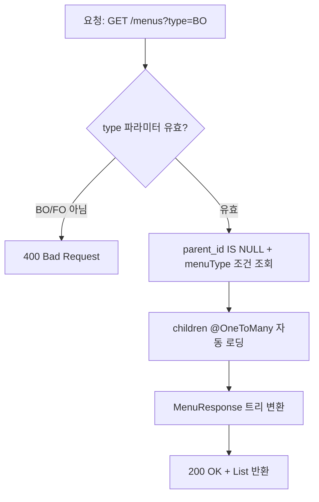

# 메뉴 관리 BE 상세 설계서

## 1. 개요
- **도메인**: 메뉴(Menu) — 시스템 메뉴 CRUD + 역할별 접근 권한 매핑
- **DB 설계**: [db_menus.md](../../db/menus/db_menus.md)
- **FE 설계**: [fe_menus.md](./fe_menus.md)
- **패키지 경로**: `com.ge.bo`

---

## 2. 파일 구조

```
com.ge.bo/
├── entity/
│   ├── Menu.java                 # 메뉴 엔티티 (self-referencing)
│   ├── RoleMenu.java             # 역할-메뉴 매핑 엔티티 (복합 PK)
│   └── RoleMenuId.java           # 복합 PK 클래스
├── dto/
│   ├── MenuRequest.java          # 생성/수정 요청 DTO
│   ├── MenuResponse.java         # 응답 DTO (재귀 트리 구조)
│   └── RoleMenuResponse.java     # 역할 매핑 응답 DTO
├── repository/
│   ├── MenuRepository.java
│   └── RoleMenuRepository.java
├── service/
│   └── MenuService.java
└── controller/
    └── MenuController.java
```

---

## 3. 엔티티 설계

### 3.1 Menu

| 필드 | 컬럼 | 타입 (Java) | 매핑 | 설명 |
|:---|:---|:---|:---|:---|
| id | id | Long | @Id, AUTO_INCREMENT | PK |
| name | name | String | @Column(length=50, NOT NULL) | 메뉴명 |
| description | description | String | @Column(length=500, NULL) | 메뉴 설명 |
| url | url | String | @Column(length=200, NULL) | 메뉴 URL |
| icon | icon | String | @Column(length=30, NOT NULL, default='Folder') | 아이콘 |
| parent | parent_id | Menu | @ManyToOne(LAZY), FK | 상위 메뉴 (self-join) |
| children | - | List\<Menu\> | @OneToMany(mappedBy, cascade=ALL, orphanRemoval) | 하위 메뉴 |
| menuType | menu_type | String | @Column(length=2, NOT NULL) | BO/FO |
| sortOrder | sort_order | Integer | @Column(NOT NULL, default=1) | 정렬순서 |
| visible | visible | Boolean | @Column(NOT NULL, default=true) | 노출여부 |
| createdBy | created_by | String | @CreatedBy | 등록자 |
| createdAt | created_at | LocalDateTime | @CreatedDate | 등록일시 |
| updatedBy | updated_by | String | @LastModifiedBy | 수정자 |
| updatedAt | updated_at | LocalDateTime | @LastModifiedDate | 수정일시 |

**제약조건:**
- UNIQUE: `(name, parent_id, menu_type)` — 동일 부모/타입 내 이름 중복 방지
- children: `@OrderBy("sortOrder ASC")` — 항상 정렬순서 기준 조회
- 비즈니스 메서드: `isParent()`, `isMenuManagement()` (시스템 메뉴 삭제 차단용)

### 3.2 RoleMenu

| 필드 | 컬럼 | 타입 (Java) | 매핑 | 설명 |
|:---|:---|:---|:---|:---|
| roleId | role_id | Long | @Id, FK(role.id), ON DELETE CASCADE | 역할 ID |
| menuId | menu_id | Long | @Id, FK(menu.id), ON DELETE CASCADE | 메뉴 ID |
| createdAt | created_at | LocalDateTime | @PrePersist 자동설정 | 매핑일시 |

- 복합 PK: `RoleMenuId` (roleId + menuId)

### 3.3 DTO

**MenuRequest** (생성/수정 공용):

| 필드 | 타입 | 필수 | Bean Validation | 에러 메시지 |
|:---|:---|:---|:---|:---|
| name | String | Y | @NotBlank, @Size(max=50), @Pattern | 메뉴명은 한글, 영문, 숫자, 공백, -, _, ()만 사용 가능합니다. |
| description | String | N | @Size(max=500) | 메뉴 설명은 500자 이하로 입력해주세요. |
| url | String | N | @Size(max=200), @Pattern(^$\|^/...) | URL은 /로 시작하는 경로를 입력해주세요. |
| icon | String | Y | @NotBlank | 아이콘을 선택해주세요. |
| parentId | Long | N | - | - |
| menuType | String | Y | @NotBlank, @Pattern(^(BO\|FO)$) | 메뉴 구분은 BO 또는 FO만 가능합니다. |
| sortOrder | Integer | Y | @Min(1), @Max(999) | 정렬 순서는 1~999 사이여야 합니다. |
| visible | Boolean | Y | - | - |

**MenuResponse**: id, name, description, url, icon, parentId, menuType, sortOrder, visible, createdAt, updatedAt, children (재귀)

**RoleMenuResponse**: menuId, roleId, roleName(code), roleDisplayName, hasAccess

---

## 4. API 엔드포인트 명세

| Method | URL | 설명 | 권한 | 트랜잭션 | 성공 코드 |
|:---|:---|:---|:---|:---|:---|
| GET | `/api/v1/menus?type={BO\|FO}` | 타입별 메뉴 트리 조회 | ADMIN | readOnly | 200 |
| GET | `/api/v1/menus/{id}` | 메뉴 단건 조회 | ADMIN | readOnly | 200 |
| POST | `/api/v1/menus` | 메뉴 생성 | ADMIN | REQUIRED | 201 |
| PUT | `/api/v1/menus/{id}` | 메뉴 수정 | ADMIN | REQUIRED | 200 |
| DELETE | `/api/v1/menus/{id}` | 메뉴 삭제 (하위 포함) | ADMIN | REQUIRED | 204 |
| PATCH | `/api/v1/menus/{id}/sort` | 정렬 순서 변경 | ADMIN | REQUIRED | 200 |
| GET | `/api/v1/menus/{id}/roles` | 메뉴별 역할 매핑 조회 | ADMIN | readOnly | 200 |
| PUT | `/api/v1/menus/{menuId}/roles/{roleId}` | 역할 매핑 변경 | ADMIN | REQUIRED | 200 |

---

## 5. 비즈니스 로직 상세

### 5.1 메뉴 목록 조회



- fetch join으로 N+1 방지
- children은 sortOrder ASC 정렬 보장

### 5.2 메뉴 생성

```mermaid
flowchart TD
    A[요청: POST /menus] --> B[@Valid 검증]
    B -- "실패" --> C[400 VALIDATION_FAILED]
    B -- "성공" --> D{parentId 있음?}
    D -- "없음" --> H[대메뉴로 생성]
    D -- "있음" --> E{부모 메뉴 존재?}
    E -- "없음" --> F[404 MENU_NOT_FOUND]
    E -- "있음" --> G{부모 menuType == 요청 menuType?}
    G -- "불일치" --> G1[400 MENU_TYPE_MISMATCH]
    G -- "일치" --> G2{부모가 이미 하위메뉴? parent.parent != null}
    G2 -- "예 (3depth)" --> G3[400 MENU_DEPTH_EXCEEDED]
    G2 -- "아니오" --> H
    H --> I{동일 부모+타입 내 이름 중복?}
    I -- "중복" --> J[409 MENU_NAME_DUPLICATE]
    I -- "없음" --> K{URL 비어있지 않고, URL 중복?}
    K -- "중복" --> L[409 MENU_URL_DUPLICATE]
    K -- "없음/빈값" --> M{하위메뉴인데 URL 비어있음?}
    M -- "예" --> M1[400 URL 필수]
    M -- "아니오" --> N[Menu 엔티티 저장]
    N --> O[201 Created + MenuResponse]
```

**핵심 비즈니스 규칙:**
1. **2depth 제한**: 부모 메뉴의 parent가 null이어야만 하위메뉴 생성 허용. 즉, 대메뉴(1depth)의 자식(2depth)까지만 허용하고 3depth 이상 차단
2. **타입 일관성**: 하위메뉴의 menuType은 부모의 menuType과 반드시 일치해야 함
3. **이름 중복 범위**: 같은 parentId + 같은 menuType 내에서만 이름 유일성 보장. 즉 BO의 Settings 하위에 "관리자 관리"가 있어도 FO에는 동일 이름 가능
4. **URL 중복**: 전체 menu 테이블에서 URL 유일성 보장 (menuType 무관)
5. **하위메뉴 URL 필수**: parentId가 있으면(하위메뉴) URL은 반드시 입력해야 함

### 5.3 메뉴 수정

```mermaid
flowchart TD
    A[요청: PUT /menus/{id}] --> B[@Valid 검증]
    B -- "실패" --> C[400 VALIDATION_FAILED]
    B -- "성공" --> D{메뉴 존재?}
    D -- "없음" --> E[404 MENU_NOT_FOUND]
    D -- "있음" --> F{이름 변경됨?}
    F -- "예" --> G{동일 부모+타입 내 이름 중복? 자신 제외}
    G -- "중복" --> H[409 MENU_NAME_DUPLICATE]
    G -- "없음" --> I
    F -- "아니오" --> I{URL 변경됨?}
    I -- "예" --> J{URL 중복? 자신 제외}
    J -- "중복" --> K[409 MENU_URL_DUPLICATE]
    J -- "없음" --> L
    I -- "아니오" --> L{하위메뉴인데 URL 비어있음?}
    L -- "예" --> L1[400 URL 필수]
    L -- "아니오" --> M[엔티티 필드 업데이트]
    M --> N[200 OK + MenuResponse]
```

**핵심 비즈니스 규칙:**
1. **이름 중복 체크 시 자신 제외**: `existsByNameAndParentAndMenuTypeAndIdNot`
2. **URL 중복 체크 시 자신 제외**: `existsByUrlAndIdNot`
3. **menuType/parentId는 수정 불가**: 대메뉴↔하위메뉴 전환, BO↔FO 전환은 삭제 후 재생성으로만 가능
4. **노출 숨김 전환 시**: 대메뉴를 숨기면 FE에서 하위메뉴도 같이 숨겨지지만, DB 레벨에서는 대메뉴의 visible만 변경 (하위메뉴 visible은 유지)

### 5.4 메뉴 삭제

```mermaid
flowchart TD
    A[요청: DELETE /menus/{id}] --> B{메뉴 존재?}
    B -- "없음" --> C[404 MENU_NOT_FOUND]
    B -- "있음" --> D{시스템 메뉴? url=='/admin/settings/menus'}
    D -- "예" --> E[400 MENU_SYSTEM_DELETE]
    D -- "아니오" --> F[JPA Cascade로 하위 메뉴 자동 삭제]
    F --> G[FK CASCADE로 role_menu 매핑 자동 삭제]
    G --> H[204 No Content]
```

**핵심 비즈니스 규칙:**
1. **시스템 메뉴 보호**: `/admin/settings/menus` URL을 가진 메뉴는 삭제 불가
2. **연쇄 삭제 범위**: 대메뉴 삭제 시 → 해당 대메뉴의 모든 하위 메뉴 삭제 → 각 메뉴에 연결된 role_menu 매핑도 삭제
3. **삭제 순서**: JPA CascadeType.ALL로 children 삭제 → DB FK ON DELETE CASCADE로 role_menu 삭제
4. **복구 불가**: 물리적 삭제(Hard Delete). 소프트 삭제가 필요하면 visible=false 사용 권장

### 5.5 정렬 순서 변경

**핵심 비즈니스 규칙:**
1. 같은 depth의 형제 메뉴 간에만 순서 변경 가능
2. FE에서 두 메뉴의 sortOrder를 교환하여 각각 PATCH 호출 (2회 API 호출)
3. 동시성 이슈: 동시에 같은 형제 그룹의 순서를 변경하면 충돌 가능 → 현재는 낙관적 락 없이 마지막 쓰기 우선(Last Write Wins) 정책

### 5.6 역할 매핑 조회

**핵심 비즈니스 규칙:**
1. 전체 Role 목록 + 해당 메뉴의 role_menu 매핑을 JOIN하여 hasAccess 필드 포함
2. 매핑이 없는 역할도 `hasAccess: false`로 포함하여 반환
3. 대메뉴의 역할 매핑을 설정하면 하위메뉴에는 영향 없음 (각 메뉴 독립 관리)

### 5.7 역할 매핑 변경

**핵심 비즈니스 규칙:**
1. **토글 방식**: hasAccess=true → role_menu INSERT, hasAccess=false → role_menu DELETE
2. **멱등성 보장**: 이미 매핑이 있는데 true로 다시 요청해도 에러 없이 무시. 이미 없는데 false로 요청해도 무시
3. **대메뉴 권한 제거 시**: 하위메뉴 권한은 유지됨. 단, FE에서 대메뉴 접근이 불가하면 하위메뉴로의 진입 경로가 사라짐 (사이드바에서 숨겨짐)

---

## 6. Validation 상세

### 6.1 Controller 레벨 (Bean Validation - @Valid)

| 필드 | 검증 규칙 | 시점 | 에러 메시지 |
|:---|:---|:---|:---|
| name | @NotBlank | 요청 수신 즉시 | 메뉴명을 입력해주세요. |
| name | @Size(max=50) | 요청 수신 즉시 | 메뉴명은 50자 이하로 입력해주세요. |
| name | @Pattern(`^[가-힣a-zA-Z0-9\\s\\-_()]{1,50}$`) | 요청 수신 즉시 | 메뉴명은 한글, 영문, 숫자, 공백, -, _, ()만 사용 가능합니다. |
| url | @Size(max=200) | 요청 수신 즉시 | URL은 200자 이하로 입력해주세요. |
| url | @Pattern(`^$\|^/[a-zA-Z0-9\\-_/]*$`) | 요청 수신 즉시 | URL은 /로 시작하는 경로를 입력해주세요. |
| icon | @NotBlank | 요청 수신 즉시 | 아이콘을 선택해주세요. |
| menuType | @NotBlank + @Pattern(`^(BO\|FO)$`) | 요청 수신 즉시 | 메뉴 구분은 BO 또는 FO만 가능합니다. |
| sortOrder | @Min(1) + @Max(999) | 요청 수신 즉시 | 정렬 순서는 1~999 사이여야 합니다. |

### 6.2 Service 레벨 (비즈니스 Validation)

| 검증 항목 | 조건 | HTTP | Error Code | 에러 메시지 |
|:---|:---|:---|:---|:---|
| 메뉴 존재 | findById 결과 없음 | 404 | MENU_NOT_FOUND | 해당 메뉴를 찾을 수 없습니다. |
| 역할 존재 | findById 결과 없음 | 404 | ROLE_NOT_FOUND | 해당 역할을 찾을 수 없습니다. |
| 부모 메뉴 존재 | parentId != null인데 findById 없음 | 404 | MENU_NOT_FOUND | 상위 메뉴를 찾을 수 없습니다. |
| 이름 중복 (생성) | 같은 parent+menuType 내 동일 name | 409 | MENU_NAME_DUPLICATE | 이미 동일한 이름의 메뉴가 존재합니다. |
| 이름 중복 (수정) | 같은 parent+menuType 내 동일 name (자신 제외) | 409 | MENU_NAME_DUPLICATE | 이미 동일한 이름의 메뉴가 존재합니다. |
| URL 중복 (생성) | 전체 menu에서 동일 url | 409 | MENU_URL_DUPLICATE | 이미 사용 중인 URL입니다. |
| URL 중복 (수정) | 전체 menu에서 동일 url (자신 제외) | 409 | MENU_URL_DUPLICATE | 이미 사용 중인 URL입니다. |
| 3depth 차단 | parent.parent != null | 400 | MENU_DEPTH_EXCEEDED | 메뉴는 2단계까지만 생성할 수 있습니다. |
| 타입 불일치 | parent.menuType != request.menuType | 400 | MENU_TYPE_MISMATCH | 상위 메뉴와 메뉴 구분이 일치하지 않습니다. |
| 시스템 메뉴 삭제 | url == "/admin/settings/menus" | 400 | MENU_SYSTEM_DELETE | 메뉴 관리 메뉴는 삭제할 수 없습니다. |
| 하위메뉴 URL 필수 | parentId != null && (url == null \|\| url.isEmpty()) | 400 | MENU_URL_REQUIRED | 하위 메뉴는 URL을 입력해야 합니다. |
| URL 연속 슬래시 | url.contains("//") | 400 | MENU_URL_INVALID | URL에 연속 슬래시(//)는 사용할 수 없습니다. |
| URL trailing slash | url.endsWith("/") && url.length() > 1 | 자동 제거 | - | (서버에서 자동 trim) |
| name 앞뒤 공백 | name에 앞뒤 공백 | 자동 trim | - | (서버에서 자동 trim) |
| XSS 문자 | name 또는 url에 `<`, `>`, `"`, `'` 포함 | 400 | MENU_XSS_DETECTED | 허용되지 않는 문자가 포함되어 있습니다. |
| menuType 변경 시도 | 수정 시 menuType이 기존과 다름 | 400 | MENU_TYPE_CHANGE | 메뉴 구분은 변경할 수 없습니다. 삭제 후 재생성해주세요. |
| parentId 변경 시도 | 수정 시 parentId가 기존과 다름 | 400 | MENU_PARENT_CHANGE | 상위 메뉴는 변경할 수 없습니다. 삭제 후 재생성해주세요. |

### 6.3 DB 레벨 (제약조건)

| 제약조건 | 위반 시 | 처리 |
|:---|:---|:---|
| UNIQUE (name, parent_id, menu_type) | DataIntegrityViolationException | catch → 409 MENU_NAME_DUPLICATE |
| FK parent_id → menu.id | 무결성 위반 | catch → 400 유효하지 않은 상위 메뉴 |
| FK role_id → role.id | 무결성 위반 | catch → 404 역할 없음 |
| NOT NULL (name, menu_type 등) | ConstraintViolationException | Bean Validation에서 선차단 |

---

## 7. 예외 매핑 테이블

| 예외 상황 | HTTP Status | Error Code | 사용자 메시지 |
|:---|:---|:---|:---|
| 메뉴 없음 | 404 | `MENU_NOT_FOUND` | 해당 메뉴를 찾을 수 없습니다. |
| 상위 메뉴 없음 | 404 | `MENU_NOT_FOUND` | 상위 메뉴를 찾을 수 없습니다. |
| 역할 없음 | 404 | `ROLE_NOT_FOUND` | 해당 역할을 찾을 수 없습니다. |
| 메뉴명 중복 | 409 | `MENU_NAME_DUPLICATE` | 이미 동일한 이름의 메뉴가 존재합니다. |
| URL 중복 | 409 | `MENU_URL_DUPLICATE` | 이미 사용 중인 URL입니다. |
| 3depth 시도 | 400 | `MENU_DEPTH_EXCEEDED` | 메뉴는 2단계까지만 생성할 수 있습니다. |
| 시스템 메뉴 삭제 | 400 | `MENU_SYSTEM_DELETE` | 메뉴 관리 메뉴는 삭제할 수 없습니다. |
| 타입 불일치 | 400 | `MENU_TYPE_MISMATCH` | 상위 메뉴와 메뉴 구분이 일치하지 않습니다. |
| 하위메뉴 URL 누락 | 400 | `MENU_URL_REQUIRED` | 하위 메뉴는 URL을 입력해야 합니다. |
| URL 형식 오류 | 400 | `MENU_URL_INVALID` | URL에 연속 슬래시(//)는 사용할 수 없습니다. |
| XSS 문자 감지 | 400 | `MENU_XSS_DETECTED` | 허용되지 않는 문자가 포함되어 있습니다. |
| menuType 변경 시도 | 400 | `MENU_TYPE_CHANGE` | 메뉴 구분은 변경할 수 없습니다. |
| parentId 변경 시도 | 400 | `MENU_PARENT_CHANGE` | 상위 메뉴는 변경할 수 없습니다. |
| 권한 부족 | 403 | `FORBIDDEN` | 접근 권한이 없습니다. |
| Validation 실패 | 400 | `VALIDATION_FAILED` | (필드별 에러 메시지) |

---

## 8. 보안 매트릭스

| API | Method | 권한 | 비인가 시 |
|:---|:---|:---|:---|
| `/api/v1/menus/**` | ALL | `ROLE_ADMIN` | 403 Forbidden |

- SecurityConfig에서 `.requestMatchers("/api/v1/menus/**").hasRole("ADMIN")` 설정
- 또는 Controller 클래스에 `@PreAuthorize("hasRole('ADMIN')")` 적용

---

## 9. Repository 쿼리 설계

### MenuRepository

| 메서드명 | 용도 |
|:---|:---|
| `findByMenuTypeAndParentIsNullOrderBySortOrderAsc(menuType)` | 타입별 루트 메뉴 조회 |
| `existsByNameAndParentAndMenuType(name, parent, menuType)` | 이름 중복 (생성 시) |
| `existsByNameAndParentAndMenuTypeAndIdNot(name, parent, menuType, id)` | 이름 중복 (수정 시, 자신 제외) |
| `existsByUrl(url)` | URL 중복 (생성 시) |
| `existsByUrlAndIdNot(url, id)` | URL 중복 (수정 시, 자신 제외) |

### RoleMenuRepository

| 메서드명 | 용도 |
|:---|:---|
| `findByMenuId(menuId)` | 특정 메뉴의 역할 매핑 전체 조회 |
| `existsByRoleIdAndMenuId(roleId, menuId)` | 매핑 존재 확인 |
| `deleteByRoleIdAndMenuId(roleId, menuId)` | 매핑 삭제 |

---

## 10. BE 개발 체크리스트 (07단계 검증 필수)

> ⚠️ **모든 항목이 ✅가 될 때까지 사용자에게 완료 보고를 할 수 없다.**

### 10.1 엔티티 및 DB
- [ ] Menu 엔티티의 모든 필드가 설계서 섹션 3.1과 일치하는가?
- [ ] Menu.parent가 @ManyToOne(LAZY)으로 매핑되었는가?
- [ ] Menu.children이 @OneToMany(mappedBy, cascade=ALL, orphanRemoval=true)로 매핑되었는가?
- [ ] Menu.children에 @OrderBy("sortOrder ASC")가 적용되었는가?
- [ ] UNIQUE 제약조건 (name + parent_id + menu_type)이 엔티티에 선언되었는가?
- [ ] RoleMenu 엔티티의 복합 PK (@IdClass)가 구현되었는가?
- [ ] RoleMenu에 @PrePersist로 createdAt 자동 설정이 되는가?
- [ ] Menu의 감사 컬럼 (@CreatedBy, @CreatedDate, @LastModifiedBy, @LastModifiedDate)이 자동 설정되는가?
- [ ] AuditorAware Bean이 등록되어 createdBy/updatedBy에 현재 사용자 ID가 들어가는가?
- [ ] DDL 또는 Flyway/Liquibase로 테이블이 정상 생성되는가?
- [ ] 초기 데이터(Settings, 관리자 관리, 권한 관리, 메뉴 관리 등)가 삽입되는가?

### 10.2 API 엔드포인트
- [ ] GET `/api/v1/menus?type={BO|FO}` — 트리 조회가 구현되었는가?
- [ ] GET `/api/v1/menus/{id}` — 단건 조회가 구현되었는가?
- [ ] POST `/api/v1/menus` — 메뉴 생성이 구현되었는가?
- [ ] PUT `/api/v1/menus/{id}` — 메뉴 수정이 구현되었는가?
- [ ] DELETE `/api/v1/menus/{id}` — 메뉴 삭제가 구현되었는가?
- [ ] PATCH `/api/v1/menus/{id}/sort` — 정렬 변경이 구현되었는가?
- [ ] GET `/api/v1/menus/{id}/roles` — 역할 매핑 조회가 구현되었는가?
- [ ] PUT `/api/v1/menus/{menuId}/roles/{roleId}` — 역할 매핑 변경이 구현되었는가?
- [ ] POST 성공 시 HTTP 201을 반환하는가?
- [ ] DELETE 성공 시 HTTP 204를 반환하는가?
- [ ] 나머지 성공 시 HTTP 200을 반환하는가?

### 10.3 Request DTO Validation (Controller 레벨)
- [ ] name: @NotBlank가 적용되었는가?
- [ ] name: @Size(max=50)이 적용되었는가?
- [ ] name: @Pattern(한글/영문/숫자/공백/특수일부)이 적용되었는가?
- [ ] description: @Size(max=500)이 적용되었는가? (선택 필드)
- [ ] url: @Size(max=200)이 적용되었는가?
- [ ] url: @Pattern(빈값 허용 또는 /시작)이 적용되었는가?
- [ ] icon: @NotBlank가 적용되었는가?
- [ ] menuType: @NotBlank + @Pattern(BO|FO)가 적용되었는가?
- [ ] sortOrder: @Min(1) + @Max(999)가 적용되었는가?
- [ ] @Valid가 Controller의 @RequestBody에 적용되었는가?
- [ ] MethodArgumentNotValidException이 GlobalExceptionHandler에서 처리되어 필드별 에러 메시지를 반환하는가?

### 10.4 비즈니스 Validation (Service 레벨)
- [ ] 메뉴 존재 확인 실패 시 404 MENU_NOT_FOUND가 발생하는가?
- [ ] 역할 존재 확인 실패 시 404 ROLE_NOT_FOUND가 발생하는가?
- [ ] 부모 메뉴 존재 확인 실패 시 404가 발생하는가?
- [ ] 생성 시 이름 중복 체크 (같은 parent+menuType)가 동작하는가?
- [ ] 수정 시 이름 중복 체크 (자신 제외)가 동작하는가?
- [ ] 생성 시 URL 중복 체크가 동작하는가?
- [ ] 수정 시 URL 중복 체크 (자신 제외)가 동작하는가?
- [ ] 3depth 차단 (parent.parent != null)이 동작하는가?
- [ ] 부모-자식 menuType 일치 검증이 동작하는가?
- [ ] 하위메뉴 URL 필수 검증이 동작하는가?
- [ ] URL 연속 슬래시(//) 검증이 동작하는가?
- [ ] XSS 문자 (<, >, ", ') 검증이 동작하는가?
- [ ] name 앞뒤 공백 자동 trim이 동작하는가?
- [ ] URL trailing slash 자동 제거가 동작하는가?
- [ ] menuType 변경 시도 시 400이 발생하는가?
- [ ] parentId 변경 시도 시 400이 발생하는가?
- [ ] 시스템 메뉴 삭제 시 400 MENU_SYSTEM_DELETE가 발생하는가?

### 10.5 삭제 및 연쇄 처리
- [ ] 대메뉴 삭제 시 하위 메뉴가 자동 삭제되는가? (CascadeType.ALL)
- [ ] 메뉴 삭제 시 해당 메뉴의 role_menu 매핑이 자동 삭제되는가? (ON DELETE CASCADE)
- [ ] 대메뉴 삭제 시 하위메뉴의 role_menu 매핑도 삭제되는가?
- [ ] 역할(Role) 삭제 시 해당 역할의 role_menu 매핑이 자동 삭제되는가?
- [ ] orphanRemoval=true가 동작하는가? (부모에서 children.remove() 시)

### 10.6 역할 매핑 로직
- [ ] hasAccess=true → 매핑이 없으면 INSERT 되는가?
- [ ] hasAccess=true → 이미 매핑이 있으면 에러 없이 무시되는가? (멱등성)
- [ ] hasAccess=false → 매핑이 있으면 DELETE 되는가?
- [ ] hasAccess=false → 매핑이 없으면 에러 없이 무시되는가? (멱등성)
- [ ] 매핑 조회 시 전체 Role 목록에 hasAccess 필드가 포함되는가?
- [ ] 매핑이 없는 역할도 hasAccess=false로 응답에 포함되는가?

### 10.7 트랜잭션
- [ ] GET API에 @Transactional(readOnly = true)가 적용되었는가?
- [ ] POST/PUT/DELETE/PATCH API에 @Transactional이 적용되었는가?
- [ ] 삭제 시 cascade가 단일 트랜잭션 내에서 완료되는가?
- [ ] 역할 매핑 변경이 단일 트랜잭션 내에서 완료되는가?

### 10.8 보안
- [ ] `/api/v1/menus/**` 경로에 ROLE_ADMIN 권한 제어가 설정되었는가?
- [ ] 비인가 사용자 접근 시 403 Forbidden이 반환되는가?
- [ ] 미인증 사용자 접근 시 401 Unauthorized가 반환되는가?
- [ ] JWT 토큰 없이 접근 시 차단되는가?

### 10.9 예외 처리
- [ ] 설계서 섹션 7의 모든 예외가 BusinessException으로 구현되었는가?
- [ ] 각 예외의 HTTP Status가 설계서와 일치하는가?
- [ ] 각 예외의 Error Code가 설계서와 일치하는가?
- [ ] 각 예외의 사용자 메시지가 설계서와 일치하는가?
- [ ] DataIntegrityViolationException(DB 제약조건 위반) 발생 시 적절한 BusinessException으로 변환되는가?
- [ ] GlobalExceptionHandler에서 BusinessException이 올바르게 처리되는가?

### 10.10 성능 및 쿼리
- [ ] 트리 조회 시 N+1 문제가 발생하지 않는가? (fetch join 또는 @EntityGraph)
- [ ] 불필요한 쿼리가 발생하지 않는가? (exists 쿼리 사용)
- [ ] LAZY 로딩이 적절히 설정되어 불필요한 데이터 로딩이 없는가?
- [ ] 인덱스 (idx_menu_type_parent)가 조회 쿼리에 활용되는가?

### 10.11 코드 품질
- [ ] `./gradlew build` 실행 결과 오류가 없는가?
- [ ] 하드코딩된 문자열(에러 메시지, URL 패턴 등)이 상수로 관리되는가?
- [ ] 불필요한 System.out.println / logger.debug가 없는가?
- [ ] DTO ↔ Entity 변환 로직이 일관적인가? (정적 팩토리 메서드 사용)
- [ ] Service 메서드가 단일 책임 원칙을 준수하는가?
- [ ] 사용하지 않는 import/변수가 없는가?
- [ ] 메서드 길이가 적절한가? (30줄 이하 권장)

### 10.12 데이터 초기화
- [ ] DataInitializer에 메뉴 초기 데이터 삽입이 포함되었는가?
- [ ] BO 메뉴 (Settings, Make, Demo 및 하위메뉴)가 삽입되는가?
- [ ] ADMIN 역할에 모든 메뉴 접근 권한(role_menu)이 매핑되었는가?
- [ ] 중복 실행 시 에러가 발생하지 않는가? (멱등성)

### 10.13 API 응답 형식
- [ ] 성공 응답이 프로젝트 표준 응답 형식과 일치하는가?
- [ ] 에러 응답에 status, errorCode, message 필드가 포함되는가?
- [ ] Validation 에러 시 필드별 에러 메시지가 배열로 반환되는가?
- [ ] 트리 구조 응답에서 children이 sortOrder 기준으로 정렬되어 있는가?
- [ ] null 필드(url 등)가 응답 JSON에서 적절히 처리되는가? (null 또는 빈문자열)
