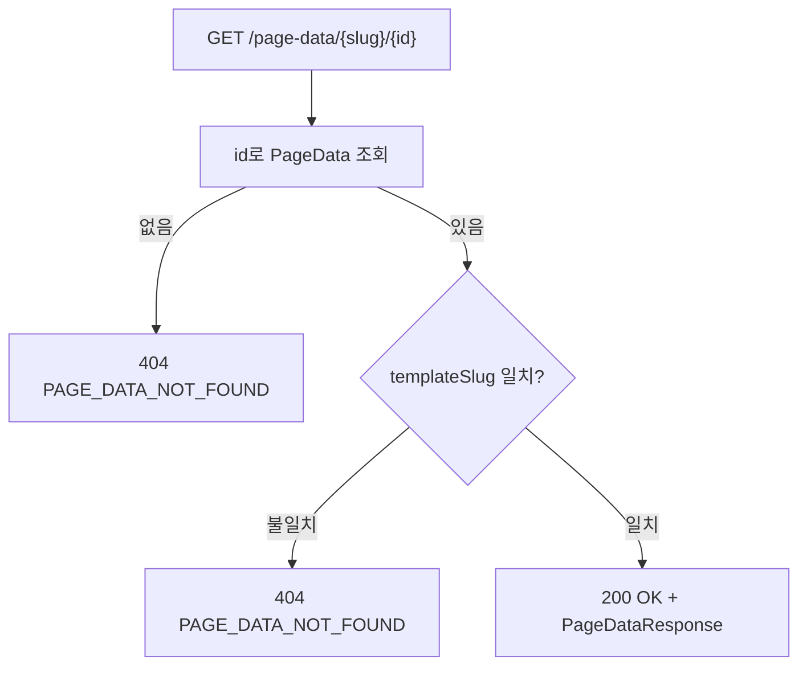
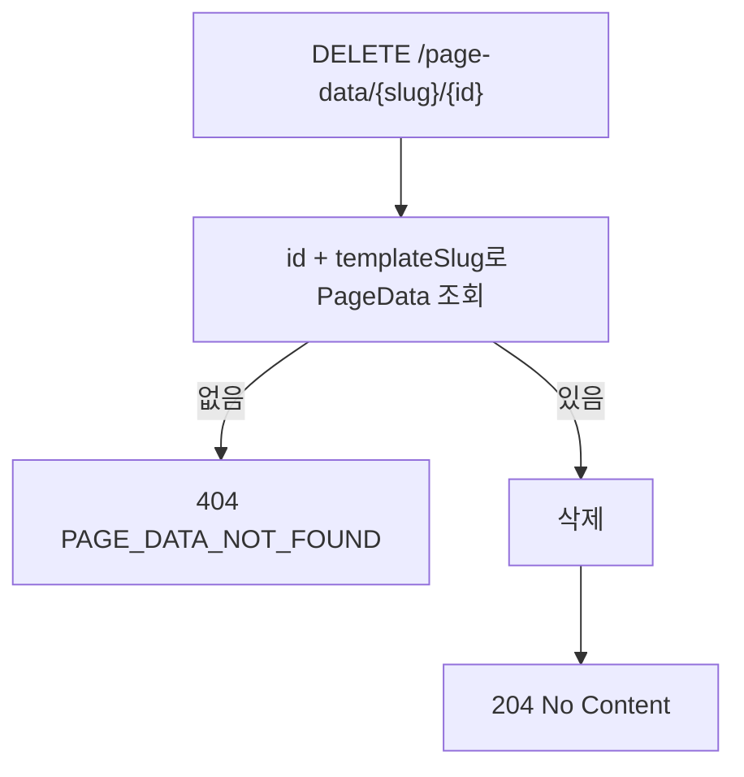

# 페이지 데이터 BE 상세 설계서

## 1. 개요
- **도메인**: 페이지 메이커로 생성된 모든 페이지의 CRUD 데이터 — 범용 저장소
- **DB 설계**: [db_page-data.md](../../db/page-data/db_page-data.md)
- **패키지 경로**: `com.ge.bo`
- **핵심 특징**: `template_slug` 하나로 List 페이지 ↔ Layer 팝업 ↔ 데이터가 자동 연결

---

## 2. 파일 구조

```
com.ge.bo/
├── entity/
│   └── PageData.java
├── dto/
│   ├── request/
│   │   └── PageDataRequest.java       # 등록/수정 요청 (dataJson Map)
│   └── response/
│       ├── PageDataResponse.java      # 단건 응답
│       └── PageDataListResponse.java  # 목록 + 페이지네이션 응답
├── repository/
│   └── PageDataRepository.java        # JPA + 동적 JSONB 네이티브 쿼리
├── service/
│   └── PageDataService.java           # 동적 검색 / CRUD 로직
└── controller/
    └── PageDataController.java
```

---

## 3. 엔티티 설계

### 3.1 PageData

| 필드 | 컬럼 | 타입 (Java) | 매핑 | 설명 |
|:---|:---|:---|:---|:---|
| id | id | Long | @Id, BIGSERIAL | PK |
| templateSlug | template_slug | String | @Column(length=255, NOT NULL) | 페이지 식별자 |
| dataJson | data_json | String | @Column(columnDefinition="jsonb", NOT NULL) | 폼 데이터 JSON 문자열 |
| createdBy | created_by | String | @CreatedBy, @Column(length=100) | 등록자 |
| createdAt | created_at | LocalDateTime | @CreatedDate | 등록일시 |
| updatedBy | updated_by | String | @LastModifiedBy, @Column(length=100) | 수정자 |
| updatedAt | updated_at | LocalDateTime | @LastModifiedDate | 수정일시 |

**제약조건:**
- `templateSlug` NOT NULL
- `dataJson` NOT NULL, columnDefinition="jsonb" (PostgreSQL JSONB 타입)
- JPA Auditing으로 createdBy/updatedAt 자동 관리
- FK 제약 없음 — 템플릿 삭제 시 데이터 보존 정책

### 3.2 DTO

**PageDataRequest** (등록/수정):

| 필드 | 타입 | 필수 | 검증 | 설명 |
|:---|:---|:---|:---|:---|
| dataJson | Map\<String, Object\> | Y | @NotNull, @NotEmpty | 폼 필드 키:값 쌍 |

**PageDataResponse** (단건/목록 항목):

| 필드 | 타입 | 설명 |
|:---|:---|:---|
| id | Long | PK |
| templateSlug | String | 페이지 식별자 |
| dataJson | Map\<String, Object\> | 폼 데이터 |
| createdBy | String | 등록자 |
| createdAt | LocalDateTime | 등록일시 |
| updatedBy | String | 수정자 |
| updatedAt | LocalDateTime | 수정일시 |

**PageDataListResponse** (목록):

| 필드 | 타입 | 설명 |
|:---|:---|:---|
| content | List\<PageDataResponse\> | 현재 페이지 데이터 |
| totalElements | long | 전체 데이터 수 |
| totalPages | int | 전체 페이지 수 |
| page | int | 현재 페이지 (0-based) |
| size | int | 페이지 크기 |

---

## 4. API 엔드포인트 명세

| Method | URL | 설명 | 권한 | 성공 코드 |
|:---|:---|:---|:---|:---|
| GET | `/api/v1/page-data/{slug}` | 목록 조회 (페이징 + 동적 검색) | 인증된 관리자 | 200 |
| POST | `/api/v1/page-data/{slug}` | 데이터 등록 | 인증된 관리자 | 201 |
| GET | `/api/v1/page-data/{slug}/{id}` | 단건 조회 | 인증된 관리자 | 200 |
| PUT | `/api/v1/page-data/{slug}/{id}` | 데이터 수정 | 인증된 관리자 | 200 |
| DELETE | `/api/v1/page-data/{slug}/{id}` | 데이터 삭제 | 인증된 관리자 | 204 |

> **권한**: SUPER_ADMIN / EDITOR 모두 허용 — 생성된 업무 페이지이므로 역할 제한 없음

---

## 5. 요청/응답 예시

### 5.1 목록 조회

```
GET /api/v1/page-data/user-list?name=홍길동&status=active&page=0&size=20
GET /api/v1/page-data/cat-main?eq_depth=2&eq_parentId=1
```

**Query Params:**

| 파라미터 | 타입 | 기본값 | 설명 |
|:---|:---|:---|:---|
| page | int | 0 | 페이지 번호 (0-based) |
| size | int | 20 | 페이지 크기 |
| 그 외 | String | - | data_json 필드 검색 조건 (fieldKey=value 형태) — ILIKE 부분 일치 |
| eq_{fieldKey} | String | - | data_json 필드 **정확 일치** 조건 — `eq_` 접두사 제거 후 `=` 비교 |

> **`eq_` 접두사 규칙**: 파라미터 키가 `eq_`로 시작하면 접두사를 제거한 필드명으로 정확 일치(`=`) 검색한다.
> 카테고리 depth/parentId 같이 정수 ID를 정확히 일치시켜야 하는 경우에 사용한다.
>
> 예시:
> - `?eq_parentId=1` → `data_json->>'parentId' = '1'`
> - `?eq_depth=2` → `data_json->>'depth' = '2'`
> - `?name=홍` → `data_json->>'name' ILIKE '%홍%'` (기존 방식 유지)

**Response 200:**
```json
{
  "content": [
    {
      "id": 1,
      "templateSlug": "user-list",
      "dataJson": { "name": "홍길동", "status": "active" },
      "createdBy": "admin@example.com",
      "createdAt": "2026-03-27T10:00:00",
      "updatedBy": "admin@example.com",
      "updatedAt": "2026-03-27T10:00:00"
    }
  ],
  "totalElements": 42,
  "totalPages": 3,
  "page": 0,
  "size": 20
}
```

### 5.2 등록

```
POST /api/v1/page-data/user-list
Content-Type: application/json

{
  "dataJson": {
    "name": "홍길동",
    "email": "hong@example.com",
    "status": "active"
  }
}
```

**Response 201:** `PageDataResponse`

### 5.3 단건 조회

```
GET /api/v1/page-data/user-list/1
```

**Response 200:** `PageDataResponse`

### 5.4 수정

```
PUT /api/v1/page-data/user-list/1
Content-Type: application/json

{
  "dataJson": {
    "name": "홍길동",
    "email": "hong2@example.com",
    "status": "inactive"
  }
}
```

**Response 200:** `PageDataResponse`

### 5.5 삭제

```
DELETE /api/v1/page-data/user-list/1
```

**Response 204:** No Content

---

## 6. 비즈니스 로직 상세

### 6.1 목록 조회 (동적 JSONB 검색)

```mermaid
flowchart TD
    A[GET /page-data/{slug}] --> B[Query Params 파싱]
    B --> C["page, size, sort 제거 → 나머지는 검색 조건"]
    C --> D{검색 조건 있음?}
    D -- 없음 --> E[template_slug = slug 조건만으로 조회]
    D -- 있음 --> F[동적 네이티브 쿼리 생성]
    F --> G{키가 eq_ 로 시작?}
    G -- 예 --> H["eq_ 제거 후 fieldKey 추출 → data_json->>fieldKey = value (정확 일치)"]
    G -- 아니오 --> I["data_json->>key ILIKE '%value%' (부분 일치)"]
    H & I --> J[WHERE 절 조합]
    E & J --> K[created_at DESC 정렬 + 페이징]
    K --> L[PageDataListResponse 반환]
    L --> M[200 OK]
```

**핵심 비즈니스 규칙:**
1. `page`, `size`, `sort`는 페이징/정렬 예약어 — 검색 조건에서 제외
2. 빈 문자열(`""`) 파라미터는 검색 조건에서 제외
3. `eq_`로 시작하는 파라미터 → 접두사 제거 후 **정확 일치(`=`)** 처리
4. 그 외 파라미터 → **부분 일치(ILIKE)** 처리 (기존 방식 유지)
5. 기본 정렬: `created_at DESC`
6. 기본 페이지 크기: 20

**동적 쿼리 생성 전략 (EntityManager 사용):**
```sql
SELECT * FROM page_data
WHERE template_slug = :slug
  AND data_json->>'name'     ILIKE '%홍길동%'  -- 일반 파라미터 → ILIKE
  AND data_json->>'parentId' = '1'             -- eq_parentId=1 → 정확 일치
  AND data_json->>'depth'    = '2'             -- eq_depth=2    → 정확 일치
ORDER BY created_at DESC
LIMIT :size OFFSET :offset
```

**Java 처리 로직 (PageDataService):**
```java
for (Map.Entry<String, String> entry : searchParams.entrySet()) {
    String key   = entry.getKey();
    String value = entry.getValue();
    if (value == null || value.isBlank()) continue; // 빈 값 제외

    if (key.startsWith("eq_")) {
        // eq_ 접두사 제거 후 정확 일치
        String fieldKey = key.substring(3);
        sql.append(" AND data_json->>'").append(fieldKey).append("' = :p").append(idx);
        params.put("p" + idx, value);
    } else {
        // 기존 ILIKE 부분 일치
        sql.append(" AND data_json->>'").append(key).append("' ILIKE :p").append(idx);
        params.put("p" + idx, "%" + value + "%");
    }
    idx++;
}

### 6.2 등록

```mermaid
flowchart TD
    A[POST /page-data/{slug}] --> B[@Valid 검증]
    B -- 실패 --> C[400 VALIDATION_FAILED]
    B -- 성공 --> D[dataJson Map → JSON 문자열 직렬화]
    D --> E[PageData 엔티티 생성]
    E --> F[templateSlug = slug 경로변수]
    F --> G[저장]
    G --> H[201 Created + PageDataResponse]
```

### 6.3 단건 조회



### 6.4 수정

```mermaid
flowchart TD
    A["PUT /page-data/{slug}/{id}"] --> B[@Valid 검증]
    B -- 실패 --> C[400 VALIDATION_FAILED]
    B -- 성공 --> D["id + templateSlug로 PageData 조회"]
    D -- 없음 --> E[404 PAGE_DATA_NOT_FOUND]
    D -- 있음 --> F[dataJson 업데이트]
    F --> G[저장]
    G --> H[200 OK + PageDataResponse]
```

### 6.5 삭제



---

## 7. Validation 상세

### 7.1 Controller 레벨 (Bean Validation)

| 필드 | 검증 규칙 | 에러 메시지 |
|:---|:---|:---|
| dataJson | @NotNull | 데이터를 입력해주세요. |
| dataJson | @NotEmpty | 최소 1개 이상의 필드를 입력해주세요. |

### 7.2 Service 레벨 (비즈니스 Validation)

| 검증 항목 | HTTP | Error Code | 에러 메시지 |
|:---|:---|:---|:---|
| id + slug 조합으로 데이터 없음 | 404 | PAGE_DATA_NOT_FOUND | 해당 데이터를 찾을 수 없습니다. |

---

## 8. 예외 매핑 테이블

| 예외 상황 | HTTP | Error Code | 사용자 메시지 |
|:---|:---|:---|:---|
| 데이터 없음 | 404 | PAGE_DATA_NOT_FOUND | 해당 데이터를 찾을 수 없습니다. |
| dataJson 빈 값 | 400 | VALIDATION_FAILED | 최소 1개 이상의 필드를 입력해주세요. |
| 미인증 | 401 | UNAUTHORIZED | 로그인이 필요합니다. |
| 권한 부족 | 403 | FORBIDDEN | 접근 권한이 없습니다. |

> `ErrorCode` enum에 `PAGE_DATA_NOT_FOUND` 추가 필요

---

## 9. 보안 매트릭스

| API | Method | 권한 |
|:---|:---|:---|
| `/api/v1/page-data/**` | ALL | 인증된 관리자 (SUPER_ADMIN / EDITOR) |

---

## 10. Repository 쿼리 설계

### PageDataRepository

| 메서드명 | 용도 |
|:---|:---|
| `findByIdAndTemplateSlug(Long id, String slug)` | 단건 조회 (slug 불일치 방지) |
| `deleteByIdAndTemplateSlug(Long id, String slug)` | 삭제 |

**동적 검색은 Repository가 아닌 Service에서 `EntityManager.createNativeQuery()` 사용**

### eq_ 정확 일치 쿼리 예시

```sql
-- 요청: GET /page-data/cat-main?eq_depth=2&eq_parentId=1&name=상의
SELECT * FROM page_data
WHERE template_slug = 'cat-main'
  AND data_json->>'depth'    = '2'          -- eq_depth    → 정확 일치
  AND data_json->>'parentId' = '1'          -- eq_parentId → 정확 일치
  AND data_json->>'name'     ILIKE '%상의%' -- name        → ILIKE
ORDER BY created_at DESC
LIMIT 20 OFFSET 0;
```

> **파라미터 예약어 목록** (검색 조건에서 제외):
> `page`, `size`, `sort`

---

## 11. BE 개발 체크리스트

> ⚠️ **모든 항목이 ✅가 될 때까지 완료 보고 불가**

### 11.1 엔티티 및 DB

- [ ] PageData 엔티티의 모든 필드가 설계서와 일치하는가?
- [ ] `dataJson` 컬럼이 `columnDefinition = "jsonb"`로 선언되었는가?
- [ ] `templateSlug` NOT NULL 제약이 적용되었는가?
- [ ] JPA Auditing (`@CreatedBy`, `@CreatedDate`, `@LastModifiedBy`, `@LastModifiedDate`)이 동작하는가?
- [ ] `idx_page_data_slug`, `idx_page_data_slug_created` 인덱스가 생성되었는가?

### 11.2 API 엔드포인트

- [ ] GET `/api/v1/page-data/{slug}` — 목록 조회가 구현되었는가?
- [ ] POST `/api/v1/page-data/{slug}` — 등록이 구현되었는가?
- [ ] GET `/api/v1/page-data/{slug}/{id}` — 단건 조회가 구현되었는가?
- [ ] PUT `/api/v1/page-data/{slug}/{id}` — 수정이 구현되었는가?
- [ ] DELETE `/api/v1/page-data/{slug}/{id}` — 삭제가 구현되었는가?
- [ ] POST 성공 시 HTTP 201을 반환하는가?
- [ ] DELETE 성공 시 HTTP 204를 반환하는가?

### 11.3 목록 조회 동적 검색

- [ ] `page`, `size`, `sort` 파라미터가 검색 조건에서 제외되는가?
- [ ] 빈 문자열 파라미터가 검색 조건에서 제외되는가?
- [ ] 검색 조건이 JSONB 컬럼에 ILIKE로 적용되는가?
- [ ] `eq_` 접두사 파라미터가 정확 일치(`=`)로 처리되는가?
- [ ] `eq_` 접두사 제거 후 올바른 fieldKey로 쿼리가 생성되는가?
- [ ] `eq_parentId=1` 요청 시 `data_json->>'parentId' = '1'` 조건이 적용되는가?
- [ ] `eq_` 파라미터와 일반 파라미터가 함께 사용될 때 모두 정상 동작하는가?
- [ ] 결과가 `created_at DESC` 기준으로 정렬되는가?
- [ ] 페이지네이션이 올바르게 동작하는가? (`totalElements`, `totalPages` 정확)

### 11.4 단건 조회 / 수정 / 삭제

- [ ] id + templateSlug 조합으로 조회하는가? (다른 slug 데이터 접근 차단)
- [ ] 존재하지 않는 id 요청 시 404가 반환되는가?
- [ ] slug 불일치 시 404가 반환되는가?

### 11.5 Request DTO Validation

- [ ] `dataJson`에 @NotNull이 적용되었는가?
- [ ] `dataJson`에 @NotEmpty가 적용되었는가?
- [ ] @Valid가 Controller @RequestBody에 적용되었는가?

### 11.6 트랜잭션

- [ ] GET API에 `@Transactional(readOnly = true)`가 적용되었는가?
- [ ] CUD API에 `@Transactional`이 적용되었는가?

### 11.7 예외 처리

- [ ] `PAGE_DATA_NOT_FOUND`가 ErrorCode enum에 추가되었는가?
- [ ] 설계서 섹션 8의 모든 예외가 구현되었는가?

### 11.8 보안

- [ ] `/api/v1/page-data/**`에 인증된 사용자만 접근 가능한가?
- [ ] SecurityConfig에 해당 경로가 올바르게 설정되었는가?

### 11.9 빌드

- [ ] `./gradlew build` 오류가 없는가?

### 11.10 FE 연동 테스트

- [ ] List 페이지 진입 시 데이터 목록이 정상 조회되는가?
- [ ] 검색 조건 입력 후 조회 시 필터링이 동작하는가?
- [ ] Layer 팝업에서 저장 시 목록에 새 데이터가 반영되는가?
- [ ] 행 클릭(수정) 시 팝업에 기존 데이터가 채워지는가?
- [ ] 수정 저장 시 목록에 변경 데이터가 반영되는가?
- [ ] 삭제 시 목록에서 해당 행이 제거되는가?
- [ ] 존재하지 않는 id 요청 시 에러 토스트가 표시되는가?
