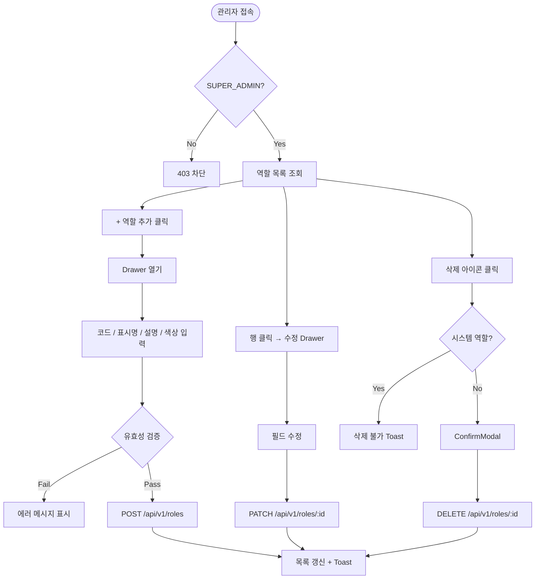

# 권한 관리 기능 명세서 (FSD)

## 1. Overview
- **Feature Name**: 역할(Role) CRUD 관리
- **Goal**: 시스템에서 사용하는 역할을 생성·수정·삭제하고, 각 역할의 표시 정보를 관리한다.
- **Actors**: SUPER_ADMIN (전용 기능, EDITOR 접근 불가)
- **경로**: `/admin/settings/roles`

---

## 2. User Journey (Flowchart)

---

## 3. Screen Requirements

### [SCN-01] 역할 목록 화면

- **Description**: 등록된 역할을 카드 또는 테이블 형태로 표시
- **UI Elements**:

| Element | Type | Rules |
|:---|:---|:---|
| `역할 코드` 배지 | Badge | 대문자, 언더스코어 허용 (e.g. `SUPER_ADMIN`) |
| `표시명` | Text | 한글 표시 이름 |
| `설명` | Text | 역할 설명 (선택) |
| `색상` | Color dot | Hex 색상 미리보기 |
| `사용 인원` | Number | 해당 역할로 등록된 관리자 수 |
| `시스템 여부` | Badge | 시스템 역할은 잠금 아이콘 표시, 삭제 불가 |
| `+ 역할 추가` | Button | Drawer 오픈 |
| `수정` 아이콘 | IconButton | Drawer 오픈 (편집 모드) |
| `삭제` 아이콘 | IconButton | 시스템 역할이면 비활성 |

### [SCN-02] 역할 등록/수정 Drawer

- **Description**: 우측 슬라이드 패널로 역할 생성·수정
- **UI Elements**:

| Element | Type | 필수 | Validation |
|:---|:---|:---:|:---|
| `역할 코드` | TextField | ✅ | 영문 대문자·숫자·`_` 만 허용, min 2자, max 30자, 중복 불가, 수정 시 비활성(readonly) |
| `표시명` | TextField | ✅ | min 1자, max 20자 |
| `설명` | Textarea | ❌ | max 100자 |
| `색상` | ColorPicker (preset) | ✅ | 8개 프리셋 중 선택 |

- **Process Logic**:
  1. `역할 코드` 입력 시 자동 대문자 변환 + 공백→`_` 치환
  2. blur 시 중복 체크 (신규 등록 시만)
  3. 저장 버튼 클릭 → 유효성 검증 → API 호출
  4. 성공 시 Drawer 닫기 + 목록 갱신 + Toast

---

## 4. Unhappy Paths (Exception Handling)

| Trigger | System Response | User Feedback |
|:---|:---|:---|
| 역할 코드 중복 | API 400 반환 | "이미 사용 중인 역할 코드입니다." |
| 시스템 역할 삭제 시도 | 삭제 버튼 비활성 | "시스템 기본 역할은 삭제할 수 없습니다." |
| 사용 중인 역할 삭제 | API 409 반환 | "해당 역할을 사용 중인 관리자가 {n}명 있습니다." |
| 역할 코드 형식 오류 | 클라이언트 차단 | "영문 대문자, 숫자, _만 입력 가능합니다." |
| 빈 표시명 | 클라이언트 차단 | "표시명을 입력해주세요." |
| 네트워크 오류 | 요청 실패 처리 | "작업 중 오류가 발생했습니다." |

---

## 5. Backend 설계

### 5.1 신규 테이블: `role`
| 컬럼 | 타입 | 설명 |
|:---|:---|:---|
| `id` | BIGINT PK | |
| `code` | VARCHAR(30) UNIQUE | 역할 식별 키 (e.g. `SUPER_ADMIN`) |
| `display_name` | VARCHAR(20) | 화면 표시명 |
| `description` | VARCHAR(100) | 역할 설명 |
| `color` | VARCHAR(7) | Hex 색상 (`#4361ee`) |
| `is_system` | BOOLEAN | true면 삭제 불가 |
| `created_at` | TIMESTAMP | |
| `updated_at` | TIMESTAMP | |

### 5.2 초기 데이터 (System Roles)
| code | display_name | color | is_system |
|:---|:---|:---|:---|
| `SUPER_ADMIN` | 최고 관리자 | `#4361ee` | true |
| `EDITOR` | 편집자 | `#6b7280` | true |

### 5.3 API 엔드포인트
| Method | Path | 설명 |
|:---|:---|:---|
| GET | `/api/v1/roles` | 전체 역할 목록 (사용 인원 포함) |
| POST | `/api/v1/roles` | 역할 생성 |
| PATCH | `/api/v1/roles/{id}` | 역할 수정 (code 변경 불가) |
| DELETE | `/api/v1/roles/{id}` | 역할 삭제 (is_system=true 또는 사용 중이면 거부) |

---

## 6. Acceptance Criteria

- [ ] 역할 목록이 `GET /api/v1/roles` 로 조회된다
- [ ] `+ 역할 추가` 클릭 시 Drawer가 열린다
- [ ] 역할 코드 중복 시 에러 메시지가 표시된다
- [ ] 시스템 역할(is_system=true)의 삭제 버튼이 비활성화된다
- [ ] 사용 중인 역할 삭제 시 사용 인원 포함 에러 메시지가 표시된다
- [ ] 생성·수정·삭제 후 목록이 즉시 갱신된다
- [ ] EDITOR 계정으로 해당 페이지 접근 시 차단된다
