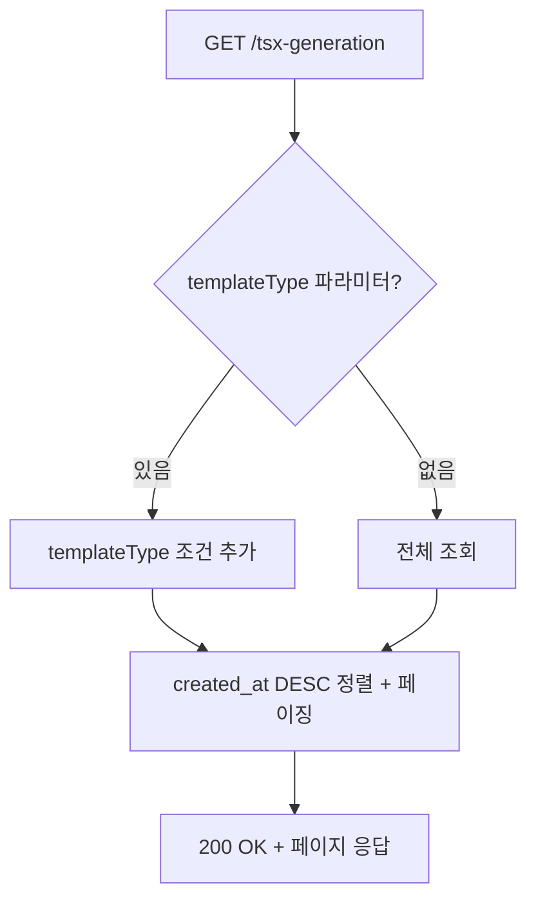
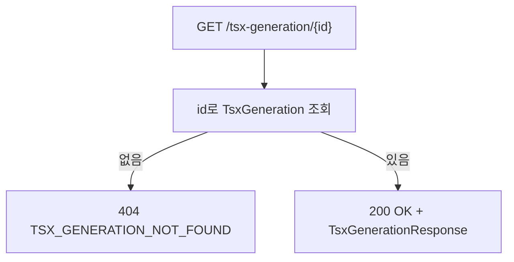
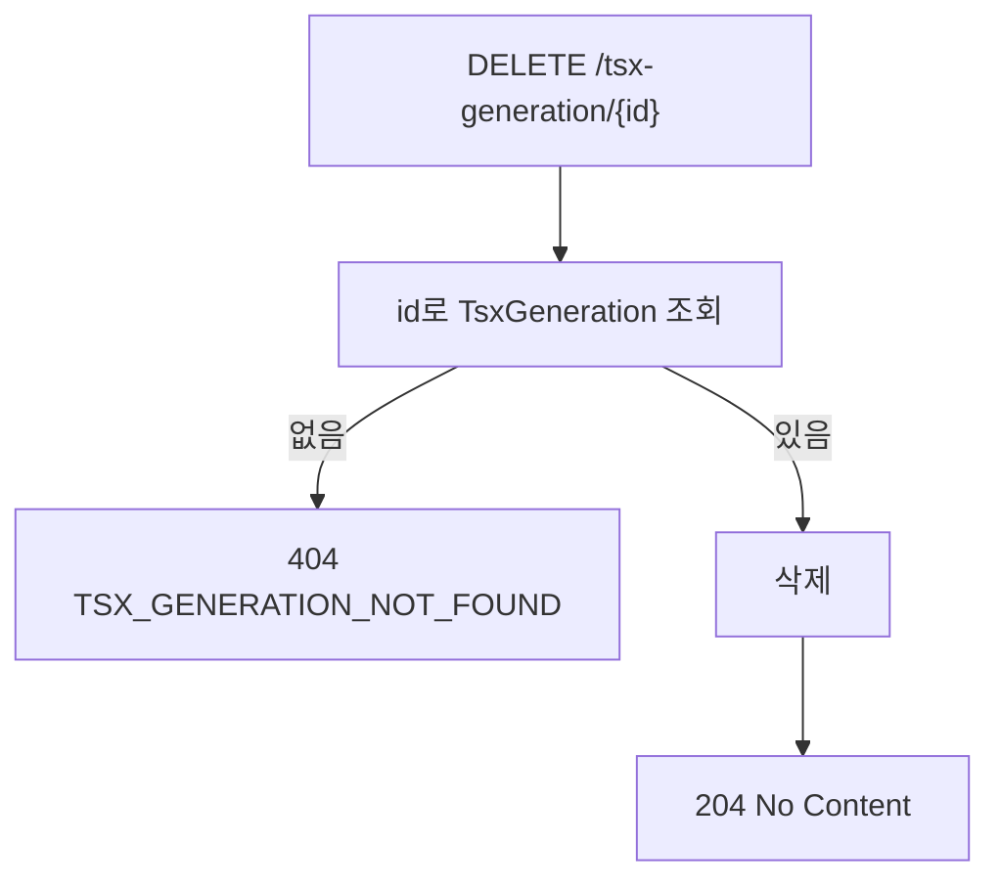

# TSX 생성 이력 BE 상세 설계서

## 1. 개요
- **도메인**: 페이지 메이커 `[생성]` 버튼 클릭 시 TSX 파일 생성과 동시에 이력을 저장
- **DB 설계**: [db_tsx-generation.md](../../db/tsx-generation/db_tsx-generation.md)
- **패키지 경로**: `com.ge.bo`
- **핵심 특징**:
  - `[생성]` 과 `[저장/수정]`(page_template) 완전 분리된 독립 도메인
  - 생성 이력의 `configJson`을 다시 불러와 빌더에서 재편집·재생성 가능
  - 동일 경로에 여러 이력이 누적됨 (덮어쓰기 X)

---

## 2. 파일 구조

```
com.ge.bo/
├── entity/
│   └── TsxGeneration.java
├── dto/
│   ├── TsxGenerationRequest.java        # 저장 요청 (생성 버튼 클릭 시)
│   └── TsxGenerationResponse.java       # 응답 (목록 + 단건 공통)
├── repository/
│   └── TsxGenerationRepository.java
├── service/
│   └── TsxGenerationService.java
└── controller/
    └── TsxGenerationController.java
```

---

## 3. 엔티티 설계

### 3.1 TsxGeneration

| 필드 | 컬럼 | 타입 (Java) | 매핑 | 설명 |
|:---|:---|:---|:---|:---|
| id | id | Long | @Id, BIGSERIAL | PK |
| name | name | String | @Column(length=100, NOT NULL) | 이력 식별 이름 (ex: `게시판 목록`) |
| folderName | folder_name | String | @Column(length=100, NOT NULL) | 저장 폴더 경로 (ex: `admin/board`) |
| fileName | file_name | String | @Column(length=100, NOT NULL) | 저장 파일명 (ex: `page.tsx`) |
| templateType | template_type | String | @Column(length=20, NOT NULL) | `LIST` 또는 `LAYER` |
| configJson | config_json | String | @Column(columnDefinition="text", NOT NULL) | 빌더 설정 JSON 전문 |
| tsxCode | tsx_code | String | @Column(columnDefinition="text", NOT NULL) | 생성된 TSX 코드 전문 |
| createdBy | created_by | String | @CreatedBy, @Column(length=100) | 생성자 |
| createdAt | created_at | LocalDateTime | @CreatedDate | 생성일시 |

**제약조건:**
- `name`, `folderName`, `fileName`, `templateType`, `configJson`, `tsxCode` NOT NULL
- `updated_at` 없음 — 생성 전용 이력 테이블 (수정 불가)
- JPA Auditing으로 `createdBy`, `createdAt` 자동 관리

### 3.2 DTO

**TsxGenerationRequest** (등록):

| 필드 | 타입 | 필수 | 검증 | 설명 |
|:---|:---|:---|:---|:---|
| name | String | Y | @NotBlank | 이력 식별 이름 |
| folderName | String | Y | @NotBlank | 저장 폴더 경로 |
| fileName | String | Y | @NotBlank | 저장 파일명 |
| templateType | String | Y | @NotBlank | `LIST` 또는 `LAYER` |
| configJson | String | Y | @NotBlank | 빌더 설정 JSON |
| tsxCode | String | Y | @NotBlank | 생성된 TSX 코드 |

**TsxGenerationResponse** (목록/단건 공통):

| 필드 | 타입 | 설명 |
|:---|:---|:---|
| id | Long | PK |
| name | String | 이력 식별 이름 |
| folderName | String | 저장 폴더 경로 |
| fileName | String | 저장 파일명 |
| templateType | String | `LIST` 또는 `LAYER` |
| configJson | String | 빌더 설정 JSON (재편집용) |
| tsxCode | String | 생성된 TSX 코드 전문 |
| createdBy | String | 생성자 |
| createdAt | LocalDateTime | 생성일시 |

---

## 4. API 엔드포인트 명세

| Method | URL | 설명 | 권한 | 성공 코드 |
|:---|:---|:---|:---|:---|
| POST | `/api/v1/tsx-generation` | 생성 이력 저장 | 인증된 관리자 | 201 |
| GET | `/api/v1/tsx-generation` | 이력 목록 조회 (페이징) | 인증된 관리자 | 200 |
| GET | `/api/v1/tsx-generation/{id}` | 단건 조회 (재편집용) | 인증된 관리자 | 200 |
| DELETE | `/api/v1/tsx-generation/{id}` | 이력 삭제 | 인증된 관리자 | 204 |

> **권한**: SUPER_ADMIN / EDITOR 모두 허용

---

## 5. 요청/응답 예시

### 5.1 생성 이력 저장

```
POST /api/v1/tsx-generation
Content-Type: application/json

{
  "name": "게시판 목록",
  "folderName": "admin/board",
  "fileName": "page.tsx",
  "templateType": "LIST",
  "configJson": "{\"templateType\":\"LIST\",\"searchRows\":[...],\"tableColumns\":[...]}",
  "tsxCode": "'use client';\nimport React from 'react';\n..."
}
```

**Response 201:** `TsxGenerationResponse`

---

### 5.2 이력 목록 조회

```
GET /api/v1/tsx-generation?templateType=LIST&page=0&size=20
```

**Query Params:**

| 파라미터 | 타입 | 기본값 | 설명 |
|:---|:---|:---|:---|
| templateType | String | - | `LIST` / `LAYER` 필터 (선택) |
| page | int | 0 | 페이지 번호 (0-based) |
| size | int | 20 | 페이지 크기 |

**Response 200:**
```json
{
  "content": [
    {
      "id": 1,
      "name": "게시판 목록",
      "folderName": "admin/board",
      "fileName": "page.tsx",
      "templateType": "LIST",
      "configJson": "{...}",
      "tsxCode": "'use client';...",
      "createdBy": "admin@example.com",
      "createdAt": "2026-04-13T10:00:00"
    }
  ],
  "totalElements": 5,
  "totalPages": 1,
  "page": 0,
  "size": 20
}
```

---

### 5.3 단건 조회 (재편집용)

```
GET /api/v1/tsx-generation/1
```

**Response 200:** `TsxGenerationResponse` (configJson 포함 전체 필드)

---

### 5.4 이력 삭제

```
DELETE /api/v1/tsx-generation/1
```

**Response 204:** No Content

---

## 6. 비즈니스 로직 상세

### 6.1 생성 이력 저장

```mermaid
flowchart TD
    A[POST /tsx-generation] --> B[@Valid 검증]
    B -- 실패 --> C[400 VALIDATION_FAILED]
    B -- 성공 --> D[TsxGeneration 엔티티 생성]
    D --> E[저장]
    E --> F[201 Created + TsxGenerationResponse]
```

### 6.2 이력 목록 조회



### 6.3 단건 조회



### 6.4 삭제



---

## 7. Validation 상세

### 7.1 Controller 레벨 (Bean Validation)

| 필드 | 검증 규칙 | 에러 메시지 |
|:---|:---|:---|
| name | @NotBlank | 이름을 입력해주세요. |
| folderName | @NotBlank | 폴더명을 입력해주세요. |
| fileName | @NotBlank | 파일명을 입력해주세요. |
| templateType | @NotBlank | 템플릿 타입을 입력해주세요. |
| configJson | @NotBlank | 빌더 설정 JSON이 없습니다. |
| tsxCode | @NotBlank | 생성된 TSX 코드가 없습니다. |

### 7.2 Service 레벨 (비즈니스 Validation)

| 검증 항목 | HTTP | Error Code | 에러 메시지 |
|:---|:---|:---|:---|
| id로 이력 없음 | 404 | TSX_GENERATION_NOT_FOUND | 해당 생성 이력을 찾을 수 없습니다. |

---

## 8. 예외 매핑 테이블

| 예외 상황 | HTTP | Error Code | 사용자 메시지 |
|:---|:---|:---|:---|
| 이력 없음 | 404 | TSX_GENERATION_NOT_FOUND | 해당 생성 이력을 찾을 수 없습니다. |
| 요청 필드 빈 값 | 400 | VALIDATION_FAILED | 입력값을 확인해주세요. |
| 미인증 | 401 | UNAUTHORIZED | 로그인이 필요합니다. |
| 권한 부족 | 403 | FORBIDDEN | 접근 권한이 없습니다. |

> `ErrorCode` enum에 `TSX_GENERATION_NOT_FOUND` 추가 필요

---

## 9. 보안 매트릭스

| API | Method | 권한 |
|:---|:---|:---|
| `/api/v1/tsx-generation/**` | ALL | 인증된 관리자 (SUPER_ADMIN / EDITOR) |

---

## 10. Repository 쿼리 설계

| 메서드명 | 용도 |
|:---|:---|
| `findAllByTemplateTypeOrderByCreatedAtDesc(String templateType, Pageable)` | templateType 필터 목록 조회 |
| `findAllByOrderByCreatedAtDesc(Pageable)` | 전체 목록 조회 |

---

## 11. BE 개발 체크리스트

> ⚠️ **모든 항목이 ✅가 될 때까지 완료 보고 불가**

### 11.1 엔티티 및 DB

- [ ] TsxGeneration 엔티티의 모든 필드가 설계서와 일치하는가?
- [ ] `configJson`, `tsxCode`가 `columnDefinition = "text"`로 선언되었는가?
- [ ] `updated_at` 필드가 없는가? (생성 전용)
- [ ] JPA Auditing (`@CreatedBy`, `@CreatedDate`)이 동작하는가?
- [ ] `idx_tsx_gen_type`, `idx_tsx_gen_created` 인덱스가 생성되었는가?

### 11.2 API 엔드포인트

- [ ] POST `/api/v1/tsx-generation` — 저장이 구현되었는가?
- [ ] GET `/api/v1/tsx-generation` — 목록 조회가 구현되었는가?
- [ ] GET `/api/v1/tsx-generation/{id}` — 단건 조회가 구현되었는가?
- [ ] DELETE `/api/v1/tsx-generation/{id}` — 삭제가 구현되었는가?
- [ ] POST 성공 시 HTTP 201을 반환하는가?
- [ ] DELETE 성공 시 HTTP 204를 반환하는가?

### 11.3 목록 조회

- [ ] `templateType` 파라미터가 있을 때 필터링이 동작하는가?
- [ ] `templateType` 파라미터가 없을 때 전체 조회가 되는가?
- [ ] 결과가 `created_at DESC` 기준으로 정렬되는가?
- [ ] 페이지네이션이 올바르게 동작하는가?

### 11.4 단건 조회 / 삭제

- [ ] 존재하지 않는 id 요청 시 404가 반환되는가?

### 11.5 Request DTO Validation

- [ ] 모든 필수 필드에 @NotBlank가 적용되었는가?
- [ ] @Valid가 Controller @RequestBody에 적용되었는가?

### 11.6 트랜잭션

- [ ] GET API에 `@Transactional(readOnly = true)`가 적용되었는가?
- [ ] POST, DELETE API에 `@Transactional`이 적용되었는가?

### 11.7 예외 처리

- [ ] `TSX_GENERATION_NOT_FOUND`가 ErrorCode enum에 추가되었는가?
- [ ] 설계서 섹션 8의 모든 예외가 구현되었는가?

### 11.8 보안

- [ ] `/api/v1/tsx-generation/**`에 인증된 사용자만 접근 가능한가?
- [ ] SecurityConfig에 해당 경로가 올바르게 설정되었는가?

### 11.9 빌드

- [ ] `./gradlew build` 오류가 없는가?

### 11.10 FE 연동 테스트

- [ ] `[생성]` 버튼 클릭 시 TSX 파일 생성 + 이력 저장이 동시에 동작하는가?
- [ ] 이력 목록에서 불러오기 클릭 시 빌더에 configJson이 복원되는가?
- [ ] 이력 삭제 시 목록에서 해당 행이 제거되는가?
